# 4.6.1 브로드캐스팅(Broadcasting) 개요


## 브로드캐스팅의 프로그래밍적 의미


> "너랑 나랑 크기(Shape)가 안 맞아? 내가 널 위해 내 몸을 고무줄처럼 늘려서 복제해 줄게!"

## 수학적 의미: 차원 복제와 공간 확장 (Sweeping)

NumPy의 **브로드캐스팅(Broadcasting)**은 데이터 분석에서 가장 강력하면서도 편리한 특허급 연산 규칙입니다. 

수학에서 `1차원 선분(Vector)`을 특정 방향으로 똑같이 밀어서 복사하면 `2차원 면적(Matrix)`이 창조되는 기하학적 원리를 프로그래밍에 도입했습니다. 


> 1차원으로 나열된 선형 데이터 블록이 텅 빈 축을 향해 스캔하듯 복제되며 2차원 면적으로(Sweeping) 확장됩니다.

규격(`Shape`)이 서로 다른 큰 배열과 작은 배열끼리 연산을 시도한다고 가정해 봅시다.

융통성이 없는 일반적인 프로그래밍 언어라면 즉시 에러를 뿜었겠지만, NumPy 엔진은 아주 똑똑하게 작동합니다. **"작은 배열 측의 부족한 차원을 스스로 복제하여, 거대한 상대방 배열 공간에 자신의 크기를 억지로 맞춘 뒤 연산을 수행"**합니다.


> 숫자 `10` 하나가 파티션의 크기만큼 마법처럼 길게 뻗어나가며 확장(Broadcast)됩니다.

**[비유로 이해하기: 광역 파티 버프 시전]**

온라인 게임에서 파티장 1명이 전체 파티원 5명에게 **"모두 공격력 +10!"**이라는 단일 스킬(광역 버프)을 쓴다고 생각해 보세요. 스칼라 값(`10`) 단 한 개가 마법처럼 5명 크기의 배열로 쫙 늘어나고 복제되어, 모든 파티원에게 동시에 버프 연산이 들어가는 직관적 원리입니다.

---

## 완벽하게 형태가 일치하는 경우

아직 연산 규칙에 익숙하지 않다면 가장 기본으로 돌아갑시다. 배열끼리의 연산에서 에러가 절대 나지 않는 가장 완벽한 조건은 **"두 배열의 가로세로 규격(Shape)이 완벽히 일치하는 상태"**입니다. 

### 브로드캐스팅이 필요 없는 안전한 연산

이 경우에는 크기를 늘릴(Broadcasting) 필요 없이 1:1로만 작동합니다.


> 배열 a와 b가 마치 레고 블록처럼 길이가 3칸으로 똑같기 때문에, 무리하게 복제할 필요 없이 동일 위치의 요소끼리 1:1로 짝찌어 덧셈이 무사통과됩니다.

```python
import numpy as np

# [1단계] 완전히 똑같이 칸이 3개씩(Shape: 3) 들어있는 1차원 배열 준비
a = np.array([3, 4, 5])
b = np.array([8, 7, 6])
print("배열 a:", a)
print("배열 b:", b)

# [2단계] 크기가 완벽히 같으므로 브로드캐스팅(늘이기) 없이 1:1 같은 자리끼리 덧셈이 무사통과
result_safe = a + b
print("\n✅ 동일 규격 안전 덧셈 결과:", result_safe)
```
**실행 결과:**
```text
배열 a: [3 4 5]
배열 b: [8 7 6]

✅ 동일 규격 안전 덧셈 결과: [11 11 11]
```

---

## 규격이 파괴되어 브로드캐스팅으로도 복구할 수 없경우
브로드캐스팅이 고무줄처럼 마법을 부린다고 해서 **제멋대로 아무렇게나 늘려주는 만능 시스템은 아닙니다.** 차원이 확장될 때는 엄격한 아다리가 맞아야 합니다. 

### 치명적인 에러 발생

짝이 아예 안 맞는 애매한 크기 조합을 던져주면 Numpy도 당황하여 연산을 포기하고 에러를 뿜어냅니다.


> 4칸과 3칸은 어떻게 복제해도 서로의 규격을 맞출 수 없어 시스템이 붕괴됩니다.

```python
import numpy as np

# 'x'는 길이가 4칸, 'y'는 길이가 3칸
x = np.array([3, 4, 5, 7])
y = np.array([8, 7, 6])
print("배열 x 쉐이프:", x.shape)
print("배열 y 쉐이프:", y.shape)

# "내가 1칸을 어떻게 늘려야 3칸이랑 맞물릴까? 불가능해, 포기!" -> 에러 발생
try:
    print("\n❌ 크기 불일치 곱셈 시도...")
    result_error = x * y
except Exception as e:
    print("시스템 에러 발생! 차원 크기를 맞출 수 없습니다.")
    print("에러 로그:", e)
```
**실행 결과:**
```text
배열 x 쉐이프: (4,)
배열 y 쉐이프: (3,)

❌ 크기 불일치 곱셈 시도...
시스템 에러 발생! 차원 크기를 맞출 수 없습니다.
에러 로그: operands could not be broadcast together with shapes (4,) (3,) 
```

브로드캐스팅을 에러 없이 성공시키려면, 배열 모양(Shape)의 숫자들 중 적어도 "한쪽 끝이 거울처럼 똑같거나", 아니면 "숫자 `1`이어서 자유롭게 복제 가능한 상태"여야 합니다. 

구체적인 통과 규칙은 다음 챕터인 **스칼라 브로드캐스팅**과 **차원 브로드캐스팅**에서 단계별로 정복해 보겠습니다!
