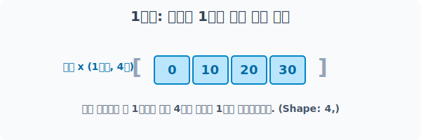

# 4.6.4 np.newaxis
> 강제로 새로운 차원(축) 찔러넣기


## 부족한 모양과 차원을 강제로 주입
앞서 우리는 Numpy가 모양이 맞지 않는 배열들을 브로드캐스팅(차원 확장)을 통해 자동으로 맞춰준다는 것을 배웠습니다. 

하지만, **애초에 방향(가로/세로) 자체가 엇나가서 Numpy가 갈피를 못 잡는 경우**에는 우리가 직접 가이드를 줘야 합니다.

이때 수학적으로 완전히 새로운 빈 차원을 강제로 하나 주입하여 1차원 선분을 2차원 면적의 테두리로 밀어 올리는 마법의 상수가 바로 `np.newaxis` 입니다.


## 1단계: 베이스 1차원 배열 생성

우선 평범하게 바닥에 누워있는 4칸짜리 1차원 배열 `x`를 준비합니다. 

앞으로 이 배열을 눕히고 세우며 조각할 것입니다.



```python
import numpy as np

# 원소 4개가 차례대로 들어있는 1차원 배열: Shape (4,)
x = np.array([0, 10, 20, 30])
print("베이스 1차원 배열 x:", x)
```
**1단계 실행 결과:**
```text
베이스 1차원 배열 x: [ 0 10 20 30]
```

---

## 2단계: 가로 차원 추가 (x[np.newaxis, :])

1차원 배열(List)은 단순히 원소가 나열된 줄자일 뿐, '행(가로)'이나 '열(세로)'이라는 개념조차 없습니다. 
이 1차원 줄자를 **아파트 형태의 2차원 공간으로 끌어올린 뒤, "첫 번째 가로줄(1행)"로 배치해라!** 라고 명령하는 것이 바로 가로 차원 추가입니다.

### 문법과 작동 원리
NumPy 배열을 인덱싱 대괄호 `[ ]`로 부를 때, **콤마(,)의 왼쪽은 '행(Row)', 오른쪽은 '열(Col)'**을 의미합니다.

* `x[np.newaxis, :]` 코드를 뜯어봅시다.
* **`np.newaxis` (행 자리)**: "새로운 빈 행(가로층)을 1개 만들어라!"
* **`:` (열 자리)**: "거기에 내 원래 데이터 4개를 열(Col) 방향으로 쫙 깔아라!"

결과적으로 아무런 차원도 없는 그냥 줄자 `(4,)` 형태가, **1층(행) x 4호(열)**을 가진 어엿한 2차원 테이블 행렬 `(1, 4)` 형태로 강제 승격됩니다. 


> 겉에 대괄호 `[[ ]]`가 하나 더 둘러지면서 1차원에서 2차원으로 강제 둔갑하는 시각적 효과를 가집니다!

```python
# 행(row) 자리에 새로운 차원(newaxis) 주입, 열(col)은 원래 데이터(:) 전부 사용
# 1차원 (4,) 모델이 -> 2차원 (1, 4) 모델로 업그레이드!
a = x[np.newaxis, :]  
# 참고: x[None, :] 라고 써도 완벽히 똑같이 동작합니다!

print("가로 2차원 행렬로 승격된 a:\n", a)
print("a의 배열 구조(Shape):", a.shape)
```
**2단계 실행 결과:**
```text
가로 2차원 행렬로 승격된 a:
 [[ 0 10 20 30]]
a의 배열 구조(Shape): (1, 4)
```

---

### 3단계: 세로 차원 추가 (x[:, np.newaxis])

데이터 분석 실전에서 아주 많이 쓰이는 핵심 기법입니다. 

누워있던 선분 `x`를 90도 회전시켜 **우뚝 솟은 세로 기둥형 2차원 배열(열 벡터)**로 강제로 세워봅시다.

이번엔 콤마(,) 뒤에 있는 두 번째 축(열)의 위치에 `np.newaxis`를 주입합니다.


> 데이터 값들이 하나하나 낱갈래 대괄호에 싸인 뒤 한 줄로 수직으로 도열하며 강력한 기둥이 되었습니다.

```python
# 행(row)은 원래 데이터 전부(:) 사용, 열(col) 자리를 빈 껍질(newaxis)로 쪼개어 세움!
# 1차원 (4,) 모델이 -> 2차원 (4, 1) 모델로 우뚝 섬!
x_tower = x[:, np.newaxis]

print("세로 기둥 탑으로 솟은 x_tower:\n", x_tower)
print("x_tower의 배열 구조(Shape):", x_tower.shape)
```
**3단계 실행 결과:**
```text
세로 기둥 탑으로 솟은 x_tower:
 [[ 0]
  [10]
  [20]
  [30]]
x_tower의 배열 구조(Shape): (4, 1)
```

---

### 4단계: 궁극의 콜라보레이션 (쌍방향 복제 연산)

왜 굳이 차원을 올렸다 세웠다 귀찮은 작업을 할까요? 

바로 **복잡한 행렬 충돌(브로드캐스팅)을 우리가 원하는 방향으로 정밀 조종**하기 위해서입니다!

아래 짧은 예제로 확인해봅시다.


> 평행한 가로줄 `[1,2,3]`과 수직 탑 `[[0], [10], [20], [30]]`이 만나, 파이썬 반복문(`for`) 하나 없이 자동으로 4x3 구구단 테이블을 뽑아냅니다.

```python
import numpy as np

# 방금 3단계에서 세운 (4,1) 기둥 벡터 준비
x_tower = np.array([0, 10, 20, 30])[:, np.newaxis]
print("좌측 세로 기둥 탑 (4x1):\n", x_tower)

# 여기에 들이받을 새로운 가로 누운 배열 (3,)
b = np.array([1, 2, 3])
print("\n우측 가로 누운 배열 (1x3):", b)

# 세로기둥 (4,1) 배열에 가로선 (3,) 배열을 덧셈하면 엄청난 쌍방향 복제증식이 일어남!
result = x_tower + b
print("\n🔥 궁극의 십자포화 덧셈 결과 (4x3 창조):\n", result)
```
**4단계 덧셈 결과:**
```text
좌측 세로 기둥 탑 (4x1):
 [[ 0]
  [10]
  [20]
  [30]]

우측 가로 누운 배열 (1x3): [1 2 3]

🔥 궁극의 십자포화 덧셈 결과 (4x3 창조):
 [[ 1  2  3]
  [11 12 13]
  [21 22 23]
  [31 32 33]]
```

곱하기도 완벽하게 똑같이 브로드캐스팅 사분면을 장악합니다! 

**(4칸짜리 기둥)**과 **(3칸짜리 가로줄)**이 만나 자신이 부족한 허공(나머지 칸)을 향해 쉴 새 없이 스스로를 복제한 뒤, 서로 2차원 공간을 꽉 채우자마자 `4x3 = 12번`의 연산을 순식간에 때려버린 것입니다.

이것이 파이썬 Numpy가 실무에서 `for` 반복문 없이도 복잡한 수학 테이블 모델을 **빛의 속도로** 뽑아내는 절대 비결입니다!

---

### 핵심 요약: 성공적인 브로드캐스팅의 3원칙
Numpy가 불평등한 두 배열을 에러 없이 강제 결합(Broadcast)시켜 연산을 성공시키려면, 머릿속에서 다음 3가지 규칙을 따른 결과물이 일치해야 합니다.

1. **차원이 다르면 앞쪽에 '1'을 채워 차원 개수를 맞춘다**: 한쪽이 1차원(3,)이고 다른 쪽이 2차원(4, 3)이면, Numpy는 1차원 녀석을 `(1, 3)` 모양의 2차원 행렬로 암묵적으로 간주합니다.
2. **어느 한 축의 길이가 '1'이면, 제일 큰 배열의 길이만큼 늘어날 수 있다**: `(4, 1)` 배열은 반대쪽에 3열이 필요하면 `(4, 3)`으로 우측 복제 확장이 합법적입니다.
3. **만약 차원의 길이가 서로 완전히 다른데 어디에도 '1'이 없다면?**: 복제(Stretch) 권한이 없으므로 `ValueError` 에러가 발생하며 프로그램이 박살납니다!
