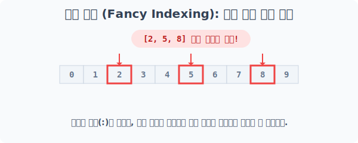
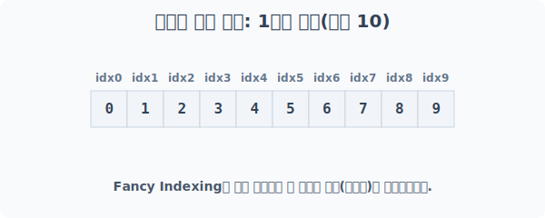

# 4.6.4 배열 색인 (Fancy Indexing)

## 배열 색인(Fancy Indexing) 작전: 다중 타겟 동시 저격
연속된 범위(`:`)를 잘라내는 기본 슬라이싱과 달리, 

**원하는 위치(인덱스)의 번호들만 리스트나 배열 형태로 콕콕 집어 전달**하여 새로운 배열을 조립해 내는 매우 강력한 문법입니다.


> 스나이퍼가 좌표 여러 개를 동시에 하달받아, 여러 위치의 타겟을 한 번에 뽑아내는 것과 같습니다.

---

### [1단계] 기지국 셋업: 1차원 배열 생성
타겟이 될 0부터 9까지의 1차원 배열 기지국을 설치합니다.



```python
import numpy as np

x = np.arange(10)
print("베이스 1차원 배열 x:\n", x)
```
**실행 결과:**
```text
베이스 1차원 배열 x:
 [0 1 2 3 4 5 6 7 8 9]
```

*(참고) 기본적인 단일 요소 추출(`x[1]`)이나 연속 범위 슬라이싱(`x[:5]`)은 이전 장에서 배운 것과 똑같이 작동합니다.*

---

## [2단계] 리스트(List)를 이용한 다중 추출
리스트 형태인 `[2, 3, 5, 8]`를 대괄호 안에 한번 더 씌워 `x[[2, 3, 5, 8]]` 구조로 넘겨주면, 해당 인덱스들의 값만 모아서 새로운 ndarray를 돌려줍니다.



```python
# 단일 타겟을 리스트에 담아 던지기 (반환 타입도 ndarray가 됨)
print("x[[2]] 단일 배열 반환:", x[[2]])

# 2, 3, 5, 8번 첨자를 동시에 타격
print("x[[2, 3, 5, 8]] 다중 추출:", x[[2, 3, 5, 8]])
```
**실행 결과:**
```text
x[[2]] 단일 배열 반환: [2]
x[[2, 3, 5, 8]] 다중 추출: [2 3 5 8]
```
> **주의:** 반환되는 데이터는 원본의 뷰(View)가 아닌 **완전히 새로운 복사본(Copy)** 배열입니다!

---

## [3단계] Numpy 배열(ndarray)을 이용한 다중 타격
파이썬 기본 리스트(`[]`) 대신 Numpy 자체의 `np.array`를 인덱스로 집어넣어 다중 타격을 할 수도 있습니다. 

특히 역순(-1, -2 ...) 기반의 **음수 인덱스도 완벽하게 지원**하며, 전달해 준 배열의 순서 그대로 결과를 조립합니다.


> -4 인덱스는 배열 끝에서 4번째, 즉 (길이 10 - 4 =) 6번 인덱스를 가리킵니다.

```python
# 5번, 3번, 뒤에서 4번째(-4), 8번 타겟을 Numpy 배열 형태로 전달
target_idx = np.array([5, 3, -4, 8])

print("x[np.array([5, 3, -4, 8])] 결과:", x[target_idx])
```
**실행 결과:**
```text
x[np.array([5, 3, -4, 8])] 결과: [5 3 6 8]
```

---

## [주의사항] 범위를 벗어나는 타겟 (IndexError)
배열 색인(Fancy Indexing)은 강력하지만, 원본 배열에 존재하지 않는 인덱스 번호를 저격하려 하면 그 즉시 프로그램이 터집니다.



```python
try:
    # 10번 인덱스 위치는 존재하지 않음 (최대 9번까지)
    error_target = np.array([10])
    print(x[error_target])
except IndexError as e:
    print("❌ 에러 발생 (IndexError):", e)
```
**실행 결과:**
```text
❌ 에러 발생 (IndexError): index 10 is out of bounds for axis 0 with size 10
```
> **꿀팁:** 데이터 범위가 확실치 않을 때는 추출 전에 항상 `x.size`나 통계값으로 타겟 인덱스가 안전한 구간 내에 있는지 검증해야 지뢰를 피할 수 있습니다.
