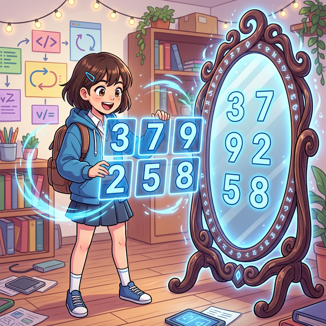

# 4.7.1 배열 형태 변환과 전치(Transpose)



<div style="text-align: center; margin: 30px 0;">
  <!-- SVG 배열 Shape 변환 애니메이션 -->
  <svg width="450" height="280" viewBox="0 0 450 280" xmlns="http://www.w3.org/2000/svg">
    <defs>
      <linearGradient id="gridGrad" x1="0%" y1="0%" x2="100%" y2="100%">
        <stop offset="0%" stop-color="#4fd1c5" />
        <stop offset="100%" stop-color="#319795" />
      </linearGradient>
      
      <filter id="reshapeGlow" x="-20%" y="-20%" width="140%" height="140%">
        <feGaussianBlur stdDeviation="3" result="blur" />
        <feComposite in="SourceGraphic" in2="blur" operator="over" />
      </filter>

      <!-- 화살표 선형 그라데이션 -->
      <linearGradient id="arrowGrad" x1="0%" y1="0%" x2="100%" y2="0%">
        <stop offset="0%" stop-color="#cbd5e0"/>
        <stop offset="50%" stop-color="#a0aec0"/>
        <stop offset="100%" stop-color="#cbd5e0"/>
      </linearGradient>
    </defs>

    <!-- 배경 그리드 장식 -->
    <rect x="0" y="0" width="450" height="280" fill="#f7fafc" rx="8"/>
    <text x="225" y="30" font-family="Arial" font-size="16" font-weight="bold" fill="#4a5568" text-anchor="middle">
      Numpy Reshape: 데이터 메모리 블록 재배치
    </text>

    <!-- 원본 배열 (1D Vector: 1x6) -->
    <g transform="translate(75, 70)">
      <text x="150" y="-15" font-family="monospace" font-size="14" font-weight="bold" fill="#718096" text-anchor="middle">Original 1D Data (size: 6)</text>
      <g stroke="#285e61" stroke-width="2">
        <rect x="0" y="0" width="50" height="40" fill="url(#gridGrad)" rx="3"/>
        <text x="25" y="25" font-family="monospace" font-size="16" fill="white" stroke="none" text-anchor="middle">1</text>
        
        <rect x="50" y="0" width="50" height="40" fill="url(#gridGrad)" rx="3"/>
        <text x="75" y="25" font-family="monospace" font-size="16" fill="white" stroke="none" text-anchor="middle">2</text>
        
        <rect x="100" y="0" width="50" height="40" fill="url(#gridGrad)" rx="3"/>
        <text x="125" y="25" font-family="monospace" font-size="16" fill="white" stroke="none" text-anchor="middle">3</text>
        
        <rect x="150" y="0" width="50" height="40" fill="url(#gridGrad)" rx="3"/>
        <text x="175" y="25" font-family="monospace" font-size="16" fill="white" stroke="none" text-anchor="middle">4</text>
        
        <rect x="200" y="0" width="50" height="40" fill="url(#gridGrad)" rx="3"/>
        <text x="225" y="25" font-family="monospace" font-size="16" fill="white" stroke="none" text-anchor="middle">5</text>
        
        <rect x="250" y="0" width="50" height="40" fill="url(#gridGrad)" rx="3"/>
        <text x="275" y="25" font-family="monospace" font-size="16" fill="white" stroke="none" text-anchor="middle">6</text>
      </g>
    </g>

    <!-- 중앙 변환 애니메이션 파트 -->
    <g transform="translate(195, 120)">
       <path d="M30,0 L30,30 L20,30 L30,45 L40,30 L30,30" fill="url(#arrowGrad)" stroke="#718096"/>
       <!-- 애니메이션 텍스트 교체 -->
       <text x="60" y="25" font-family="monospace" font-size="14" font-weight="bold" fill="#dd6b20" font-style="italic">
         <tspan x="60" dy="0">
           <animate attributeName="opacity" values="1; 1; 0; 0; 1" dur="4s" repeatCount="indefinite" />
           .reshape(2, 3)
         </tspan>
         <tspan x="60" dy="0" opacity="0">
           <animate attributeName="opacity" values="0; 0; 1; 1; 0" dur="4s" repeatCount="indefinite" />
           .reshape(3, 2)
         </tspan>
       </text>
    </g>

    <!-- 결과 배열 뷰 (2x3) -->
    <g transform="translate(40, 180)" filter="url(#reshapeGlow)">
      <!-- 깜빡이는 효과 (Reshape(2,3) 일 때 표시됨) -->
      <animate attributeName="opacity" values="1; 1; 0; 0; 1" dur="4s" repeatCount="indefinite" />
      <text x="75" y="-10" font-family="monospace" font-size="13" font-weight="bold" fill="#2b6cb0" text-anchor="middle">Shape (2, 3)</text>
      
      <g stroke="#2b6cb0" stroke-width="2">
        <rect x="0" y="0" width="50" height="30" fill="#4299e1" rx="2"/>
        <text x="25" y="20" font-family="monospace" font-size="14" fill="white" stroke="none" text-anchor="middle">1</text>
        <rect x="50" y="0" width="50" height="30" fill="#4299e1" rx="2"/>
        <text x="75" y="20" font-family="monospace" font-size="14" fill="white" stroke="none" text-anchor="middle">2</text>
        <rect x="100" y="0" width="50" height="30" fill="#4299e1" rx="2"/>
        <text x="125" y="20" font-family="monospace" font-size="14" fill="white" stroke="none" text-anchor="middle">3</text>
        
        <rect x="0" y="30" width="50" height="30" fill="#4299e1" rx="2"/>
        <text x="25" y="50" font-family="monospace" font-size="14" fill="white" stroke="none" text-anchor="middle">4</text>
        <rect x="50" y="30" width="50" height="30" fill="#4299e1" rx="2"/>
        <text x="75" y="50" font-family="monospace" font-size="14" fill="white" stroke="none" text-anchor="middle">5</text>
        <rect x="100" y="30" width="50" height="30" fill="#4299e1" rx="2"/>
        <text x="125" y="50" font-family="monospace" font-size="14" fill="white" stroke="none" text-anchor="middle">6</text>
      </g>
    </g>

    <!-- 결과 배열 뷰 (3x2) -->
    <g transform="translate(280, 180)" opacity="0" filter="url(#reshapeGlow)">
      <!-- 깜빡이는 효과 (Reshape(3,2) 일 때 표시됨) -->
      <animate attributeName="opacity" values="0; 0; 1; 1; 0" dur="4s" repeatCount="indefinite" />
      <text x="50" y="-10" font-family="monospace" font-size="13" font-weight="bold" fill="#2b6cb0" text-anchor="middle">Shape (3, 2)</text>
      
      <g stroke="#2b6cb0" stroke-width="2">
        <rect x="0" y="0" width="50" height="25" fill="#4299e1" rx="2"/>
        <text x="25" y="18" font-family="monospace" font-size="14" fill="white" stroke="none" text-anchor="middle">1</text>
        <rect x="50" y="0" width="50" height="25" fill="#4299e1" rx="2"/>
        <text x="75" y="18" font-family="monospace" font-size="14" fill="white" stroke="none" text-anchor="middle">2</text>
        
        <rect x="0" y="25" width="50" height="25" fill="#4299e1" rx="2"/>
        <text x="25" y="43" font-family="monospace" font-size="14" fill="white" stroke="none" text-anchor="middle">3</text>
        <rect x="50" y="25" width="50" height="25" fill="#4299e1" rx="2"/>
        <text x="75" y="43" font-family="monospace" font-size="14" fill="white" stroke="none" text-anchor="middle">4</text>

        <rect x="0" y="50" width="50" height="25" fill="#4299e1" rx="2"/>
        <text x="25" y="68" font-family="monospace" font-size="14" fill="white" stroke="none" text-anchor="middle">5</text>
        <rect x="50" y="50" width="50" height="25" fill="#4299e1" rx="2"/>
        <text x="75" y="68" font-family="monospace" font-size="14" fill="white" stroke="none" text-anchor="middle">6</text>
      </g>
    </g>
    
    <!-- 하단 설명 텍스트 -->
    <text x="225" y="270" font-family="Arial" font-size="12" fill="#718096" text-anchor="middle">
      메모리상의 데이터는 그대로 둔 채, 읽는 방식(View)만 바꿔 배열의 형태(Shape)를 레고 블록처럼 자유자재로 변경합니다.
    </text>

  </svg>
  <p style="color: #718096; font-size: 0.9em; margin-top: -10px;"><em>[그림] 원본 데이터 복사본 생성 없이 형태만 꺾어 보여주는 마법 거울 (Reshape View)</em></p>
</div>

## 4.7.1 배열 형태 수정

## ① 1차원 배열로 만드는 ravel()

`ndarray.ravel()`: 다차원 배열을 1차원으로 평탄화합니다.

```python
a = np.arange(12).reshape(2, 3, 2)
a
```
**출력:**
```
array([[[ 0,  1],
        [ 2,  3],
        [ 4,  5]],

       [[ 6,  7],
        [ 8,  9],
        [10, 11]]])
```

행렬인 `a`에서 `a.ravel()`의 반환 값은 `(a.size,)` 모양의 1차원 배열이다. 다음 코드로 (12,)인 1차원 배열이 반환된다.

```python
a.ravel()
```
**출력:**
```
array([ 0,  1,  2,  3,  4,  5,  6,  7,  8,  9, 10, 11])
```

## ② np.transpose(a)와 a.T (전치 행렬)

**[수학적 의미: 대각선(Diagonal) 기준 거울 반사]**
선형대수학에서 행렬의 오른쪽 위에서 왼쪽 아래로 내려오는 대각선을 기준으로 데칼코마니처럼 종이를 접어 맞은편 숫자의 위치를 강제로 뒤바꾸는 연산을 **전치 행렬(Transpose Matrix)**이라고 부릅니다. 가로축(행)이 그대로 세로축(열)으로 변신하는 거울 마법입니다. 기하학적으로는 기준축이 X축에서 Y축으로 완전히 돌아가는 위상 변동을 의미합니다.

**[Numpy 강림: .T 속성]**
`np.transpose()` 함수나 파이썬 객체 지향의 극치인 1글자 속성 `.T`를 호출하면, 복잡한 반복문 없이 곧바로 가로와 세로 배열 구조가 통째로 거울 반사되어 튀어나옵니다.

다음 코드로 모양 (2, 3)인 2차원 배열 `a`가 생성된다.

```python
a = np.arange(1, 7).reshape(2, 3)
a
```
**출력:**
```
array([[1, 2, 3],
       [4, 5, 6]])
```

다음 3가지 방법으로 행렬 `a`의 전치 행렬을 구할 수 있다.

```python
np.transpose(a)
```
**출력:**
```
array([[1, 4],
       [2, 5],
       [3, 6]])
```

```python
a.transpose()
```
**출력:**
```
array([[1, 4],
       [2, 5],
       [3, 6]])
```

```python
a.T
```
**출력:**
```
array([[1, 4],
       [2, 5],
       [3, 6]])
```

`np.transpose(a, axes)`에서 `transpose()` 함수는 옵션인 두 번째 인자가 있다. 매개변수 `axes`가 지정된 경우 `[0, 1, ..., N-1]`처럼 축의 순서를 바꾼 튜플 또는 리스트여야 한다. `N`은 `a`의 축(axes) 수이다.

지정하지 않으면 기본값은 `range(a.ndim)[::-1]`로 모든 축의 순서가 바뀐다.

다음 코드처럼 `np.transpose(a, (0, 1))`는 원래의 행렬 `a`가 그대로 출력된다. 2차원 배열에서는 `np.transpose(a, (1, 0))`으로 전치 행렬을 반환받을 수 있다.

```python
np.transpose(a, (0, 1))
```
**출력:**
```
array([[1, 2, 3],
       [4, 5, 6]])
```

```python
np.transpose(a, (1, 0))
```
**출력:**
```
array([[1, 4],
       [2, 5],
       [3, 6]])
```

다음 배열 `b`는 모양 (3, 2, 2)인 3차원 배열이다.

```python
b = np.arange(1, 13).reshape(3, 2, 2)
b
```
**출력:**
```
array([[[ 1,  2],
        [ 3,  4]],

       [[ 5,  6],
        [ 7,  8]],

       [[ 9, 10],
        [11, 12]]])
```

`ndarray.T`는 전치 행렬을 반환한다. 3차원에서의 기본적인 전치 행렬은 축 `i, j, k`가 순서가 바뀐 `(k, j, i)`가 된다.

```python
b.T
```
**출력:**
```
array([[[ 1,  5,  9],
        [ 3,  7, 11]],

       [[ 2,  6, 10],
        [ 4,  8, 12]]])
```

다음 `np.transpose(b, (0, 1, 2))` 호출로 원래의 3차원 행렬 `b`가 그대로 출력된다. 두 번째 인자가 `(0, 1, 2)`이기 때문이다.

```python
np.transpose(b, (0, 1, 2))
```
**출력:**
```
array([[[ 1,  2],
        [ 3,  4]],

       [[ 5,  6],
        [ 7,  8]],

       [[ 9, 10],
        [11, 12]]])
```

다음처럼 두 번째 인자를 `(2, 1, 0)`으로 호출하면 `b.T`와 같은 전치 행렬을 얻을 수 있다.

```python
np.transpose(b, (2, 1, 0))
```
**출력:**
```
array([[[ 1,  5,  9],
        [ 3,  7, 11]],

       [[ 2,  6, 10],
        [ 4,  8, 12]]])
```

함수 `np.transpose(a, axes)`에서 매개변수 `axes`의 기술 방법은 3차원 행렬에서는 다음 6가지 방식이 있을 수 있다.

| axes 기술 종류 | 비고           |
| :------------- | :------------- |
| `(0, 1, 2)`    | 원 행렬        |
| `(0, 2, 1)`    |                |
| `(1, 0, 2)`    |                |
| `(1, 2, 0)`    |                |
| `(2, 0, 1)`    |                |
| `(2, 1, 0)`    | 기본 전치 행렬 |

다음은 3차원 행렬 `b`에서 1축과 2축을 서로 바꾼 전치 행렬의 결과이다.

```python
np.transpose(b, (0, 2, 1))
```
**출력:**
```
array([[[ 1,  3],
        [ 2,  4]],

       [[ 5,  7],
        [ 6,  8]],

       [[ 9, 11],
        [10, 12]]])
```

다음은 모양 (2, 2, 3)의 3차원 배열 `c`이다.

```python
c = np.arange(1, 13).reshape(2, 2, 3)
c
```
**출력:**
```
array([[[ 1,  2,  3],
        [ 4,  5,  6]],

       [[ 7,  8,  9],
        [10, 11, 12]]])
```

함수 `c.transpose((1, 2, 0))`으로 배열 `c`를 축 `(1, 2, 0)`으로 transpose하면 다음과 같이 모양 (2, 3, 2)인 결과를 보인다.

```python
c.transpose((1, 2, 0))
```
**출력:**
```
array([[[ 1,  7],
        [ 2,  8],
        [ 3,  9]],

       [[ 4, 10],
        [ 5, 11],
        [ 6, 12]]])
```

## ③ np.swapaxes()

함수 `np.swapaxes(a, axis1, axis2)`는 배열 `a`에서 `axis1`과 `axis2`를 서로 교환한 배열의 뷰(view)를 반환한다. 함수 `np.swapaxes()`는 두 축만 교환하므로 그 기능이 `np.transpose()`의 부분적이다. 또한, 함수 `np.swapaxes()`는 새로운 배열을 생성하지 않고 뷰만 반환하므로 뷰를 수정해도 원본 배열에 반영된다는 점에 주의하자.

다음 배열 `x`는 모양 (1, 3)의 2차원 배열이다.

```python
x = np.array([[7, 8, 9]])
x
```
**출력:**
```
array([[7, 8, 9]])
```

다음 함수 호출로 0축과 1축이 교환된 배열 뷰가 반환된다.

```python
y = np.swapaxes(x, 0, 1)
y
```
**출력:**
```
array([[7],
       [8],
       [9]])
```

다음 코드로 뷰의 위치 (0, 0)을 수정하면 원본 배열 `x`에도 반영된다.

```python
y[0, 0] = 10
x
```
**출력:**
```
array([[10,  8,  9]])
```

다음 코드로 모양 (2, 2, 2)인 3차원 배열 `x`를 얻는다.

```python
x = np.arange(8).reshape(2, 2, 2)
x
```
**출력:**
```
array([[[0, 1],
        [2, 3]],

       [[4, 5],
        [6, 7]]])
```

다음 `np.swapaxes(x, 0, 2)` 함수 호출로 축 0과 축 2를 서로 바꾼다.

```python
np.swapaxes(x, 0, 2)
```
**출력:**
```
array([[[0, 4],
        [2, 6]],

       [[1, 5],
        [3, 7]]])
```

다음 `np.transpose(x, (2, 1, 0))` 함수 호출로도 위와 같은 기능을 수행한다.

```python
np.transpose(x, (2, 1, 0))
```
**출력:**
```
array([[[0, 4],
        [2, 6]],

       [[1, 5],
        [3, 7]]])
```
