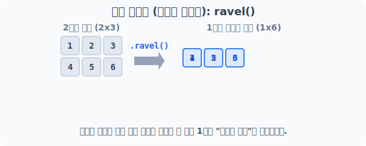

# 4.7.1 배열 자르고 펴기 (Reshape & Ravel)

데이터 수집이 끝나면, 기계학습 모델이 요구하는 입력 형태로 데이터를 구부리고 펴야 합니다. 

넘파이는 **메모리(RAM)상의 실제 데이터 배열을 직접 복사하지 않고**, 단순히 데이터를 바라보는 "시각(Shape View)"만 바꿔주는 마법의 렌즈를 제공합니다.


> [그림] 원본 데이터 복사본 생성 없이 형태만 꺾어 보여주는 마법 거울 (Reshape View)

---

## [1단계] 다차원 건물 허물기: ravel() (평탄화)

상자 안의 상자, 겹겹이 쌓인 다차원 배열을 단번에 1차원 직선 데이터로 주욱 펴주는 평탄화 기술입니다. 

기계학습에서 이미지(2D) 데이터를 신경망(1D)에 집어넣기 위해 바닥부터 공구리 치듯 평탄화 작업을 할 때 가장 많이 사용됩니다.


> 2층짜리 건물을 허물어 1차원의 평평한 바닥으로 재배치합니다.

```python
import numpy as np

# (2, 3) 모양의 2차원 건물 배열 생성
a = np.arange(1, 7).reshape(2, 3)
print("원본 2차원 배열 a:\n", a)
```
**실행 결과:**
```text
원본 2차원 배열 a:
 [[1 2 3]
  [4 5 6]]
```

행렬 `a`에 `.ravel()`을 호출하면, 다차원의 장벽이 모두 무너지고 `size`만큼의 길이를 가진 한 줄짜리 **1차원 배열**이 반환됩니다.

```python
# 다차원 벽을 모두 허물고 1차원으로 주욱 펴기
print("평탄화 배열:", a.ravel())
```
**실행 결과:**
```text
평탄화 배열: [1 2 3 4 5 6]
```
