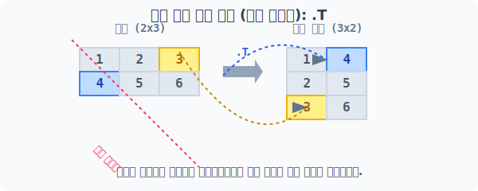
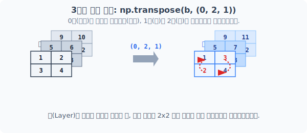
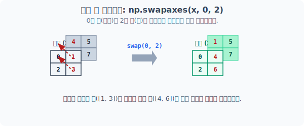

# 4.7.2 대칭 반전과 축 교환 (Transpose & Swapaxes)

## [1단계] 데칼코마니 대칭 거울: np.transpose() 와 .T

**[비유로 이해하기: 대각선(Diagonal) 기준 거울 반사]**

선형대수학에서 행렬의 왼쪽 위에서 오른쪽 아래로 떨어지는 대각선(`\`)을 거울축으로 삼아 종이를 데칼코마니처럼 접습니다. 

맞은편 숫자의 위치가 강제로 맞바뀌는 마법으로, 가로축(행)이 그대로 세로축(열)으로 변신하는 전치 행렬(Transpose Matrix) 연산입니다.

### 1. 2차원 배열의 전치 (행과 열 뒤집기)


> 2x3 배열이 대각선을 축으로 회전하여 3x2 배열로 탈바꿈합니다.

> `np.transpose()` 함수나 파이썬 객체 지향의 극치인 1글자 속성 `.T`를 호출하면, 복잡한 2중 반복문 없이 곧바로 배열 구조 전체가 통째로 대칭 반전됩니다.

```python
import numpy as np

a = np.arange(1, 7).reshape(2, 3)
print("원본 2x3 배열 a:\n", a)

# 다음 3가지 방법은 모두 똑같이 2x3 배열을 3x2 배열로 단번에 뒤집습니다.
print("\nnp.transpose(a) 결과:\n", np.transpose(a))
print("\na.transpose() 결과:\n", a.transpose())
print("\na.T 속성 직접 접근 결과:\n", a.T)
```
**실행 결과:**
```text
원본 2x3 배열 a:
 [[1 2 3]
  [4 5 6]]

np.transpose(a) 결과:
 [[1 4]
  [2 5]
  [3 6]]
```

### 2. 3차원 고차원 배열의 축(Axes) 제어 전치

3차원 배열의 `전치(Transpose)`는 단면 거울 반사를 넘어 큐브(공간) 축 자체를 뜯어고쳐 회전시켜버리는 작업입니다. 기본적으로 `.T`는 (깊이, 행, 열) -> (열, 행, 깊이) 순서로 완전히 뒤집습니다.

`np.transpose(a, axes)`를 사용할 때 넘겨주는 `axes` 튜플 파라미터로 "어떤 차원 축을 몇 번째로 보낼지" 미로 퍼즐 풀듯 세밀하게 조작할 수 있습니다.



```python
# (3, 2, 2) 모양의 3차원 배열
b = np.arange(1, 13).reshape(3, 2, 2)

# 기본 전치 연산 (원래 (0, 1, 2) 였던 3차원 축을 (2, 1, 0) 역순으로 완전 반전)
print("3차원 배열 기본 전치(b.T):\n", b.T)

# 축 순서를 세밀하게 직접 제어 (깊이 0축과 열 2축만 서로 맞바꿈)
print("\nnp.transpose(b, (0, 2, 1)) 결과:\n", np.transpose(b, (0, 2, 1)))
```

| axes 축 제어 종류 | 설명 |
| :--- | :--- |
| `(0, 1, 2)` | 원본 형태 보존 (아무것도 섞지 않고 그대로 유지) |
| `(0, 2, 1)` | 1번 축(행)과 2번 축(열)만 위치 교환 |
| `(2, 1, 0)` | 기본 `.T` 연산 (완전 거울 반전) |

---

## [2단계] 콕 집어 두 축만 강제 교환: np.swapaxes()

3차원 이상의 고차원 배열에서 `np.transpose`의 튜플 `axes` 옵션을 사용해 도미노처럼 축 전체를 돌리는 것은 초보자에게 너무 헷갈립니다. 

"그냥 0번 축하고 2번 축 딱 2개만 콕 집어서 서로 맞바꿔줘!"라고 직관적으로 타겟팅할 때 사용하는 전용 함수가 바로 `np.swapaxes(배열, 축1, 축2)`입니다.


> 지정된 2개의 차원 축 평면만 서로 위치가 스위칭되어 데이터 구조가 뒤섞입니다.

```python
# (2, 2, 2) 모양 3차원 배열
x = np.arange(8).reshape(2, 2, 2)

# 전체 축을 복잡하게 인덱싱하여 돌릴 필요 없이, 0축(깊이)과 2축(열)만 서로 쏙 잡아서 바꿉니다.
print("축 교환 결과:\n", np.swapaxes(x, 0, 2))
```
**실행 결과:**
```text
축 교환 결과:
 [[[0 4]
  [2 6]]

 [[1 5]
  [3 7]]]
```
> **⚠️ 뷰(View) 교체 주의보**: `ravel()`, `transpose()`, `swapaxes()` 함수들은 모두 원본 배열 공간의 복사본(Copy) 데이터를 새로 만들지 않습니다! 오직 데이터 접근 순서표만을 재작성하여 **거울에 비친 뷰(View 방식)**만 반환함으로써 속도를 극한으로 끌어올립니다. 따라서 반환된 바뀐 배열 모양의 특정 값을 수정하면, 언제나 **원본 배열의 같은 메모리 주소값도 함께 엎어 쳐져 조작된다**는 사실을 명심하세요!
