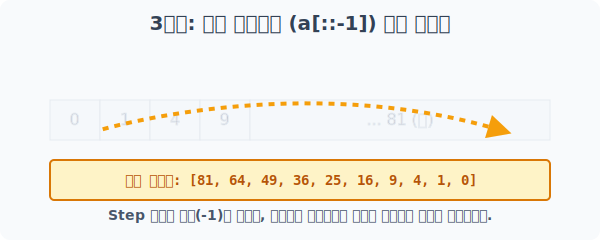
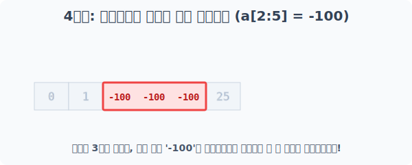

# 4.7.1 1차원 배열의 첨자와 슬라이싱


> **[그림] 방대한 데이터 블록에서 원하는 구역만 레이저로 정밀 절단하는 슬라이싱 기술**

## 데이터 추출 작전: 1차원 슬라이싱 5단계


### 1차원 배열 생성
실습을 위해 0부터 9까지의 숫자를 제곱한 10칸 짜리 1차원 배열(줄자) `a`를 생성하겠습니다.

```python
import numpy as np

# 0제곱부터 9제곱까지 10개의 숫자 생성
a = np.power(np.arange(10), 2)
print("베이스 1차원 배열 a:\n", a)
```
**출력:**
```text
베이스 1차원 배열 a:
 [ 0  1  4  9 16 25 36 49 64 81]
```

---

## [1단계] 단건 저격: 단일 요소 인덱싱
0부터 시작하는 '정향(Positive)' 위치 번호와, **맨 뒤에서부터 -1로 시작하는 '역방향(Negative)'** 위치 번호를 사용해 특정 데이터를 정확히 저격하여 뽑아낼 수 있습니다.


> 좌측에서는 0, 1, 2, 3.. 순으로 세고, 우측에서는 -1, -2, -3.. 순으로 거꾸로 셉니다.

```python
# 앞에서 4번째 데이터 (인덱스 3)
print("a[3]의 값:", a[3])

# 뒤에서 2번째 데이터 (인덱스 -2)
print("a[-2]의 값:", a[-2])
```
**실행 결과:**
```text
a[3]의 값: 9
a[-2]의 값: 64
```

---

## [2단계] 레이저 커팅: 범위를 끊어내는 부분 슬라이싱
연속된 구간을 칼로 도려내듯 추출하는 방법입니다. 

`[시작(Start) : 끝(Stop)]` 형식을 사용하며, 항상 **Stop 번호 직전(-1)**까지만 잘린다는 점을 주의해야 합니다.


> 시작점부터 자르고, 끝점은 '그 앞까지만' 도려내어 뿅! 들어올립니다.

```python
# 인덱스 1부터 3(4의 앞)까지 잘라내기
slice1 = a[1:4]
print("a[1:4] 결과:", slice1)

# 뒤에서 5번째부터 뒤에서 2번째(-1의 앞)까지 잘라내기
slice2 = a[-5:-1]
print("a[-5:-1] 결과:", slice2)
```
**실행 결과:**
```text
a[1:4] 결과: [1 4 9]
a[-5:-1] 결과: [25 36 49 64]
```

---

## 💡 잠깐! 콜론 1개(`:`)와 2개(`::`)의 결정적 차이

슬라이싱의 기저에 깔려 있는 완전한 3단 공식은 **`[시작(start) : 끝(stop) : 간격(step)]`** 입니다. 이 공식에서 콜론의 개수에 따라 의미가 크게 달라집니다.

* **`[start:stop]` (콜론 1개)**: 오직 시작점과 끝점 범위만 지정할 때 씁니다. 이 경우 세 번째 값인 간격(step)은 적지 않은 것이며, 기본값인 **'1칸씩 전진(+1)'**이 자동 적용됩니다.
* **`[::step]` (콜론 2개)**: 가운데에 적어야 할 시작점과 끝점을 **모두 생략(비워둠)**하고, 두 번째 콜론을 바로 써서 간격(step) 구역으로 워프하겠다는 뜻입니다. 시작과 끝을 비워두었으므로 **"처음부터 끝까지 전체 구역"**이라는 범위가 내부적으로 자동 적용됩니다.

---

## [3단계] 거울 뒤집기: 간격(Step)과 역순 슬라이싱
기본 커팅 뒤에 간격(Step)을 지시해 봅시다. 

만약 `Step` 자리에 음수(`-`)를 넣으면 배열이 우로 향하지 않고 좌로 역진격합니다. 

특히 앞서 배운 콜론 2개 문법을 활용하여 `[::-1]` 이라고 입력하면, "시작과 끝 범위 지정은 생략할 테니(::) 처음부터 끝까지 모조리 역방향(-1)으로 훑어라!" 라는 강력한 배열 뒤집기 특수키가 됩니다.


> Step에 -1이 붙는 순간, 칼날이 역방향으로 향하며 거울처럼 데이터가 뒤집힙니다.

```python
# 8번 위치에서 시작해 3번(2 전)까지 역순으로 1칸씩!
print("a[8:2:-1] 역진격 결과:", a[8:2:-1])

# 시작과 끝 생략(전체) + 역방향(-1) = 전체 배열 뒤집기!
print("a[::-1] 전체 역순 결과:", a[::-1])

# 간격을 두 칸씩 띄워서 역방향으로 징검다리 뛰기
print("a[::-2] 두 칸씩 역순 결과:", a[::-2])
```
**실행 결과:**
```text
a[8:2:-1] 역진격 결과: [64 49 36 25 16  9]
a[::-1] 전체 역순 결과: [81 64 49 36 25 16  9  4  1  0]
a[::-2] 두 칸씩 역순 결과: [81 49 25  9  1]
```

---

## [4단계] 데이터 갈아끼우기: 슬라이싱 구역 덮어쓰기
잘라낸 구역에 `=` 기호를 써서 새로운 데이터를 주입할 수 있습니다. 

스칼라 값을 넣으면 구역 전체에 **브로드캐스팅(동일하게 복제)**되고, 구역과 길이가 똑같은 리스트를 넣으면 **1:1로 정확하게 덮어쓰기** 됩니다.


> 방금 잘라낸 빈 3칸의 구역에, 단일 스칼라 -100 이 스스로를 3개로 확장(Broadcast)하여 일괄적으로 꽂힙니다.

```python
# [단일 값 브로드캐스팅 덮어쓰기]
# 인덱스 2~4 구역(총 3칸)에 -100을 복제하여 쑤셔 넣습니다.
a[2:5] = -100
print("스칼라 덮어쓰기 후 a:\n", a)

# [정확한 개수의 배열 덮어쓰기]
# 총 3칸의 구역이므로, 3칸짜리 리스트를 넣으면 에러 없이 각자 들어갑니다.
a[2:5] = [-5, -5, -5]
print("1:1 배열 덮어쓰기 후 a:\n", a)
```
**실행 결과:**
```text
스칼라 덮어쓰기 후 a:
 [   0    1 -100 -100 -100   25   36   49   64   81]
1:1 배열 덮어쓰기 후 a:
 [ 0  1 -5 -5 -5 25 36 49 64 81]
```

## 🚨 [주의] 형태 파괴: 크기 불일치 에러 (ValueError)
만약 잘라낸 공간은 3칸인데, 집어넣으려는 데이터가 딱 1개(스칼라)도 아니고, 3개(완전 일치)도 아닌 어중간한 상태라면 어떻게 될까요? Numpy는 어찌해야 할지 몰라 충돌을 일으키며 작동을 거부합니다.


> 공간은 3개가 뚫려있는데, 대입하려는 박스는 2개뿐이라 공간이 1개 남습니다. Numpy는 이런 애매한 핏(Fit)을 결코 용납하지 않습니다!

```python
try:
    # 3칸의 공간(인덱스 2~4)에 2칸짜리 블록을 욱여넣으려 시도
    a[2:5] = [-5, -5] 
except ValueError as e:
    print("🚨 공간 크기 오류 발생:", e)
```
**실행 결과:**
```text
🚨 공간 크기 오류 발생: could not broadcast input array from shape (2,) into shape (3,)
```
> 영문 에러 메시지를 직역하면 "2번째 모양(2,)을 3번째 모양(3,) 공간으로 억지로 잡아늘릴(broadcast) 수 없어!" 라는 뜻입니다.

---

## [5단계] 징검다리 덮어쓰기 심화
마지막으로 `[::2]` (두 칸씩 건너뛰기) 슬라이싱과 조합하여 짝수 인덱스 자리들만 골라 지뢰를 심듯 데이터를 갈아끼울 수도 있습니다.


> 토끼뜀을 뛰며 지나간 자리(0, 2, 4, 6, 8 위치)에만 타겟팅 포커스가 맞춰져 일괄 교체됩니다.

```python
# 모두 5로 채워진 길이가 10인 배열 b 생성
b = np.array([5] * 10)

# 두 칸 간격(0, 2, 4, 6, 8 위치)으로 -10을 스칼라 브로드캐스팅!
b[::2] = -10
print("짝수 간격에 -10 지뢰 심기 결과:\n", b)

# 똑같이 두 칸 간격(총 5자리)에, 길이가 5인 새로운 배열을 1:1 매핑시켜 덮어쓰기!
b[::2] = np.arange(5) # [0, 1, 2, 3, 4]
print("짝수 간격에 1:1 순차적 숫자 심기 결과:\n", b)
```
**실행 결과:**
```text
짝수 간격에 -10 지뢰 심기 결과:
 [-10   5 -10   5 -10   5 -10   5 -10   5]
짝수 간격에 1:1 순차적 숫자 심기 결과:
 [0 5 1 5 2 5 3 5 4 5]
```
