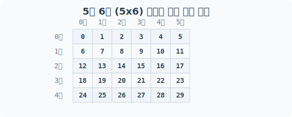

# 4.7.2 2차원 배열의 첨자와 슬라이싱

## 예시로 이해하기


**[비유로 이해하기: 색종이 오리기]**
행(가로)과 열(세로) 범위를 동시에 지정하여, 거대한 원본 공간에서 사각형 모양의 조각을 떼어냅니다. (데이터는 복사되지 않고 참조 뷰(View)를 제공합니다.)

**[실전 꿀팁]: 문제집(X)과 정답지(y) 나누기**
보통 엑셀 파일 형식의 데이터에서 맨 마지막 열이 '결과값(정답)'인 경우가 많습니다. `a[:, :-1]`은 결과값을 제외한 전체 문제집(입력 데이터) 영역을 가져오며, `a[:, -1]`은 맨 끝줄 정답값 부분만 별도로 추출해 줍니다.


> **[그림] 데이터프레임의 마지막 열(정답지 y)을 오려내는 데이터 분리 실전 스킬**


---


## [1단계] 아파트 뼈대 구성: 2차원 배열 생성
실습을 위해 0부터 29까지의 숫자가 순서대로 들어간 **5층(행) x 6호(열)** 형태의 2차원 공간 `a`를 만듭니다.



```python
import numpy as np

# 0~29까지 30개 숫자를 5행 6열 2차원 배열로 구조화
a = np.arange(30).reshape(5, 6)
print("베이스 2차원 배열 a:\n", a)
```
**실행 결과:**
```text
베이스 2차원 배열 a:
 [[ 0  1  2  3  4  5]
  [ 6  7  8  9 10 11]
  [12 13 14 15 16 17]
  [18 19 20 21 22 23]
  [24 25 26 27 28 29]]
```

---

## [2단계] 통째로 꺼내기: 특정 행(Row) 단일 인덱싱
2차원 배열에서 숫자 하나만 넣으면(예: `a[3]`), 이는 "3층 통째로 가져와!"라는 의미입니다. 

즉, 가로줄 전체가 하나의 1차원 배열로 끌려 나옵니다.



```python
# 위에서부터 4번째 줄(인덱스 3) 통째로 추출
print("a[3] 행 추출:\n", a[3])

# 맨 아랫줄(인덱스 -1) 통째로 추출
print("a[-1] 행 추출:\n", a[-1])

# 콤마 뒤의 열(Col) 표시를 ':' 형태로 생략해도 첫 번째 축인 행(Row)으로 간주합니다.
print("a[-2, :] 행 추출:\n", a[-2, :])
```
**실행 결과:**
```text
a[3] 행 추출:
 [18 19 20 21 22 23]
a[-1] 행 추출:
 [24 25 26 27 28 29]
a[-2, :] 행 추출:
 [18 19 20 21 22 23]
```

---

## [3단계] 수평 자르기: 행(Row) 범위 슬라이싱
이번엔 단일 층이 아니라, 범위를 지정하여 **여러 층**을 한 번에 뽑아내 블록을 만듭니다. 여전히 반환값은 2차원입니다.



```python
# 2번 줄부터 4번 줄 앞(3번)까지 2개 층 도려내기
print("a[2:4] 행 범위 추출:\n", a[2:4])

# 1번 줄부터 5번 줄 앞(4번)까지 2계단씩 토끼뜀 (징검다리 층 추출)
print("a[1:5:2] 징검다리 행 추출:\n", a[1:5:2])
```
**실행 결과:**
```text
a[2:4] 행 범위 추출:
 [[12 13 14 15 16 17]
  [18 19 20 21 22 23]]
a[1:5:2] 징검다리 행 추출:
 [[ 6  7  8  9 10 11]
  [18 19 20 21 22 23]]
```

---

## [4단계] 수직 자르기: 열(Col) 범위 슬라이싱
기존 리스트에서는 불가능하지만 Numpy에서만 가능한 강력한 기능입니다! 

**콤마(,) 앞부분(행)은 `:`을 써서 "전부 통과" 시키고, 콤마 뒷부분(열)에만 슬라이싱**을 걸어주면 세로 막대기 형태로 데이터를 추출할 수 있습니다.



```python
# 행(:)은 전부 가져오고, 열은 1번(두 번째) 세로 막대기 1개만 추출 (반환은 1차원)
print("a[:, 1] 단일 세로줄 추출:\n", a[:, 1])

# 행(:)은 전부 가져오고, 열은 1번열부터 6번열 앞(5번)까지 추출 (반환은 2차원)
print("a[:, 1:6] 세로 구역 추출:\n", a[:, 1:6])

# 행은 전부, 열은 처음부터 끝까지 2칸 간격(::2)으로 추출
print("a[:, ::2] 징검다리 세로 구역 추출:\n", a[:, ::2])
```
**실행 결과:**
```text
a[:, 1] 단일 세로줄 추출:
 [ 1  7 13 19 25]
a[:, 1:6] 세로 구역 추출:
 [[ 1  2  3  4  5]
  [ 7  8  9 10 11]
  [13 14 15 16 17]
  [19 20 21 22 23]
  [25 26 27 28 29]]
a[:, ::2] 징검다리 세로 구역 추출:
 [[ 0  2  4]
  [ 6  8 10]
  [12 14 16]
  [18 20 22]
  [24 26 28]]
```

---

## [5단계] 정밀 타격: 개별 요소 1개 저격
과녁의 X축과 Y축 좌표를 찍어 단 하나의 셀 값을 정확히 뽑아냅니다. 

파이썬 기본 리스트 방식(`[ ][ ]`)도 동작하지만, Numpy 최적화 문법인 콤마 분리(`[ , ]`) 사용을 적극 권장합니다.



```python
# 2행(Row) 내부의 4열(Col)을 단일 저격
print("Numpy 표준 타격 (a[2, 4]):", a[2, 4])

# 파이썬 리스트 체인 방식 (가능하지만 Numpy에서는 살짝 비효율적임)
print("파이썬 구형 타격 (a[2][4]):", a[2][4])
```
**실행 결과:**
```text
Numpy 표준 타격 (a[2, 4]): 16
파이썬 구형 타격 (a[2][4]): 16
```

---

## [6단계] 십자 교차 커팅: 2차원 부분 범위 추출
행과 열 모두에 강력한 범위를 지정하면, **가로 레이저와 세로 레이저가 지나가며 교차되는 부분 사각형** 블록만 떼어낼 수 있습니다.


> 행은 1~2, 열은 2~4 영역이 겹치는 부위만 직사각형(2x3) 형태로 떨어져 나옵니다.

```python
# Row: 1~2행 레이저 컷팅
# Col: 2~4열 레이저 컷팅
# 둘의 교집합인 사각형 모델(2x3) 뷰 리턴
cross_section = a[1:3, 2:5]

print("a[1:3, 2:5] 십자 커팅 결과:\n", cross_section)
```
**실행 결과:**
```text
a[1:3, 2:5] 십자 커팅 결과:
 [[ 8  9 10]
  [14 15 16]]
```

---

## [7단계] 매트릭스 리버스: 2차원 전체 역순 뒤집기
1차원에서 배열 전체를 뒤집었던 강력한 치트키 `[::-1]`을 콤마(,) 전후로 연달아 2번 적용하면? **상하좌우가 모두 뒤바뀐 완전 역방향 매트릭스**가 생성됩니다.


> 상하좌우가 모두 뒤집히면, 원본이 거울처럼 좌우, 상하로 반전된 것과 완전히 동일한 결과가 도출됩니다.

```python
# 행도 역순(아래에서 위로), 열도 역순(우측에서 좌측으로)!
reverse_matrix = a[::-1, ::-1]

print("상하좌우 리버스 매트릭스:\n", reverse_matrix)
```
**실행 결과:**
```text
상하좌우 리버스 매트릭스:
 [[29 28 27 26 25 24]
  [23 22 21 20 19 18]
  [17 16 15 14 13 12]
  [11 10  9  8  7  6]
  [ 5  4  3  2  1  0]]
```
