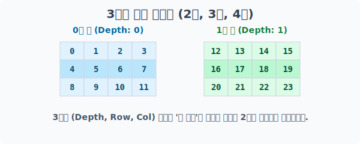
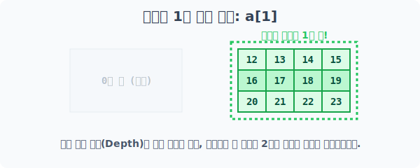
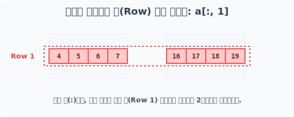
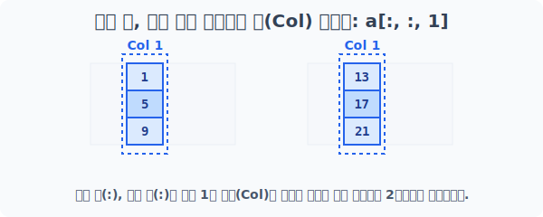
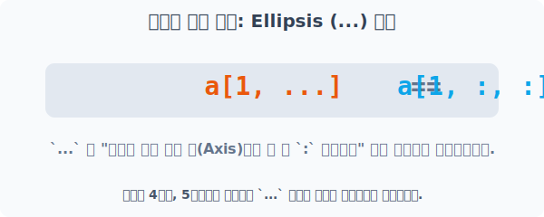

# 4.7.3 3차원 배열의 첨자와 슬라이싱


## [1단계] 아파트 단지 건설: 3차원 배열 생성
3차원 배열은 `(Depth, Row, Col)` 즉, **(동, 층, 호)** 개념으로 접근하면 가장 이해하기 쉽습니다. 

모양(Shape)이 `(2, 3, 4)`인 3차원 배열은 **"3층 4호짜리 건물이 총 2개 동"** 모여있는 아파트 단지라고 상상해 보세요.


> 0번 동(2차원 블록)과 1번 동(2차원 블록)이 나란히 서 있는 거대한 3차원 단지입니다.

```python
import numpy as np

# 0~23까지 24개의 숫자로 (2동, 3층, 4호) 3차원 배열 생성
a = np.arange(24).reshape(2, 3, 4)
print("베이스 3차원 배열 a:\n", a)
```
**실행 결과:**
```text
베이스 3차원 배열 a:
 [[[ 0  1  2  3]
   [ 4  5  6  7]
   [ 8  9 10 11]]

  [[12 13 14 15]
   [16 17 18 19]
   [20 21 22 23]]]
```

---

## [2단계] 동(단지) 추출: 가장 바깥쪽 축 (Depth)
가장 바깥쪽 괄호이자 첫 번째 축(`axis=0`)은 "동(건물)"을 의미합니다. 

숫자 하나만 입력하면 해당 건물을 완전히 통째로 들어 올립니다.



```python
# 1번 동(두 번째 건물) 전체 추출
# 반환되는 결과는 1번 동 파편인 2차원 배열 (3, 4) 입니다.
print("a[1] 1번 동 추출:\n", a[1])
```
**실행 결과:**
```text
a[1] 1번 동 추출:
 [[12 13 14 15]
  [16 17 18 19]
  [20 21 22 23]]
```

---

## [3단계] 층(Row) 관통 추출: 중간 축
첫 번째 축(동)은 `:` 처리하여 모든 건물을 통과시키고, 

두 번째 축(층)에 번호를 지정하면 **모든 건물의 똑같은 층을 관통하는 가로 레이저**가 발사됩니다.

```
a[:, 층]
```



> 0번 동과 1번 동을 모두 뚫고 지나가며, 각 건물의 1번 층 데이터만 뽑아 새로운 2차원 배열로 반환합니다.

```python
# 모든 동(:)에서, 1번 층(두 번째 가로줄) 데이터만 추출
print("a[:, 1] 층 관통 추출:\n", a[:, 1])
```
**실행 결과:**
```text
a[:, 1] 층 관통 추출:
 [[ 4  5  6  7]
  [16 17 18 19]]
```

---

## [4단계] 호(Col) 관통 추출: 가장 안쪽 축
가장 안쪽 축(`axis=2` 혹은 열/호수)까지 도달하려면 콤마를 2개 찍어 진입해야 합니다. 

동과 층을 모두 열어두고 호수만 지정하면, 위에서 아래로 떨어지는 **수직(Col) 관통 레이저**가 발사됩니다.

```
a[:, :, 호]
```



```python
# 모든 동(:), 모든 층(:)에서 1번 호수(두 번째 세로줄) 데이터만 추출
print("a[:, :, 1] 호수 관통 추출:\n", a[:, :, 1])
```
**실행 결과:**
```text
a[:, :, 1] 호수 관통 추출:
 [[ 1  5  9]
  [13 17 21]]
```

---

## [5단계] 줄임표(...)를 활용한 스마트 차원 생략
딥러닝이나 이미지 처리에서 차원이 4차원, 5차원 이상으로 늘어날 때, 매번 `:, :, :, :, 1` 처럼 콜론을 무한정 찍는 것은 매우 피곤한 일입니다. 

이때 사용하는 것이 **Ellipsis(`...`, 줄임표)** 치트키입니다.

```python
a[동, ...]
```



```python
# [정석] "1번 동을 선택하고, 하위 층수와 호수는 모두 다 가져와!"
print("a[1, :, :]:\n", a[1, :, :])

# [생략] "1번 동을 선택하고, 그 밑에 딸린 차원은 다 알아서 가져와!"
print("a[1, ...]:\n", a[1, ...])

# [최약] 단순히 a[1]만 써도 가장 끝단부터 생략한 것으로 간주하여 동일합니다.
print("a[1]:\n", a[1])
```
**실행 결과:**
```text
a[1, :, :]:
 [[12 13 14 15]
  [16 17 18 19]
  [20 21 22 23]]
a[1, ...]:
 [[12 13 14 15]
  [16 17 18 19]
  [20 21 22 23]]
a[1]:
 [[12 13 14 15]
  [16 17 18 19]
  [20 21 22 23]]
```
> **💡 실전 팁:** 단지 `a[1]`만 써도 끝 차원들이 자동 생략되지만, 반대로 "앞부분 차원들을 모조리 묶어서 생략하고, 맨 마지막 차원만 1로 지정하고 싶어!" 라고 할 때는 **`a[..., 1]`**과 같이 사용하며 실무에서 매우 막강한 위력을 발휘합니다.
