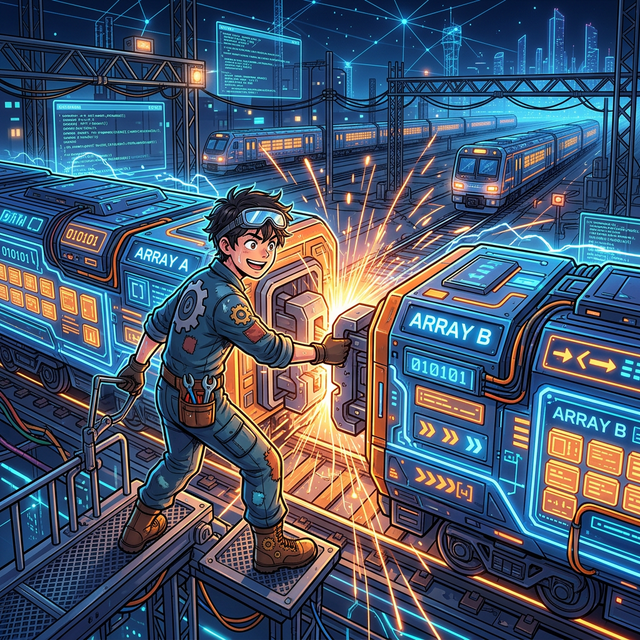

# 4.8.1 배열 결합 기술: 조립식 기차와 쌓이는 아파트

  <!-- SVG 배열 결합(Concatenation) 기차 연결 애니메이션 -->
  <svg width="500" height="250" viewBox="0 0 500 250" xmlns="http://www.w3.org/2000/svg">
    <defs>
      <!-- 기차 화물칸 메탈 질감 -->
      <linearGradient id="trainA" x1="0%" y1="0%" x2="0%" y2="100%">
        <stop offset="0%" stop-color="#3182ce"/>
        <stop offset="100%" stop-color="#2b6cb0"/>
      </linearGradient>
      <linearGradient id="trainB" x1="0%" y1="0%" x2="0%" y2="100%">
        <stop offset="0%" stop-color="#ed8936"/>
        <stop offset="100%" stop-color="#dd6b20"/>
      </linearGradient>
      <!-- 결합 스파크 글로우 효과 -->
      <filter id="sparkGlow" x="-50%" y="-50%" width="200%" height="200%">
        <feGaussianBlur stdDeviation="3" result="blur" />
        <feComposite in="SourceGraphic" in2="blur" operator="over" />
      </filter>
    </defs>

    <!-- 배경 레일 장식 -->
    <rect x="0" y="0" width="500" height="250" fill="#f7fafc" rx="8"/>
    <g stroke="#cbd5e0" stroke-width="4">
      <line x1="0" y1="180" x2="500" y2="180"/>
      <line x1="0" y1="195" x2="500" y2="195"/>
      <!-- 침목들 -->
      <line x1="30" y1="175" x2="30" y2="200"/>
      <line x1="80" y1="175" x2="80" y2="200"/>
      <line x1="130" y1="175" x2="130" y2="200"/>
      <line x1="180" y1="175" x2="180" y2="200"/>
      <line x1="230" y1="175" x2="230" y2="200"/>
      <line x1="280" y1="175" x2="280" y2="200"/>
      <line x1="330" y1="175" x2="330" y2="200"/>
      <line x1="380" y1="175" x2="380" y2="200"/>
      <line x1="430" y1="175" x2="430" y2="200"/>
      <line x1="480" y1="175" x2="480" y2="200"/>
    </g>

    <text x="250" y="30" font-family="Arial" font-size="16" font-weight="bold" fill="#4a5568" text-anchor="middle">
      Numpy hstack (수평 결합): 기차 칸 연결하기
    </text>

    <!-- 기차 A (왼쪽 대기) -->
    <g transform="translate(50, 90)">
      <!-- 연결기(Coupler) 튀어나온 부분 -->
      <rect x="120" y="60" width="20" height="10" fill="#4a5568"/>
      <circle cx="140" cy="65" r="7" fill="#2d3748"/>
      
      <!-- 배열 블록 컨테이너 -->
      <rect x="0" y="0" width="120" height="80" fill="url(#trainA)" rx="4"/>
      
      <!-- 배열 데이터 (2x2 Matrix A) -->
      <g fill="white" font-family="monospace" font-size="16" font-weight="bold" text-anchor="middle">
        <text x="30" y="30">A1</text>
        <text x="90" y="30">A2</text>
        <text x="30" y="60">A3</text>
        <text x="90" y="60">A4</text>
      </g>
      
      <!-- 바퀴 -->
      <circle cx="20" cy="85" r="10" fill="#4a5568" stroke="#1a202c" stroke-width="2"/>
      <circle cx="100" cy="85" r="10" fill="#4a5568" stroke="#1a202c" stroke-width="2"/>
    </g>

    <!-- 기차 B (오른쪽에서 다가오는 애니메이션) -->
    <g>
      <animateTransform 
        attributeName="transform" 
        type="translate" 
        values="400,0; 200,0; 200,0; 400,0" 
        dur="4s" 
        repeatCount="indefinite" 
        keyTimes="0; 0.3; 0.8; 1"
      />
      
      <g transform="translate(0, 90)">
        <!-- 연결기(Coupler) 수용부 -->
        <rect x="-20" y="60" width="20" height="10" fill="#4a5568"/>
        <path d="M0,58 L-10,58 L-10,72 L0,72 Z" fill="#2d3748"/>
        
        <!-- 배열 블록 컨테이너 -->
        <rect x="0" y="0" width="120" height="80" fill="url(#trainB)" rx="4"/>
        
        <!-- 배열 데이터 (2x2 Matrix B) -->
        <g fill="white" font-family="monospace" font-size="16" font-weight="bold" text-anchor="middle">
          <text x="30" y="30">B1</text>
          <text x="90" y="30">B2</text>
          <text x="30" y="60">B3</text>
          <text x="90" y="60">B4</text>
        </g>
        
        <!-- 바퀴 -->
        <circle cx="20" cy="85" r="10" fill="#4a5568" stroke="#1a202c" stroke-width="2"/>
        <circle cx="100" cy="85" r="10" fill="#4a5568" stroke="#1a202c" stroke-width="2"/>
      </g>
    </g>

    <!-- 결합 순간 스파크 애니메이션 -->
    <g transform="translate(195, 155)">
      <g opacity="0" filter="url(#sparkGlow)">
        <animate attributeName="opacity" values="0; 0; 1; 1; 0; 0" dur="4s" repeatCount="indefinite" keyTimes="0; 0.28; 0.3; 0.4; 0.42; 1"/>
        <circle cx="0" cy="0" r="15" fill="#fbd38d"/>
        <path d="M-20,-20 L20,20 M-20,20 L20,-20 M0,-25 L0,25 M-25,0 L25,0" stroke="#fff" stroke-width="3"/>
      </g>
    </g>

    <!-- 코드 스니펫 중앙 표시 -->
    <rect x="160" y="50" width="180" height="30" fill="#2d3748" rx="4" opacity="0.9"/>
    <text x="250" y="70" font-family="monospace" font-size="14" font-weight="bold" fill="#68d391" text-anchor="middle">
      np.hstack((A, B))
    </text>

    <!-- 하단 설명 -->
    <text x="250" y="235" font-family="Arial" font-size="12" fill="#718096" text-anchor="middle">
      행(가로줄 숫자)이 동일한 두 배열을 기차 연결하듯 수평(Horizontal)으로 결합합니다.
    </text>
  </svg>
  
<em>[그림] 서로 떨어진 두 데이터 블록 칸을 강력하게 용접하여 이어 붙이는 hstack</em>

## 4.8.1 배열 결합 개요

## 4.6.1 배열 결합 개요

**[비유] Axis(축)의 방향 잡기**
- **Axis 0 (수직/행 방향)**: 아파트 층을 위로 차곡차곡 쌓아 올리듯 결합합니다.
- **Axis 1 (수평/열 방향)**: 기차를 연결하듯 옆으로 나란히 결합하여 길이를 늘입니다.

배열을 결합하는 방법 중에서 가장 많이 사용하는 `numpy.vstack()`과 `numpy.hstack()`을 먼저 알아보자.

배열을 수직(vertically)으로 결합하는 `numpy.vstack()`과 수평(horizontally)으로 결합하는 `numpy.hstack()` 함수이다. 이 `numpy.vstack()`과 `numpy.hstack()`은 다음 그림으로 이해하면 매우 쉽다.

위 그림에서도 알 수 있듯이 2차원 배열에서의 수직으로 합치는 `vstack`은 열 수가 같아야 하며 수평으로 합치는 `hstack`은 행 수가 같아야 한다.
