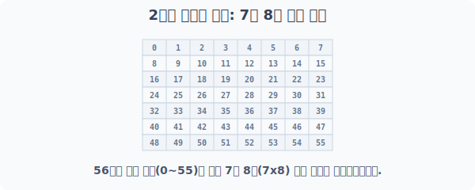
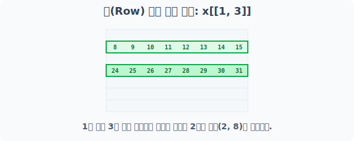
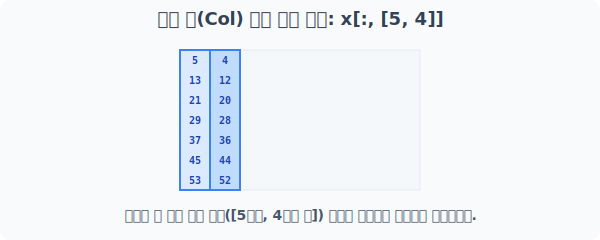
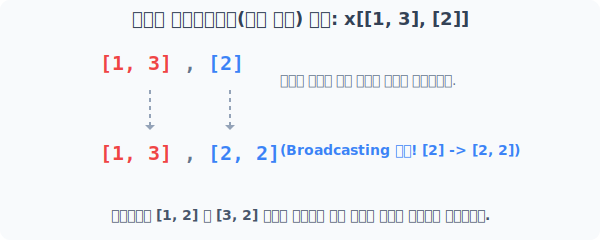
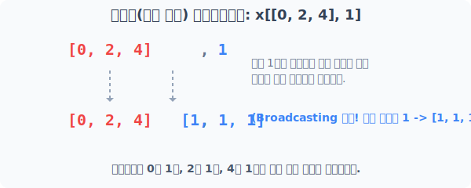

# 4.8.2 2차원 배열 색인 (Fancy Indexing)

## 배열 색인(Fancy Indexing) 2차원 작전: 좌표 동시 타격
행렬 구조인 2차원 배열부터는 행(Row)과 열(Column)이라는 **2개의 축**이 존재합니다. 

이때부터 Fancy Indexing은 단순한 이빨 빠진 리스트 추출을 넘어, **`[행 좌표 묶음], [열 좌표 묶음]`**을 동시에 투하하여 원하는 특정 지점들(좌표쌍)만 정확하게 저격하는 기법으로 발전합니다.


> 행(Y축) 리스트와 열(X축) 리스트를 콤마로 연결하면, 파이썬이 이를 조합해 타겟을 찾아냅니다.

---

## [1단계] 기지국 셋업: 7x8 배열 공간 생성
모양 `(7, 8)`의 2차원 배열 요도를 준비합니다. 값은 `0~55`까지 들어있습니다.



```python
from numpy import arange

x = arange(56).reshape(7, 8)
print("베이스 2차원 배열 x:\n", x)
```
**실행 결과:**
```text
베이스 2차원 배열 x:
 [[ 0  1  2  3  4  5  6  7]
  [ 8  9 10 11 12 13 14 15]
  [16 17 18 19 20 21 22 23]
  [24 25 26 27 28 29 30 31]
  [32 33 34 35 36 37 38 39]
  [40 41 42 43 44 45 46 47]
  [48 49 50 51 52 53 54 55]]
```

*(참고) 단순 좌표 색인 `x[0, 1]`이나 슬라이싱 `x[:, 2:8]` 방식은 그대로 작동합니다.*

---

## [2단계] 행(Row) 단위 다중 선별 타격
콤마 앞쪽(행 축)에만 대괄호 리스트를 던지면, 1차원 Fancy Indexing 때처럼 **열은 다 놔두고, 원하는 행 전체만 쏙쏙** 뽑아옵니다.


> 1번 행과 3번 행을 통째로 뽑아, 새로운 `(2, 8)` 형태의 2차원 배열을 복사로 생성합니다.

```python
# 1번 행과 3번 행만 타격. (콤마 뒤쪽 열을 생략하면 x[[1, 3], :] 와 완전히 동일)
print("x[[1, 3]] 행 추출 결과:\n", x[[1, 3]])
```
**실행 결과:**
```text
x[[1, 3]] 행 추출 결과:
 [[ 8  9 10 11 12 13 14 15]
  [24 25 26 27 28 29 30 31]]
```

---

## [3단계] 열(Col) 단위 순서 다중 선별
가로행을 `:`으로 전부 통과시킨 뒤, 콤마 뒤쪽(열 축)에 추출하고자 하는 인덱스 리스트를 지정합니다. 

이때 **우리가 제시한 번호와 순서대로** 세로줄(열)이 복사되어 조립됩니다.



```python
# 모든 행에서 5번째 줄과 4번째 줄을 역순으로 조립
print("x[:, [5, 4]] 열 추출 결과:\n", x[:, [5, 4]])
```
**실행 결과:**
```text
x[:, [5, 4]] 열 추출 결과:
 [[ 5  4]
  [13 12]
  [21 20]
  [29 28]
  [37 36]
  [45 44]
  [53 52]]
```

---

## [4단계] [행 묶음, 열 묶음] 정밀 교차 저격
단순 행/열 추출을 넘어, **특정 셀(좌표)**에 있는 숫자들만 단일 리스트로 빼오고 싶을 때 사용합니다.

`행 묶음 배열`과 `열 묶음 배열`의 각 위치 원소끼리 **1:1로 짝꿍을 맺어 좌표쌍**을 생성합니다.



```python
# [1, 3]과 [2, 2]가 만나 -> 좌표 (1, 2)와 (3, 2)를 한 번에 저격
# 값 10과 26을 반환합니다. 결과는 1차원 배열입니다!
print("x[[1, 3], [2, 2]] 교차 저격:", x[[1, 3], [2, 2]])
```
**실행 결과:**
```text
x[[1, 3], [2, 2]] 교차 저격: [10 26]
```
> 결과가 2차원이 아니라 1차원 `[10, 26]`으로 나오는 것에 반드시 유의하세요.

---

## [5단계] 브로드캐스팅(자동 복제)을 이용한 스마트 교차
행렬 계산 연산에서 작동하던 훌륭한 파트너 구하기 문법인 자동 복제(**Broadcasting**)는 Fancy Indexing에서도 발동됩니다!

### 5-1. 크기가 1인 배열의 자동 복제 (Array Broadcasting)
행렬의 크기(Shape)가 다를 때, 한 쪽의 크기가 `1`이라면 파이썬은 모자란 개수만큼 원소를 스스로 복사하여 길이를 맞춰줍니다.


> `[1, 3]`은 크기가 2고, `[2]`는 크기가 1입니다. 파이썬이 알아서 `[2]`를 `[2, 2]`로 뻥튀기해 줍니다. 

```python
# 열 좌표를 번거롭게 [2, 2]로 쓰지 않고 [2]만 줘도 파이썬이 알아서 복제하여 (1,2) (3,2)를 조립
print("x[[1, 3], [2]] 브로드캐스팅 저격:", x[[1, 3], [2]])
```
**실행 결과:**
```text
x[[1, 3], [2]] 브로드캐스팅 저격: [10 26]
```

### 5-2. 단박에 다중 행, 단일 열 저격하기 (스칼라 값 적용)
아예 리스트 `[1]` 형태가 아니라 순수한 정수(스칼라 숫자 하나)를 넣어도 똑같이 브로드캐스팅이 발생합니다. 이는 실전에서 "A번, B번, C번 사람의 1번 데이터만 다 모아와"라고 할 때 정말 자주 쓰입니다.



```python
import numpy as np

# 행은 0, 2, 4번 (크기 3) / 열은 그냥 숫자 1
# 숫자 1이 알아서 [1, 1, 1] 로 복제되어 (0,1), (2,1), (4,1)을 순서대로 때림
print("x[np.array([0, 2, 4]), 1] 다중 타격:", x[np.array([0, 2, 4]), 1])
```
**실행 결과:**
```text
x[np.array([0, 2, 4]), 1] 다중 타격: [ 1 17 33]
```

---

## [주의사항] Fancy Indexing 에러 피하기

### 🛑 주의사항 1. 모양 불일치(Shape Mismatch)의 늪
브로드캐스팅 마법도 만능은 아닙니다. **크기가 완전히 똑같거나, 둘 중 하나가 크기가 1**이어야먄 짝짓기가 성공합니다. 
애매하게 크기 3과 크기 2의 배열이 만나면 스나이퍼는 짝꿍을 찾지 못하고 즉각 폭발합니다.



```python
try:
    # 3개 vs 2개는 서로 1:1 매칭도 안 되고, 어느 한쪽을 복제할 수도 없음
    print(x[np.array([0, 2, 4]), np.array([0, 1])])
except IndexError as e:
    print("❌ 에러 발생 (IndexError):", e)
```
**실행 결과:**
```text
❌ 에러 발생 (IndexError): shape mismatch: indexing arrays could not be broadcast together with shapes (3,) (2,)
```

### 🛑 주의사항 2. 차원 초과 에러 방어하기 (Too many indices)
가끔 고차원 데이터와 씨름하다 보면, 현재 자신이 다루고 있는 배열의 차원(축의 개수)을 초과하여 좌표를 우겨넣는 실수를 범하기도 합니다. 
2차원 공간 지도의 좌표계에 무리하게 3차원 Z축 정보까지 넘기면 시스템이 에러를 뿜습니다.



```python
try:
    # 2차원 배열은 행 콤마(,) 열 만 가능. 콤마가 2개 이상 들어가면 3차원 이상을 요구하게 됨
    print(x[[1], [2], [3]])
except IndexError as e:
    print("❌ 에러 발생 (IndexError):", e)
```
**실행 결과:**
```text
❌ 에러 발생 (IndexError): too many indices for array: array is 2-dimensional, but 3 were indexed
```
> **💡 실전 팁:** 헷갈릴 때는 항상 `x.shape`와 `x.ndim`을 출력해보는 습관을 들여 자신이 위치한 차원(Dimension)을 파악하세요!
