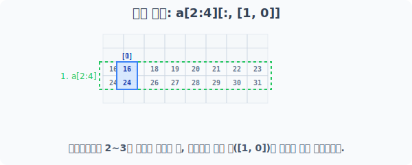
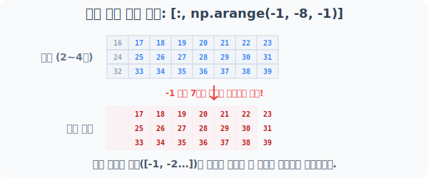
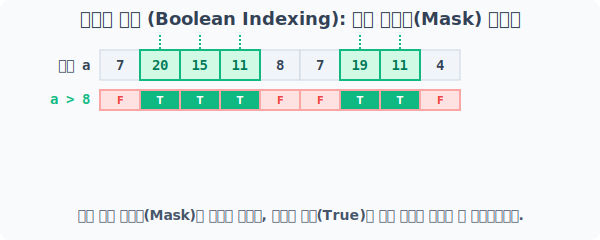
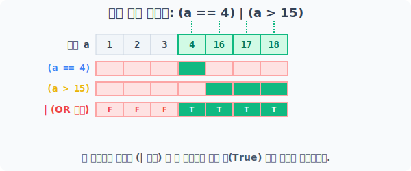

# 4.8.3 다양한 색인 기법 (혼합 색인 & 조건부 색인)

단순한 범위 지정(Slicing)이나 콕콕 집어내기(Fancy Indexing)를 넘어, 이 둘을 극강으로 조합하거나 아예 데이터의 **조건**을 걸어 뽑아내는 실전 응용 기술을 익혀봅시다.

---

## [1부] 혼합 전술: 팬시 색인과 슬라이싱의 결합 (Fancy Indexing + Slicing)

슬라이싱으로 거대한 블록(구간)을 먼저 썰어낸 다음, 그 블록 안에서 내가 원하는 특정 열(Col)의 순서만 바꿔서 쏙쏙 빼오는 2단 콤보 기술입니다.

### [1단계] 기반 요도 생성
0에서 39까지의 값을 가진 (5, 8) 2차원 배열 공간을 생성합니다.
```python
import numpy as np

a = np.arange(40).reshape(5, 8)
print("베이스 배열 a:\n", a)
```
**실행 결과:**
```text
베이스 배열 a:
 [[ 0  1  2  3  4  5  6  7]
  [ 8  9 10 11 12 13 14 15]
  [16 17 18 19 20 21 22 23]
  [24 25 26 27 28 29 30 31]
  [32 33 34 35 36 37 38 39]]
```

*(참고)* 다차원을 다룰 때는 `a[2:4, 3:7]` 처럼 콜론(`:`) 2개를 배열하면 연속된 2D 직사각형 덩어리 자체를 잘라냅니다.

### [2단계] 가로축 색인 추출 후 세로축 섞기 (혼합 타격)

앞쪽(행)에는 범위를 주는 `np.arange(2, 4)` 즉 2와 3을 반환하는 슬라이싱 배열을 걸고, 뒤쪽(열)에는 특정 인덱스 `[1, 0, 3, 5]` 형태의 Fancy Indexing 리스트를 걸면 혼합 방식이 적용됩니다.


> 즉, `2번 행`과 `3번 행`을 썰어낸 덩어리에서 -> 1열, 0열 번호에 해당하는 수직 기둥만 낚아채서 조립합니다.

```python
# 1. a[np.arange(2, 4)] 로 먼저 2행, 3행 추출
# 2. 뒤이어 [:, [1, 0]] 로 각 꺼내진 행의 1번째 열과 0번째 열 기둥을 순서대로 추출
print("혼합 색인 [1, 0] 결과:\n", a[np.arange(2, 4)][:, [1, 0]])


```
**실행 결과:**
```text
혼합 색인 [1, 0] 결과:
 [[17 16]
  [25 24]]

```

```python
# 열 타겟을 더 늘려볼까요? (2,3,4행을 썰어내고, 그 안에서 1,0,3,5열 기둥을 잡아채기)
print("혼합 색인 다중 열 결과:\n", a[np.arange(2, 5)][:, [1, 0, 3, 5]])
```

**실행 결과:**
```text
혼합 색인 다중 열 결과:
 [[17 16 19 21]
  [25 24 27 29]
  [33 32 35 37]]
```


### [3단계] 역순 추출 혼합 작전

열 인덱싱 자리에 아예 역순으로 번호를 생성하는 `np.arange(-1, -8, -1)` (즉 `-1, -2, -3...`)를 넣어버리면, 뽑혀 나온 데이터 블록이 거울처럼 좌우 반전되는 마법을 볼 수 있습니다.


> 보폭을 `-1` 로 주어 맨 뒷열부터 거꾸로 추출하는 응용 기법입니다.

```python
# 행은 2,3,4행 추출 / 열은 맨 뒤(-1)부터 왼쪽으로 거꾸로 추출!
print("역순 혼합 색인 결과:\n", a[np.arange(2, 5)][:, np.arange(-1, -8, -1)])
```
**실행 결과:**
```text
역순 혼합 색인 결과:
 [[23 22 21 20 19 18 17]
  [31 30 29 28 27 26 25]
  [39 38 37 36 35 34 33]]
```

---

## [2부] 조건부 색인 (Boolean Indexing): 그물망(Mask) 필터링

**비유로 쉽게 이해하기: 마법의 뜰채(그물망) 만들기**

앞서 배운 인덱싱은 "3번 타일, 5번 타일 가져와!" 처럼 번호를 직접 불러서 빼오는 방식이었습니다. 

하지만 데이터가 10만 개가 넘어가면 짝수 번호나 특정 범위에 해당하는 번호를 일일이 부를 수가 없습니다.
이럴 때 사용하는 것이 바로 **조건부 색인(Boolean Indexing)**입니다. 

원리는 아주 단순하면서 강력합니다.

1. **그물망 만들기**: "8보다 큰 애들 손들어!" 라고 외치면, 조건에 맞는 곳은 `[True]`, 아닌 곳은 `[False]`가 뜬 **거대한 그물망(마스크)**이 만들어집니다.
2. **뜰채 덮어씌우기**: 이 `True / False` 모양의 틀을 원본 배열 위에 툭 덮어씌웁니다.
3. **결과물 얻기**: 그물망에 구멍이 난 부분(`True`) 아래에 있던 알맹이 데이터들만 후두둑 떨어져서 내 손에 들어오게 됩니다!

---

### [1단계] 단순 조건문으로 그물망(Mask) 씌우기

배열 변수 안에 숫자가 아닌 조건식(`> 8` 등)을 그대로 집어넣으면 됩니다.



```python
a = np.array([7, 20, 15, 11, 8, 7, 19, 11, 4])

# "a > 8" 이라는 조건 그물망을 a 모양 파이프 위에 씌워버림!
mask_result = a[a > 8]
print("8보다 큰 값들만 즉시 필터링:", mask_result)
```
**실행 결과:**
```text
8보다 큰 값들만 즉시 필터링: [20 15 11 19 11]
```

### [2단계] 조건을 두 개 이상 섞어 겹그물망 만들기

조건이 복잡할 때 파이썬의 표준 `and`, `or` 키워드를 배열에 사용하면 에러가 납니다. 

배열 전체를 일괄 검사할 때는 비트 연산자인 **`&` (그리고, AND)** 와 **`|` (이거나, OR)** 기호를 씁니다.

🔥 **핵심 주의사항**: 기호를 쓰기 전에 반드시 각 조건을 괄호 `( )`로 묶어서 보호해 주어야 합니다!


> 즉석에서 "(a가 4다)" 마스크와 "(a가 15보다 크다)" 마스크를 만든 뒤, 둘을 포개서 `| (OR)`로 합치는 원리입니다.

```python
a = np.array([1, 2, 3, 4, 16, 17, 18])

# 4이거나(OR) 15 초과인 값만 추출
result1 = a[(a == 4) | (a > 15)]
print("다중 그물망(OR) 추출 결과:", result1)
```
**실행 결과:**
```text
다중 그물망(OR) 추출 결과: [ 4 16 17 18]
```

---

### [3단계] 추출 대신 "값 강제 치환" 하기 (클리핑)

그물망 필터링의 진짜 무서운 점은 뽑아내는 것뿐만 아니라, **해당하는 녀석들만 일망타진하여 값을 한 번에 바꿔버릴 수 있다**는 점입니다. 

이를 `클리핑(Clipping)`이라고 부르기도 합니다.

```python
# 점수가 10점 이상인 녀석들을 싹 다 잡아서 강제로 10점으로 하향 평준화
a[a >= 10] = 10
print("10점 이상 클리핑 조치 완료:", a)
```
**실행 결과:**
```text
10점 이상 클리핑 조치 완료: [ 1  2  3  4 10 10 10]
```

---

### [4단계] 데이터 말고, "위치(좌표) 번호"만 탐지하기: np.where()

데이터를 후두둑 떨어뜨려 가져오지 않고, **"그래서 조건을 만족하는 애들 진짜 집 주소(인덱스 번호)가 구체적으로 몇 번이야?"** 라고 수색 레이더를 돌려야 할 때가 있습니다. 

이때 `np.where()` 함수를 씁니다.


> 배열 데이터 `7`이나 `5` 대신, 그놈들이 숨어있는 좌표인 `인덱스 0`과 `인덱스 1`을 배열로 반환합니다.

```python
x = np.array([1, 5, 7, 8, 10])

# 7보다 작은 숫자들의 집 주소 반환 요청
idx = np.where(x < 7)

print("수색 반경 내 타겟 위치:", idx)
```
**실행 결과:**
```text
수색 반경 내 타겟 위치: (array([0, 1], dtype=int64),)
```
> **💡 실전 팁:** 결과가 약간 특이하게 보일 수 있는데, 항상 `(튜플, )` 안에 `array`가 감싸진 형태로 반환됩니다. `idx[0]`을 치면 `[0, 1]` 원본 배열을 바로 확인할 수 있습니다. `np.where`는 결측치(NaN, 구멍 난 데이터)가 도대체 10만 행 데이터 중 어디 어디에 숨어있는지 탐지할 때 필수적으로 쓰입니다!
