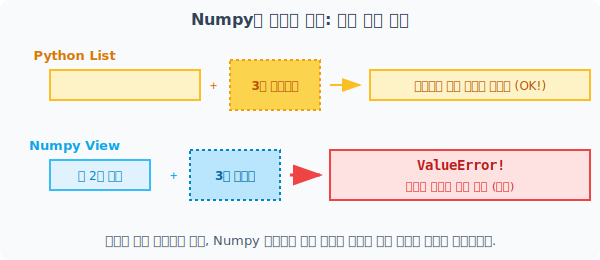
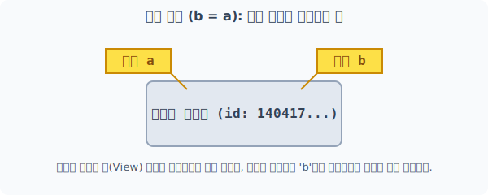

# 4.9.3 메모리 공유와 형태 한계 (View)

NumPy 배열은 방대한 데이터를 최대한 빠르고 효율적으로 다루기 위해 특수한 구조를 가집니다.
배열을 조작하다 보면 **"내가 방금 가져온 배열이 원본의 환영(View)인지, 아니면 완전히 새롭게 분리된 복제본(Copy)인지"**를 명확히 알아야 합니다. 이를 헷갈리면 나도 모르는 사이에 원본 데이터가 훼손되어 버리는 심각한 버그를 초래할 수 있습니다!

---

## [1단계] 메모리를 아끼는 홀로그램: 보기(View)

**[비유로 이해하기: 1개의 거대한 본체와 여러 개의 홀로그램 렌즈]**
천만 개의 데이터가 들어있는 거대한 엑셀 파일(메모리 원본)이 하나 있다고 가정해 봅시다. 이 데이터의 일부를 확인하기 위해 매번 엑셀 파일을 통째로 복사(Ctrl+C, Ctrl+V)하면 컴퓨터 메모리가 금방 터져버릴 것입니다.

대신 Numpy는 실제 데이터(버퍼)는 원본 그대로 하나만 놔두고, **바라보는 렌즈(홀로그램 카메라)의 각도나 프레임만 씌워서 마치 새로운 배열인 것처럼 보여주는 기술**을 극대화하여 사용합니다. 이것이 바로 **보기(뷰, View)**입니다.


> 데이터 저장소 메모리는 1개뿐이므로, 홀로그램(View)에 투사된 무언가를 부수거나 수정하면 원본 메모리도 똑같은 타격을 입습니다!

```python
import numpy as np

# 원본 1차원 배열 생성
org = np.arange(5)
print("원본 org:", org)

# 원본의 거울(View) 생성
v = org.view()
print("뷰 v:", v)
```
**실행 결과:**
```text
원본 org: [0 1 2 3 4]
뷰 v: [0 1 2 3 4]
```

만약 뷰 `v`의 데이터를 수정하면 어떻게 될까요?
```python
# 뷰의 2번 인덱스 값을 악의적으로 200으로 변경!
v[2] = 200
print("변경된 뷰 v:", v)

# 원본을 확인해보면?
print("타격 입은 원본 org:", org)
```
**실행 결과:**
```text
변경된 뷰 v: [  0   1 200   3   4]
타격 입은 원본 org: [  0   1 200   3   4]
```

데이터 자체에 닿아있는 투명한 거울판이기 때문에, 거울을 통해 데이터를 수정하면 원본 `org` 또한 똑같이 변해버렸습니다.

---

## [2단계] 뷰(View)의 한계점: 파이썬 리스트와의 형태 구조 차이

파이썬의 기본 `list`는 크기를 마법의 가방처럼 마음대로 늘리거나 줄일 수 있습니다(=동적 크기 할당).
하지만 Numpy 배열과 그것의 View는 **사전에 완전히 고정된 블록 아파트 규격**이므로 불필요한 데이터를 다짜고짜 더 우겨넣을 수 없습니다.


> Python의 가방은 신축성이 있지만 Numpy 배열 메모리는 고정된 철제 골조와 같습니다.

```python
# 일반 파이썬 리스트
lst = list(range(8))
lst[3:5] = [30, 40, 50]  # 2칸짜리 블록을 강제로 부수고 3개의 값을 쑤셔 넣기 (가능!)
print("파이썬 리스트:", lst)
```
**출력:**
```text
파이썬 리스트: [0, 1, 2, 30, 40, 50, 5, 6, 7]
```

반면 Numpy 배열에서는 허용된 사이즈 격자를 벗어나면 오류를 매몰차게 뱉어냅니다.
```python
x = np.arange(8)

# 2칸 공간에 2개를 넣는 건 OK
x[3:5] = [30, 40]
print("동일 규격 교환:", x)

# 2칸밖에 없는 View 자리에 3개의 원소를 우겨넣으면?
# x[3:5] = [30, 40, 50]  --> ValueError: could not broadcast 에러 터짐!
```
Numpy는 이처럼 메모리 구조적 엄격함을 유지하여 수백만 단위의 숫자가 흔들림 없이 일렬로 CPU를 직통 관통할 수 있도록 최고의 성능을 보장하는 구조입니다.

---

## [3단계] 단순 변수 대입(b = a)은 어떻게 될까? (얕은 복사)

그럼 `copy()`도 안 쓰고 `view()`도 안 쓰고, 실수로 그냥 `=` 기호로 대입해 버리면 물리적으로 어떻게 처리될까요? 파이썬 코어 개념에서 이는 그저 **"원래 존재하는 객체 메모리에 단순히 별명(포스트잇 이름표)을 하나 더 붙인 것"**에 불과한 완전한 동일체 취급이 됩니다.


> 변수 a와 변수 b는 동일한 객체를 가리키는 포스트잇 이름표일 뿐이므로 완전히 한 몸처럼 움직입니다.

```python
a = np.array([[1, 2, 3], [4, 5, 6]])

b = a  # 단순 변수명 매칭! (얕은 복사)

# b와 a는 완전히 생물학적으로 같은 녀석(동일 메모리 ID)인가?
print("a와 b는 영혼의 쌍둥이인가?", b is a)
print("a의 ID:", id(a), " / b의 ID:", id(b))
```
**출력:**
```text
a와 b는 영혼의 쌍둥이인가? True
a의 ID: 140417...  / b의 ID: 140417...
```
> 단순 대입 연산인 얕은 복사(`b = a`)는 `View` 개념보다 한술 더 떠서, 아예 가짜 렌즈조차 만들지 않은 **이름만 다를 뿐 완벽한 동일 본체**입니다.
> `View(v = a.view())`는 메모리 주소값(`id()`)이 서로 다르지만 바라보는 타겟이 같은 홀로그램이며, `단순 대입(b = a)`은 메모리 주소값마저 100% 동일한 이름표 스티커 부착 행위입니다!
