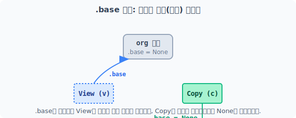

# 4.9.4 독립적인 클론 생성과 추적 (Copy)

## [1단계] 독립적이고 안전한 클론 본체: 복사(Copy)

안전하게 데이터 실험 처리를 하고 싶거나 원본 훼손을 막아야 할 때는, 뷰(View)를 쓰는 것보다 메모리를 약간 더 쓰더라도 완전히 독립된 복제인간(클론)을 만들어야 합니다. 이때 `.copy()` 함수를 구사합니다.


> 새로운 메모리 공간을 아예 파서 복제본을 만드므로, 복사본에 아무리 폭격을 가해도 원본은 안전합니다. 단, 속도는 View보다 상대적으로 살짝 느립니다.

```python
import numpy as np

org = np.arange(5)

# 독립된 클론(Copy) 생성
c = org.copy()

# 클론을 강제로 수정
c[2] = 200
print("변경된 복사본 c:", c)

# 보호된 원본 확인
print("안전한 원본 org:", org)
```
**실행 결과:**
```text
변경된 복사본 c: [  0   1 200   3   4]
안전한 원본 org: [0 1 2 3 4]
```

---

## [2단계] 내 족보(출처) 확인하기: .base 속성 추적

작업하다 보면 내가 지금 복잡하게 조작한 변수가 남의 홀로그램(View)인지, 완전히 독립된 데이터(Copy)인지 헷갈릴 때가 있습니다. 이때 `ndarray.base` 속성을 찍어보면 이 객체의 본거지(뿌리)가 대체 누구인지 즉각 알려줍니다.


> `.base` 호출 시 View는 숙주(원본 메모리) 배열 주소를 뱉고, 본체(Copy)는 다른 것에 기대지 않으므로 `None`을 뱉어냅니다.

```python
x = np.arange(6)

# reshape()은 대표적으로 View를 반환하는 함수입니다!
y = x.reshape(2, 3) 
print("y의 본거지(base)는 누구냐?", y.base)

# Transpose 연산도 View를 반환합니다.
z = y.transpose()
print("z의 본거지(base)는 누구냐?", z.base)

# 명시적으로 Copy를 한 것은 본체가 자기 자신이므로 None이 나옵니다.
c = z.copy()
print("c의 본거지(base)는?", c.base)
```
**실행 결과:**
```text
y의 본거지(base)는 누구냐? [0 1 2 3 4 5]
z의 본거지(base)는 누구냐? [0 1 2 3 4 5]
c의 본거지(base)는? None
```
> 출처 탐색기 `.base`를 두드렸을 때 **`None`**이 나오면, "아, 내가 곧 뿌리(메모리 원본)구나. 마음대로 건져 조작해도 남에게 피해가 안 가겠네!" 하고 안심하시면 됩니다.
