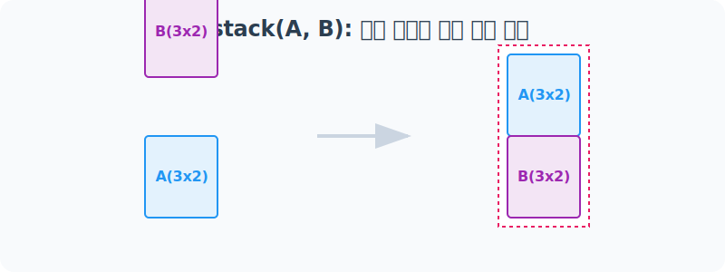
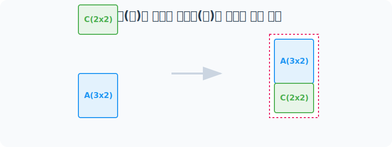
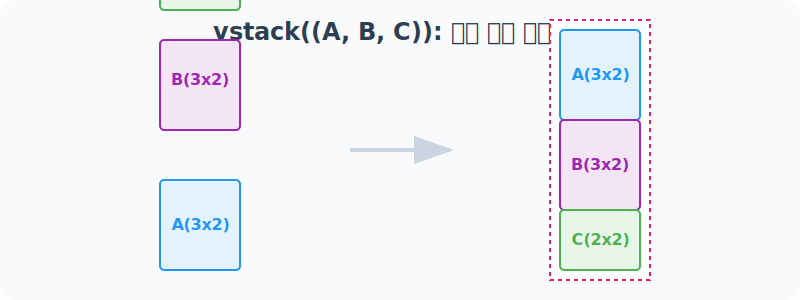
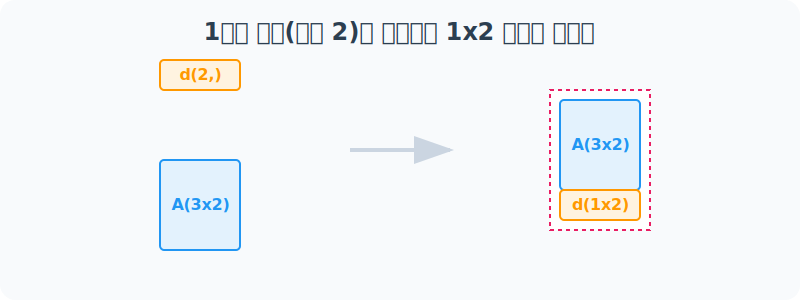
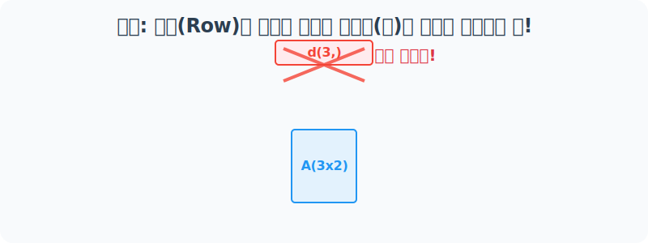

# 4.10.2 numpy.vstack()

## 1. 개념 이해

### 수학적 의미: 행렬의 수직 확장과 관측치 추가 (Row Augmentation)
수학에서 두 행렬 $A$와 $B$를 위아래로 결합하려면, 행렬의 **열(Column)의 개수**가 반드시 일치해야 합니다. 

예를 들어, 행렬 $A$가 $m \times p$ 차원(행 $m$개, 열 $p$개)이고, 행렬 $B$가 $n \times p$ 차원이라면, 이 둘을 수직 결합(`vstack`)한 새로운 행렬 $C$의 차원은 **$(m+n) \times p$** 가 됩니다.

#### 수식 표현
$\begin{bmatrix} A \\ B \end{bmatrix}_{ (m+n) \times p }$

#### 데이터 과학에서의 의미 (관측치 추가)
데이터 분석에서 **열(Column)**은 데이터의 속성(Feature: 예-키, 몸무게, 나이)을 나타내고, **행(Row)**은 하나의 관측치(Observation: 사람 1명의 기록)를 의미합니다. 

따라서 `vstack`은 **"동일한 속성 구조(열)를 가진 새로운 데이터(행)들을 기존 데이터셋의 아래에 지속적으로 추가(Append)하는 작업"**을 수학적으로 수행하는 것입니다.

#### 연립방정식 관점에서의 상세 의미 (방정식/조건식 추가)
행렬을 연립방정식으로 바라볼 때, **열(Column)**은 구해야 할 '미지수($x_1, x_2, \ldots, x_p$)'의 개수를 의미하고, **행(Row)**은 미지수들이 만족해야 하는 개별 '방정식(조건식)'을 의미합니다.

기존 조건들만으로 해(Solution)를 특정하기 어려워, 관측이나 실험을 통해 **새로운 방정식(새로운 제약 조건)을 추가로 확보**했을 때 이를 식의 제일 밑에 덧붙여야 합니다. 당연하게도, 새롭게 추가되는 방정식 역시 **기존과 완벽히 동일한 구성의 미지수들(동일한 열)**로 이루어져 있어야만 하나의 연립 체계로 묶일 수 있습니다. 

이처럼 `미지수의 개수(가로 열 길이)는 변함없이 고정한 채`, 식(세로 행)들만 아래로 계속 덧붙여 해안을 구체화(Overdetermined system)해 나가는 과정이 바로 `vstack` 연산의 본질입니다.

### 비유로 이해하기: 조립식 아파트 층수 올리기
마치 1층 위에 2층, 3층 모듈을 차곡차곡 얹듯이 데이터를 **위아래(수직, Vertical)** 방향으로 건물처럼 층층이 쌓아 올립니다. 
(단, 무너지지 않게 모든 층의 **가로 폭(열 개수)**이 동일해야만 위로 얹어 올릴 수 있습니다!)

---

## 2. 단계별 실습

### [1단계] 같은 모양의 2차원 배열 쌓아 올리기
가장 기본적인 형태로, (3, 2) 모양을 가진 두 배열을 수직으로 합쳐서 (6, 2) 모양의 배열을 만들어 봅니다.


> 배열 `a`와 `b`를 위아래로 쌓아올려 높이(행)를 6층으로 만듭니다.

```python
import numpy as np

a = np.arange(6).reshape(3, 2)
b = np.arange(6, 12).reshape(3, 2)

print("배열 a (3x2):\n", a)
print("배열 b (3x2):\n", b)

# [수직 결합] 튜플 형태로 (a, b) 전달!
result = np.vstack((a, b))

print("\n🚀 vstack((a, b)) 결과 (6x2):\n", result)
```

**[실행 결과]**
```text
배열 a (3x2):
 [[0 1]
  [2 3]
  [4 5]]
배열 b (3x2):
 [[ 6  7]
  [ 8  9]
  [10 11]]

🚀 vstack((a, b)) 결과 (6x2):
 [[ 0  1]
  [ 2  3]
  [ 4  5]
  [ 6  7]
  [ 8  9]
  [10 11]]
```

---

### [2단계] 행(Row) 개수가 달라도 가로폭(열)만 같으면 OK!
건물을 위로 쌓아 올릴 때, 얹어지는 층의 높이(행의 개수)는 달라도 상관없습니다. **가장 중요한 것은 가로 폭, 즉 열(Column)의 개수만 동일**하면 아귀가 맞아떨어집니다.


> 3층 건물(배열 `a`) 위에 2층짜리 모듈(배열 `c`)을 얹어 5층 건물을 만듭니다.

```python
# 모양이 (2, 2)인 배열 c
c = np.arange(20, 24).reshape(2, 2)
print("배열 c (2x2):\n", c)

# 모양이 (3, 2)인 a와 수직 결합
result_ac = np.vstack((a, c))

print("\n🏢 vstack((a, c)) 결과 (5x2):\n", result_ac)
```

**[실행 결과]**
```text
배열 c (2x2):
 [[20 21]
  [22 23]]

🏢 vstack((a, c)) 결과 (5x2):
 [[ 0  1]
  [ 2  3]
  [ 4  5]
  [20 21]
  [22 23]]
```

---

### [3단계] 여러 단지 동시에 올리기 (다중 배열 결합)
`np.vstack()`은 한 번에 2개뿐만 아니라, 열 개수만 같다면 수십 개의 배열도 한 번에 쌓아 올릴 수 있습니다.



```python
# a(3x2), b(3x2), c(2x2)를 한 방에 우뚝 세웁니다!
result_abc = np.vstack((a, b, c))

print("🏙️ vstack((a, b, c)) 초대형 결합 결과 (8x2):\n", result_abc)
```

**[실행 결과]**
```text
🏙️ vstack((a, b, c)) 초대형 결합 결과 (8x2):
 [[ 0  1]
  [ 2  3]
  [ 4  5]
  [ 6  7]
  [ 8  9]
  [10 11]
  [20 21]
  [22 23]]
```

---

### [4단계] 1차원 배열(바닥 타일)을 아파트 층으로 바로 올리기
`np.vstack()`의 마법 중 하나는 **1차원 배열을 넣어도 스마트하게 "가로 한 줄(1행) 데이터"로 취급**하여 자연스럽게 결합해 준다는 점입니다.



```python
# 원소가 2개인 1차원 배열 준비
d = np.array([100, 200])
print("1차원 배열 d:", d)

# 2차원(3x2)인 a의 바닥에 1차원 타일(크기 2) 결합!
result_ad = np.vstack((a, d))

print("\n💡 vstack((a, d)) 결과 (4x2):\n", result_ad)
```

**[실행 결과]**
```text
1차원 배열 d: [100 200]

💡 vstack((a, d)) 결과 (4x2):
 [[  0   1]
  [  2   3]
  [  4   5]
  [100 200]]
```

*(참고) 1차원 배열끼리 결합하면 각 배열이 한 행씩 배정되어 자연스럽게 2차원 행렬로 격상됩니다!*
```python
x = np.array([1, 2, 3])
y = np.array([5, 6, 7])
print(np.vstack((x, y)))
# 출력:
# [[1 2 3]
#  [5 6 7]]
```

---

## 3. 에러 분석 및 주의사항

### [주의사항] 크레인 추락! 열(Column) 개수가 다르면 에러발생
기본 뼈대의 열(가로 폭)이 2인데, 얹으려는 배열의 열이 3이라면 어떻게 될까요? 아귀가 맞지 않아 모듈이 무너지며 즉시 에러가 발생합니다.



```python
try:
    # a는 열이 2개인데, 오류 배열 d는 길이가 3개입니다.
    error_d = np.array([100, 200, 300])
    np.vstack((a, error_d))
    
except ValueError as e:
    print("❌ 에러 발생 (ValueError):\n", e)
```

**[실행 결과]**
```text
❌ 에러 발생 (ValueError):
 all the input array dimensions except for the concatenation axis must match exactly, but along dimension 1, the array at index 0 has size 2 and the array at index 1 has size 3
```
> **핵심 룰:** 수직 결합(`vstack`)을 시행할 때는 모든 대상 배열들의 **가로 길이(dimension 1 사이즈)** 가 일치하는지 꼭 사전에 확인하세요!
