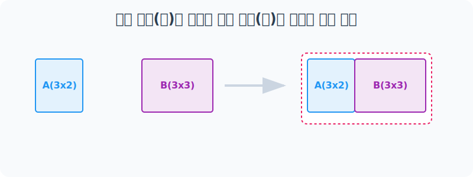
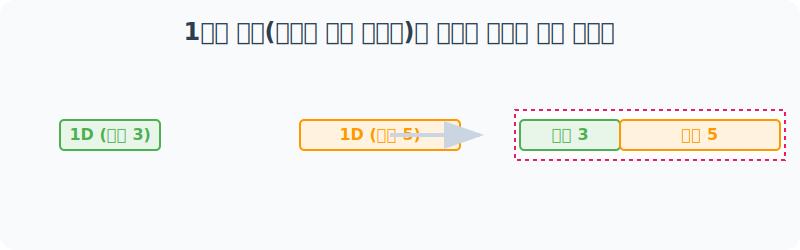
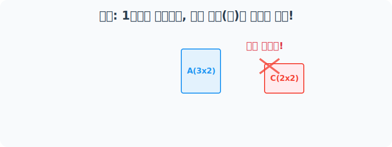

# 4.10.3 numpy.hstack()

## 1. 개념 이해

### 수학적 의미: 행렬의 수평 확장과 특성(Feature) 추가 (Column Augmentation)
수학에서 두 행렬 $A$와 $B$를 좌우로 결합하려면, 두 행렬의 **행(Row)의 개수**가 반드시 일치해야 합니다. 

예를 들어, 행렬 $A$가 $m \times p$ 차원(행 $m$개, 열 $p$개)이고, 행렬 $B$가 $m \times q$ 차원이라면, 이 둘을 수평 결합(`hstack`)한 새로운 행렬 $C$의 차원은 **$m \times (p+q)$** 가 됩니다.

#### 수식 표현
$\begin{bmatrix} A & B \end{bmatrix}_{ m \times (p+q) }$

#### 데이터 과학에서의 의미 (특성 추가)
데이터 분석에서 **행(Row)**은 각각의 관측치(예: 사람 1명, 특정 날짜 1일)를 의미하고, **열(Column)**은 해당 관측치의 속성(Feature: 기온, 풍속 등)을 의미합니다. 

따라서 `hstack`은 이미 존재하는 관측치(행)들에 대하여 **"새로운 변수나 속성(열) 데이터를 오른쪽 옆에 계속해서 병합(Append)하여 데이터셋을 풍부하게 확장하는 작업"**입니다. 예를 들어, 기존에 존재하던 '이름, 나이' 데이터 옆에 새로 수집된 '이메일 주소' 데이터를 새로운 열(Column)로 좌우로 합치는 작업과 같습니다.

#### 연립방정식 관점에서의 상세 의미 (종속 변수 벡터의 통폐합)
행렬을 연립방정식 시스템 $Ax = B$ 로 바라볼 때, **행(Row)**은 개별 조건식을 의미합니다. 

방정식을 풀기 위한 수학적 해법(가우스 소거법 등)을 적용할 때, 수학자들은 변수들의 계수 행렬 $A$의 맨 오른쪽 끝부분에 결과 벡터 $B$를 통째로 이어 붙여 거대한 **첨가 행렬(Augmented Matrix)**을 구성합니다. 이렇게 동일한 개수의 행(수식 개수)을 지닌 행렬들을 좌우 측면으로 접합할 때 사용하는 연산 원리가 곧 `hstack`입니다. 

### 비유로 이해하기: 기차의 객차 이어 붙이기
마치 기관차 꼬리에 새로운 객차 칸을 연결하듯이 데이터를 **옆(수평, Horizontal)** 방향으로 나란히 결합하여 폭(길이)을 늘립니다. 
(단, 기차가 레일 위를 안정적으로 달리려면 연결되는 두 기차칸 표면의 **위아래 높이(행의 개수)**가 완벽히 동일해야 단단히 이어붙일 수 있습니다!)

---

## 2. 단계별 실습

### [1단계] 열 개수(너비)가 달라도 행(높이)만 같으면 결합 OK!
수평 결합에서는 데이터 블록의 가로 길이가 얼마인지는 중요하지 않습니다. **두 데이터의 위아래 높이(행의 개수)만 정확히 같다면** 문제없이 이어 붙일 수 있습니다.


> 행이 3개인 배열 `a(3x2)`와 행이 3개인 배열 `b(3x3)`를 매끄럽게 연결합니다.

```python
import numpy as np

# 행 높이가 3층인 두 배열 준비
a = np.arange(6).reshape(3, 2)
b = np.arange(10, 19).reshape(3, 3)

print("배열 a (3x2):\n", a)
print("배열 b (3x3):\n", b)

# [수평 결합] a 옆에 b를 찰싹 붙입니다!
result = np.hstack((a, b))

print("\n🚀 hstack((a, b)) 결과 (3x5):\n", result)
```

**[실행 결과]**
```text
배열 a (3x2):
 [[0 1]
  [2 3]
  [4 5]]
배열 b (3x3):
 [[10 11 12]
  [13 14 15]
  [16 17 18]]

🚀 hstack((a, b)) 결과 (3x5):
 [[ 0  1 10 11 12]
  [ 2  3 13 14 15]
  [ 4  5 16 17 18]]
```

---

### [2단계] 1차원 배열(단순 리스트)은 무조건 옆으로 길어집니다
모양이 같은 2차원 배열이 아니더라도, **1차원 배열(단순 리스트 성격)끼리는 길이 상관없이 무조건 양옆으로 이어 붙여** 길다란 하나의 1차원 배열을 만듭니다.



```python
# 원소가 3개인 1차원 배열과 5개인 1차원 배열 준비
arr1 = np.arange(3)         # [0 1 2]
arr2 = np.arange(10, 15)    # [10 11 12 13 14]

# hstack으로 결합하면 하나로 이어진 1차원 배열이 됩니다.
result_1d = np.hstack((arr1, arr2))

print("💡 1차원 hstack 결과:", result_1d)
```

**[실행 결과]**
```text
💡 1차원 hstack 결과: [ 0  1  2 10 11 12 13 14]
```

---

## 3. 에러 분석 및 주의사항

### [주의사항] 레일 높이 불일치! 행(Row) 개수가 다르면 에러발생
기차를 이어 붙일 때 레일 높이가 다르면 탈선하듯, **결합하려는 배열들의 행(Row) 개수가 다르면 무조건 에러가 터집니다.**



```python
try:
    # a는 3행(3x2)인데, c는 2행(2x2)입니다. (높이가 맞지 않음)
    c = np.array([[10, 20], [30, 40]])
    np.hstack((a, c))
    
except ValueError as e:
    print("❌ 에러 발생 (ValueError):\n", e)
```

**[실행 결과]**
```text
❌ 에러 발생 (ValueError):
 all the input array dimensions except for the concatenation axis must match exactly, but along dimension 0, the array at index 0 has size 3 and the array at index 1 has size 2
```
> **핵심 룰:** 수평 결합(`hstack`)을 시행할 때는 모든 대상 배열들의 **세로 폭(dimension 0 사이즈 = 행의 개수)** 가 완전히 일치하는지 꼭 사전에 확인해야 합니다!
