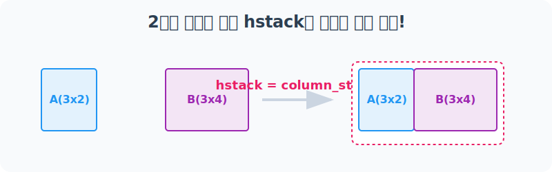
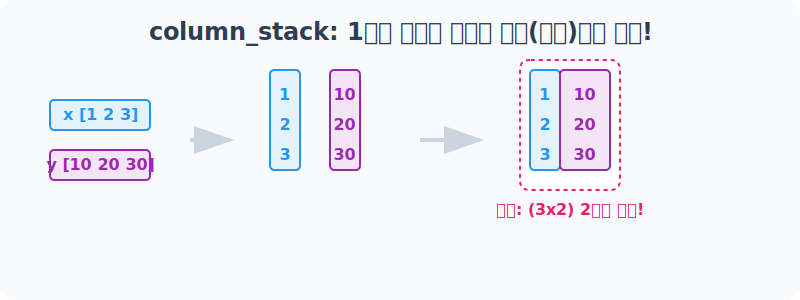
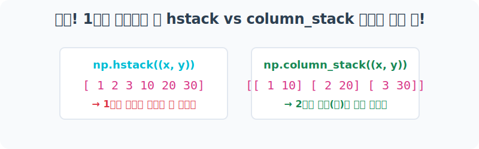

# 4.10.4 배열 결합 변형 기법: column_stack() & row_stack()

앞서 배운 `hstack()`과 `vstack()`이 기본기라면, 이번에는 1차원 배열을 다룰 때 헷갈리지 않고 특수한 형태(기둥 모양)로 조립할 수 있게 도와주는 맞춤형 특수 결합 함수 두 가지를 알아봅니다.

---

## 1. 차원의 반란! 기둥 형태로 조립하는 `np.column_stack()`

### 1.1 개념 이해

`column_stack()`은 그 이름에서 알 수 있듯 1차원 배열 데이터를 **열(Column, 기둥)** 형태로 꼿꼿이 세워 결합하는 특수 함수입니다.

#### 수학적 의미: '열 벡터(Column Vector)'로의 1차원 승급 
선형대수적 관점에서, 입력된 1차원 배열 요소들을 모두 $N \times 1$ 크기를 지니는 명확한 방향성의 **열 벡터(Column Vector)** 로 차원 승급(열 공간 확장)시킵니다. 이후 세워진 기둥 벡터들을 옆으로 나란히 수평 병합(`hstack` 방식)하여 독립적인 다변량 행렬(Matrix)을 단번에 구성해 냅니다.


#### 데이터 과학에서의 의미 (속성/Feature 조립)
분석 과정에서 여러 변수의 관측 데이터가 개별 리스트로 쪼개져 파편화되어 있을 때(예: `키_리스트`, `몸무게_리스트`), 각각의 1차원 데이터들을 모아 속성별 컬럼(기둥)으로 배치하여 머신러닝이 학습 가능한 형태의 완전한 **2차원 데이터프레임(표 형식)** 으로 합체(Assemble)할 때 핵심적인 역할을 수행합니다.


### 1.2 단계별 실습

#### [1단계] 2차원 배열에서는? (hstack과 100% 동일)
만약 이미 기둥 모양이 잡혀있는 2차원 배열을 인자로 넘긴다면, `np.hstack()`으로 옆으로 이어 붙이는 것과 완벽하게 똑같이 동작합니다.



```python
import numpy as np

a = np.arange(6).reshape(3, 2)
b = np.arange(10, 22).reshape(3, 4)

# 2차원 배열 끼리의 column_stack은 hstack과 차이가 없습니다.
result_col = np.column_stack((a, b))
result_hor = np.hstack((a, b))

print("🚀 column_stack 결과:\n", result_col)
print("🚀 hstack 결과 (동일함):\n", result_hor)
```

**[실행 결과]**
```text
🚀 column_stack 결과:
 [[ 0  1 10 11 12 13]
  [ 2  3 14 15 16 17]
  [ 4  5 18 19 20 21]]
🚀 hstack 결과 (동일함):
 [[ 0  1 10 11 12 13]
  [ 2  3 14 15 16 17]
  [ 4  5 18 19 20 21]]
```

#### [2단계] 1차원 배열에서 진가 발휘! (기둥 세우기)
`column_stack()`의 진짜 존재 이유는 **1차원 배열(단순 리스트)** 을 결합할 때 극명하게 나타납니다. 1차원 배열을 납작한 가로줄이 아니라 **세로 기둥** 단위로 취급하여, 차원을 스스로 한 단계 높인 후(2차원) 차곡차곡 우측으로 세워 나갑니다.


> 1차원 배열 `x[1, 2, 3]`이 마치 `[[1], [2], [3]]`으로 강제 기립된 후 합쳐지는 효과입니다.

```python
x = np.array([1, 2, 3])
y = np.array([10, 20, 30])

# 1차원 배열을 열(컬럼)처럼 세워서 2차원 테이블 구조로 만듦!
result_1d_col = np.column_stack((x, y))

print("🏢 1차원 배열 column_stack 결과 (2차원으로 승급):\n", result_1d_col)
```

**[실행 결과]**
```text
🏢 1차원 배열 column_stack 결과 (2차원으로 승급):
 [[ 1 10]
  [ 2 20]
  [ 3 30]]
```

*(참고) 내부적으로는 `x[:, np.newaxis]` 연산을 통해 1차원을 억지로 2차원 컬럼 행렬로 바꾼 뒤 `hstack` 하는 것과 정확히 같은 원리입니다.*

---

### 1.3 에러 분석 및 주의사항

#### [주의사항] 1차원 결합 시 `hstack` vs `column_stack` 극과 극 비교!
이 둘의 1차원 배열 처리 방식을 혼동하면, 데이터 분석 및 차원 병합 시 심각한 구조적 오류(차원 붕괴) 현상이 발생할 수 있습니다!



```python
# hstack은 1차원을 그냥 가로로 이어붙임 (여전히 1차원)
print("👉 hstack((x, y)) 결과:", np.hstack((x, y)))

# column_stack은 1차원을 기둥으로 세워서 붙임 (2차원 행렬)
print("👉 column_stack((x, y)) 결과:\n", np.column_stack((x, y)))

# 즉, 이 둘은 서로 완전히 다른 함수입니다!
print("\n결과가 똑같나요? :", np.array_equal(np.column_stack((x, y)), np.hstack((x, y))))
```

**[실행 결과]**
```text
👉 hstack((x, y)) 결과: [ 1  2  3 10 20 30]
👉 column_stack((x, y)) 결과:
 [[ 1 10]
  [ 2 20]
  [ 3 30]]

결과가 똑같나요? : False
```

---

## 2. vstack의 완벽한 쌍둥이 동생, `np.row_stack()`

### 2.1 개념 이해: 행 벡터 기반 적층
`row_stack()`은 1차원 배열 데이터를 행(Row, 가로줄) 단위로 층층이 위아래로 쌓아 올리는 함수입니다. 그런데 이 설명, 앞서 배운 내용과 많이 비슷하지 않나요?

#### 수학적 의미: 행 벡터(Row Vector)들의 수직 확장
주어진 배열들을 수학적으로 크기 $1 \times N$ 인 독자적 **행 벡터(Row Vector)** 로 인식하고, 이를 수직 방향(아래)으로 계속해서 적층(Stacking)해 나갑니다.


### 2.2 [간단 요약] 결국 vstack과 100% 똑같다!
결론부터 말하자면, **`row_stack()`은 우리가 앞서 집중적으로 학습했던 `vstack()`과 단 하나의 차이점도 없이 소스코드 단까지 완벽하게 동일하게 구성된 복제(Alias) 함수**입니다.


> 함수 내부 소스코드를 까보면 `row_stack` 안에서 그냥 `vstack`을 돌려줄 정도로 완전히 똑같습니다.

```python
a = np.array([4., 2., 1.])
b = np.array([3., 8., 7.])

print("👇 row_stack 결과:\n", np.row_stack((a, b)))
print("\n👇 vstack 결과:\n", np.vstack((a, b)))
```

**[실행 결과]**
```text
👇 row_stack 결과:
 [[4. 2. 1.]
  [3. 8. 7.]]

👇 vstack 결과:
 [[4. 2. 1.]
  [3. 8. 7.]]
```

*(참고) 데이터 과학자들 사이에서는 타이핑도 조금 더 짧고 직관적인 `np.vstack`이 압도적으로 더 많이 쓰입니다!*
