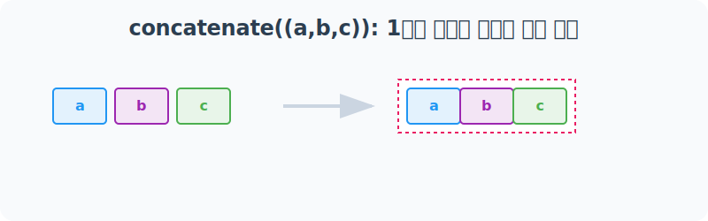
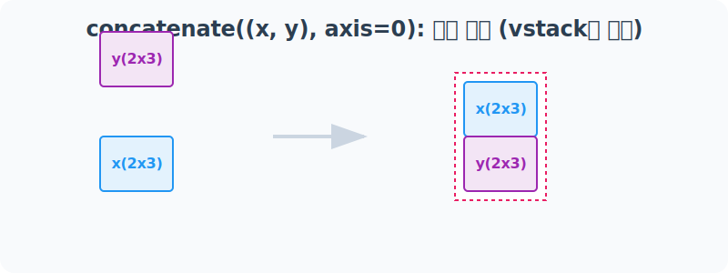
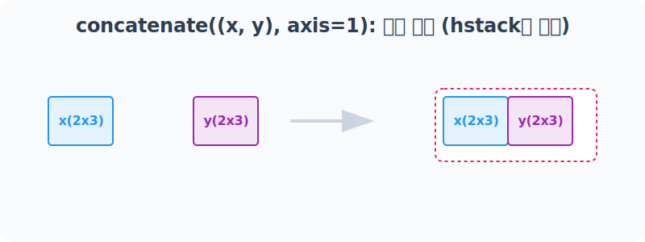
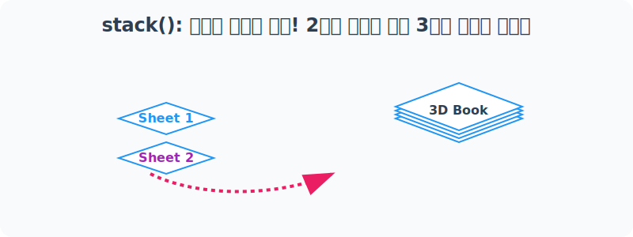
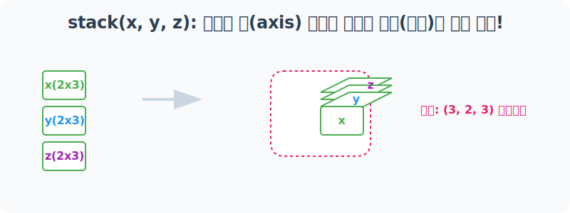

# 4.10.5 만능 결합기: concatenate()와 stack()

지금까지 배운 `hstack`이나 `vstack`은 내부적으로 모두 `concatenate()`나 `stack()`이라는 강력한 만능 도구를 쉽게 포장해 놓은 단축키(Alias)와 같습니다. 이번에는 방향(축, axis)을 자유자재로 설정할 수 있는 이 두 가지 본원적 함수 사용법을 알아봅니다.

---

## 1. 차원 유지 결합의 정수: `np.concatenate()`

### 1.1 개념 이해
`concatenate()`는 원하는 결합 방향(축, axis)을 지정해주면, 데이터의 기본 차원(Dimension) 깊이는 그대로 유지한 채 지정된 방향으로만 이어 붙이는 함수입니다.

#### 수학적 의미: 축 공간(Axis Space) 내의 텐서 연장
수학적으로 $N$차원 텐서들을 결합할 때, 전체 차원 공간의 수(차수)는 높이지 않고 오직 지정된 `axis` 방향의 크기(Size)만을 더하여 연장된 텐서를 만들어냅니다.


#### 데이터 과학에서의 의미 (입체 데이터의 유연한 부분 확장)
다차원 데이터를 다룰 때, 표의 아래쪽(행/Row)으로 데이터를 덧붙이거나(관측치 추가), 우측(열/Column)로 덧붙이는(특성 추가) 수학적 조작 행위 모두를 가장 포괄적이고 유연하게 처리할 수 있는 범용 병합 엔진입니다.


### 1.2 단계별 실습

#### [1단계] 1차원 배열(벡터) 합치기
1차원 배열을 합칠 때는 기본적으로 옆으로 나란히 이어 붙습니다(`axis=0`).



```python
import numpy as np

a = np.array([1, 2])
b = np.array([3, 4])
c = np.array([5, 6])

# 1차원 배열의 기본 병합
result_1d = np.concatenate((a, b, c))
print("💡 1차원 concatenate 결과: ", result_1d)

# axis=0 을 명시해줘도 똑같이 동작합니다.
# axis=None 을 주면 평면화(전체 1차원으로 쫙 폄)하여 결합합니다.
```

**[실행 결과]**
```text
💡 1차원 concatenate 결과:  [1 2 3 4 5 6]
```

#### [2단계] 2차원 배열 세로로 합치기 (`axis=0`)
`axis=0`은 행(Row) 방향으로 내려가면서(수직으로) 합친다는 의미입니다. 즉, **`vstack`과 동일한 효과**를 냅니다.



```python
x = np.arange(6).reshape(2, 3)
y = np.arange(10, 16).reshape(2, 3)

# 수직(위아래)으로 결합
result_ax0 = np.concatenate((x, y), axis=0)

print("🏢 axis=0 (수직 결합) 결과:\n", result_ax0)
```

**[실행 결과]**
```text
🏢 axis=0 (수직 결합) 결과:
 [[ 0  1  2]
  [ 3  4  5]
  [10 11 12]
  [13 14 15]]
```
> *(주의) 만약 열(가로 폭) 개수가 다른 배열을 수직으로 결합하려 하면 ValueError가 발생합니다.*

#### [3단계] 2차원 배열 가로로 합치기 (`axis=1`)
`axis=1`은 열(Column) 방향으로(수평으로) 나란히 합친다는 의미입니다. **`hstack`과 동일한 효과**입니다.



```python
z = np.arange(20, 24).reshape(2, 2)

# 가로 폭이 달라도 높이(행)만 같으면 수평 결합 가능!
result_ax1 = np.concatenate((x, y, z), axis=1)

print("🚀 axis=1 (수평 결합) 결과:\n", result_ax1)
```

**[실행 결과]**
```text
🚀 axis=1 (수평 결합) 결과:
 [[ 0  1  2 10 11 12 20 21]
  [ 3  4  5 13 14 15 22 23]]
```

---

## 2. 차원의 벽을 넘다: `np.stack()`

### 2.1 개념 이해

`concatenate`가 평면 종이를 계속 옆이나 밑으로 이어 붙여 커다란 포스터를 만드는 것이라면, `stack`의 본질은 완전히 다릅니다.

#### 수학적 의미: N차원 텐서들의 (N+1)차원 공간 사상
$N$차원 텐서 여러 개를 입력받아, 차원의 벽을 넘고 내부에 완전히 새로운 차원 축(`axis`)을 생성하여 이를 차곡차곡 적층시킵니다. 결과적으로 $N+1$ 차원으로 텐서 공간 자체가 승격(Promotion)됩니다. 공간의 구조가 변하므로 결합 대상 배열들의 형태(Shape)가 무조건 일치해야만 수학적 연산이 성립합니다.


#### 비유로 이해하기: 얇은 종이를 겹쳐 다차원 두꺼운 책 만들기
`stack`은 아예 **새로운 차원의 축**을 창조해냅니다. 평평한 2차원 낱장 종이들을 허공으로 겹겹이 쌓아 올려, 입체적인 3차원의 두꺼운 전공서적(Volume)으로 차원을 격상시키는 과정과 완벽히 일치합니다.



#### 데이터 과학에서의 의미 (시계열/채널 분리 데이터의 일괄 결합)
시계열 데이터 분석 시 [2021년도 2D 데이터프레임], [2022년도 2D 데이터프레임]처럼 연도별로 쪼개진 패널 데이터를 묶어 단 하나의 [연도 $\times$ 행 $\times$ 열] 구조를 지니는 **3차원 입체 시계열 패널 텐서**로 취합할 때 거의 필수적으로 사용됩니다. 컴퓨터 비전(CNN)에서 흑백 이미지 여러 장(2D)을 합쳐 컬러 다채널(RGB 채널 등) 이미지 통(3D)으로 포장할 때도 핵심 원리로 사용됩니다.


### 2.2 단계별 실습

#### [1단계] 1차원을 여러 겹 쌓아 2차원으로!
1차원 배열(선) 2개를 겹쳐 2차원 행렬(면)로 승급시킵니다.

```python
a = np.array([1, 2, 3])
b = np.array([4, 5, 6])

# 새 축을 세로방향으로(axis=0) 해서 쌓기
stack_ax0 = np.stack((a, b), axis=0)

# 새 축을 가로방향으로(axis=1) 해서 쌓기
stack_ax1 = np.stack((a, b), axis=1)

print("📚 1차원 stack (axis=0):\n", stack_ax0)
print("📚 1차원 stack (axis=1):\n", stack_ax1)
```

**[실행 결과]**
```text
📚 1차원 stack (axis=0):
 [[1 2 3]
  [4 5 6]]
📚 1차원 stack (axis=1):
 [[1 4]
  [2 5]
  [3 6]]
```

#### [2단계] 2차원을 여러 겹 쌓아 3차원 입체블록으로!
모양이 완벽히 똑같은 2차원 판자 `x, y, z`를 준비하여 축 옵션에 따라 어떤 형태의 입체 코어(3D)로 조립되는지 확인해 봅시다.



```python
x = np.arange(6).reshape(2, 3)
y = np.arange(10, 16).reshape(2, 3)
z = np.arange(20, 26).reshape(2, 3)

# 방법 1: 뭉텅이 단위로 층층이 올리기 (행을 통째로 올림)
ax0 = np.stack((x, y, z), axis=0)

print(f"🧊 axis=0 스택 후 모양: {ax0.shape}")
print(ax0)
```

**[실행 결과]**
```text
🧊 axis=0 스택 후 모양: (3, 2, 3)
[[[ 0  1  2]
  [ 3  4  5]]

 [[10 11 12]
  [13 14 15]]

 [[20 21 22]
  [23 24 25]]]
```

```python
# 방법 2: 각각의 행(Row)들끼리 교차하며 합치기
ax1 = np.stack((x, y, z), axis=1)

print(f"\n🧊 axis=1 스택 후 모양: {ax1.shape}")
print(ax1)
```

**[실행 결과]**
```text
🧊 axis=1 스택 후 모양: (2, 3, 3)
[[[ 0  1  2]
  [10 11 12]
  [20 21 22]]

 [[ 3  4  5]
  [13 14 15]
  [23 24 25]]]
```

```python
# 방법 3: 각각의 원소 열끼리 모아서 깊이(Depth)로 박아넣기
ax2 = np.stack((x, y, z), axis=2) 

print(f"\n🧊 axis=2 스택 후 모양: {ax2.shape}")
print(ax2)
```

**[실행 결과]**
```text
🧊 axis=2 스택 후 모양: (2, 3, 3)
[[[ 0 10 20]
  [ 1 11 21]
  [ 2 12 22]]

 [[ 3 13 23]
  [ 4 14 24]
  [ 5 15 25]]]
```

### 2.3 요약 정리 노트

> **핵심 룰:** `concatenate`는 현재의 차원 공간 내에서 크기(Size)만 덩치를 불리는 함수이고, `stack`은 무조건 **차원(Dimension) 자체를 +1 업그레이드** 시키는 함수라는 것을 절대 잊지 마세요!

