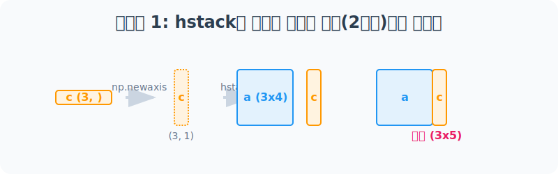
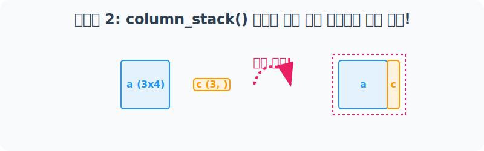

# 4.10.6 실전 비교: column_stack() vs hstack()

## 1. 형태결합 규칙의 차이점 이해

### 1.1 수학적 규칙의 근본적 차이

#### `hstack`의 엄격함: 
선형대수학의 텐서 결합 연산 시, 대상 텐서들의 **차원 수(Number of dimensions, `ndim`)가 완벽히 동일**해야만 결합을 허용하는 엄격한 성질을 지닙니다. 

즉, 2차원 행렬($N \times M$) 옆에는 오직 2차원 행렬만이 형태상 결합될 수 있습니다.


#### `column_stack`의 유연함: 
내부적으로 입력 배열의 차원을 검사하여, 입력값이 1차원 스칼라 배열일 경우 이를 자동으로 2차원 **열 벡터(Column Vector, $N \times 1$)** 로 즉각 차원 승격시켜 준 뒤 수평 결합하는 스마트 래퍼(Smart Wrapper) 연산입니다.


### 1.2 비유로 이해하기: 

#### 2차원 표(Table)에 특성(Feature) 붙이기
실무에서 데이터 분석을 하다 보면 이미 만들어진 2차원 표 구조(예: 학급 성적표) 맨 끝 열에 1차원 리스트 형태로 따로 분리된 새로운 변수(예: 출석 점수 목록)를 통째로 보너스 열로 끼워 넣어야 할 때가 수시로 발생합니다. 

이때 두 함수의 1차원 배열 제어 차이를 제대로 인지하지 못하면 끝없는 차원 불일치 에러의 수렁에 빠지게 됩니다.


---

## 2. 실전 문제 해결 과정

### 2.1 [1단계] 2차원 배열에 1차원 데이터 이어 붙이기 (hstack의 실패)
우선 행이 3개인 2차원 행렬 `a(3x4)`와 길이가 3인 1차원 배열 `c(3,)`를 준비합니다. 데이터의 원소 개수(높이) 자체는 같으니 `hstack`으로 바로 옆에 붙일 수 있을까요?


```python
import numpy as np

# 3행 4열 2차원 배열
a = np.arange(1, 13).reshape(3, 4)
print("배열 a (3x4):\n", a)

# 길이 3짜리 1차원 배열
c = np.arange(1, 6, 2)
print("\n배열 c (3,):", c)

try:
    print("\n[시도] hstack((a, c))")
    np.hstack((a, c))
    
except ValueError as e:
    print("❌ 에러 발생:\n", e)
```

**[실행 결과]**
```text
배열 a (3x4):
 [[ 1  2  3  4]
  [ 5  6  7  8]
  [ 9 10 11 12]]

배열 c (3,): [1 3 5]

[시도] hstack((a, c))
❌ 에러 발생:
 all the input arrays must have same number of dimensions, but the array at index 0 has 2 dimension(s) and the array at index 1 has 1 dimension(s)
```
> `hstack`은 **반드시 차원(Dimension) 수가 똑같은 상태**에서만 결합을 허용합니다. 2차원과 1차원이 만났으므로 즉시 에러가 터집니다.

---

### 2.2 [2단계] hstack으로 해결하려면? (억지로 기둥 만들기)
끝끝내 `hstack`을 고집하려면, 1차원 배열 `c`를 억지로 2차원 기둥 형태로 변경(`np.newaxis` 또는 `np.expand_dims`)해 차원을 맞춰줘야 합니다.



```python
# c 배열의 차원을 강제로 1에서 2로 늘려 기둥(Column)으로 세움
c_column = c[:, np.newaxis] 
print("👉 c 의 2차원 기둥 변환 (3x1):\n", c_column)

# 2차원(a) + 2차원(c_column) 이므로 hstack 성공!
result_hstack = np.hstack((a, c[:, np.newaxis]))
print("\n✅ hstack 결합 결과 (3x5):\n", result_hstack)
```

**[실행 결과]**
```text
👉 c 의 2차원 기둥 변환 (3x1):
 [[1]
  [3]
  [5]]

✅ hstack 결합 결과 (3x5):
 [[ 1  2  3  4  1]
  [ 5  6  7  8  3]
  [ 9 10 11 12  5]]
```

---

### 2.3 [3단계] column_stack의 마법: 그냥 넣으면 끝!
방금 전 `hstack`이 2차원 기둥으로 강제 변환시키는 과정을 거쳐야만 작동했던 것을 기억하시나요? **`column_stack`은 이걸 알아서(자동으로) 해주는 함수**입니다.



```python
# 차원을 맞추는 복잡한 작업(np.newaxis) 싹 다 필요 없습니다.
result_colstack = np.column_stack((a, c))

print("✨ column_stack 결합 결과 (3x5):\n", result_colstack)
```

**[실행 결과]**
```text
✨ column_stack 결합 결과 (3x5):
 [[ 1  2  3  4  1]
  [ 5  6  7  8  3]
  [ 9 10 11 12  5]]
```

## 3. 실무 요약 노트

> **[실무 꿀팁 요약]**
> * 2차원 구조체끼리 병합할 땐 `hstack`이든 `column_stack`이든 취향대로 써도 결과가 동일합니다.
> * **기존 2차원 테이블 셋에 파편화된 1차원 독립 컬럼을 병합 추가할 땐, 무조건 `column_stack`을 씁니다.** 차원 수동 제어(newaxis) 코드가 사라져 코드가 압도적으로 우아해집니다.
