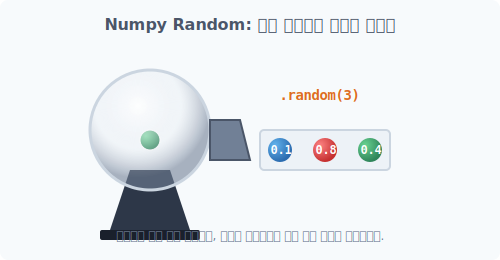

# 4.11.1 데이터 창조의 마법사: 난수(Random)와 확률 모형


<div style="text-align: center; margin: 30px 0;">
  
  <p style="color: #718096; font-size: 0.9em; margin-top: 10px;"><em>[그림] 예측할 수 없는 무작위 값을 연속으로 뽑아내어 배열 통에 채우는 랜덤 제너레이터(Generator)</em></p>
</div>

## [도입] 왜 '무작위(Random)' 데이터가 필요할까요?

**[수학적 의미: 통계학과 카오스 이론의 모방]**
지금까지 우리는 항상 값이 꽉 차 있거나, 규칙적으로 증가하는(`arange`) 고정된 배열들만 다뤄왔습니다. 하지만 현실 세계의 데이터(주사위 굴리기, 날씨 변화, 주가 차트)는 불확실성(Uncertainty)으로 가득 차 있습니다. 이러한 **예측 불가능한 세상을 시뮬레이션**하기 위해 가짜 데이터를 뿜어내는 마법사가 바로 **난수(Random Number)** 입니다.

**[비유로 이해하기: 게임 속 아이템 강화 확률]**
게임에서 "+10강 무기"가 뜰 확률이나, 인공지능이 강아지와 고양이 사진을 구분하기 위해 맨 처음 찍어보는(초기화) 가중치 값들은 모두 이 무작위 배열을 통해 뿌려집니다. Numpy의 최신 `random` 모듈 삼 형제가 이 무작위 생성을 완벽하게 수행합니다.

---

## [1단계] 난수 생성기(Generator) 생성하기

최신 Numpy에서는 예전 방식(`np.random.rand()`) 대신, 전용의 **난수 생성 기계(Generator)**를 먼저 한 대 구입해서 방에 들여놓는 방식을 권장합니다. 


```python
import numpy as np

# 나만의 난수 생성 기계(Generator)를 'rg'라는 변수에 할당합니다.
# 괄호 안의 숫자(12345)는 '시드(seed)' 라고 부릅니다.
rg = np.random.default_rng(12345)

print("할당된 기계:", rg)
```
**[실행 결과]**
```text
할당된 기계: Generator(PCG64) at 0x...
```

> **[꿀팁] 시드(Seed) 값이란?**
> 시드 값을 `12345`나 `42` 등 고정된 숫자로 똑같이 입력하면, **아무리 컴퓨터를 껐다 켜도 무조건 똑같은 난수 순서가 나오게 보장**해 줍니다. 연구나 실험을 다른 사람이 재현(Reproducibility)할 수 있게 도와주는 중요한 개념입니다!
