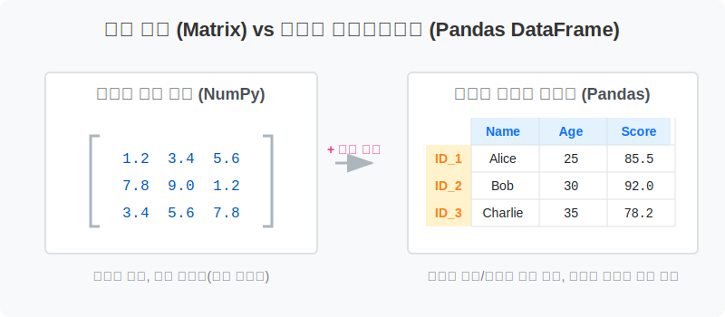

# 6.1.1 pandas 개요

## 🐼 Pandas란 무엇인가요?

Pandas는 파이썬에서 표 형태의 데이터(Tabular Data)를 가장 쉽고 빠르게 다룰 수 있게 해주는 라이브러리입니다. 엑셀이나 SQL과 같은 데이터베이스의 기능을 파이썬 코드 안에서 빠르고 강력하게 사용할 수 있습니다.

**[비유로 이해하기: 파이썬계의 초고속 엑셀(Excel)]**
- **엑셀(Excel)**: 눈으로 보면서 마우스로 하나씩 표를 그리고 색칠하는 수작업 공방입니다.
- **판다스 (Pandas)**: 엑셀에서 하던 수십만 줄의 표 계산과 정렬, 필터링 작업을 코드 한 줄로 순식간에 찍어내는 **초거대 자동화 공장**입니다.
- **데이터베이스 (DB)**: 회사 데이터가 영구 보관되는 **거대한 도서관 서고**라면, **판다스(Pandas)**는 서고에서 필요한 책만 꺼내서 이리저리 펼쳐놓고 작업하는 **내 책상 위(RAM 공간)**입니다.

### [수학적/전산학적 의미: 구조화된 다차원 관계형 테이블 모델]

단순히 "파이썬의 엑셀"이라는 비유를 넘어, 전산학적으로 판다스가 가지는 진정한 강력함은 **이산 행렬(Matrix)의 한계를 극복한 것**에 있습니다.

> 💡 **[참고] 이산 행렬(Discrete Matrix)이란?**
> 수학에서 연속되지 않고 뚝뚝 끊어진 개별적인 숫자 데이터들이 직사각형(행과 열)의 격자 형태로 뭉쳐있는 덩어리를 말합니다. 예를 들어 컴퓨터 모니터의 픽셀 데이터 배열이나, 엑셀에서 순수한 숫자 셀 영역만 잘라낸 모습이 이산 행렬에 해당합니다. 컴퓨터는 이런 단순한 숫자 격자 배열을 엄청나게 빠른 속도로 연산할 수 있습니다. 판다스는 이 행렬 위에 '이름표'를 붙여 인간이 다루기 쉽게 만든 것입니다.

1. **라벨(Label) 식별자 결합**
   - 기존의 수학적 행렬(NumPy)은 0, 1, 2 같은 **위치(숫자 인덱스)**로만 데이터에 접근할 수 있었습니다.
   - 판다스는 이 행렬의 상단과 좌측에 **컬럼(Column)**과 **인덱스(Index)**라는 인간 친화적인 라벨을 씌웠습니다. 덕분에 `[1, 2]`라는 모호한 위치 대신 `df.loc['ID_1', 'Age']`처럼 명확한 식별자로 데이터베이스(DB)처럼 접근이 가능해졌습니다.

2. **이기종(Heterogeneous) 데이터의 수용**
   - 순수 행렬은 연산 속도를 위해 "오직 같은 타입의 숫자(Int, Float 등)"만 담을 수 있습니다.
   - 하지만 현실 세계의 데이터는 이름(문자열), 가입일(날짜), 등급(카테고리) 등 형태가 다양합니다. 판다스는 각 열(Column)마다 서로 다른 데이터 타입(dtype)을 허용하면서도, 내부적으로는 C언어 기반의 연산 엔진을 사용하여 **유연성과 연산 속도**를 동시에 잡아냈습니다.

3. **관계형 대수(Relational Algebra) 연산 지원**
   - 단순한 사칙연산을 넘어, SQL에서나 가능했던 **JOIN(병합), GROUP BY(그룹 집계), Pivot(구조 변환)** 같은 고차원적인 관계형 데이터베이스 연산을 파이썬 메모리 위에서 즉각적으로 수행할 수 있는 완벽한 데이터 모델을 제공합니다.
