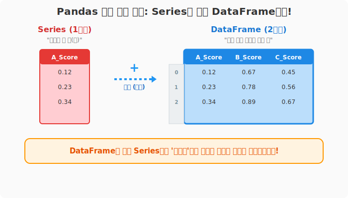

# 6.1.1 pandas 개요

**[수학적/전산학적 의미: 구조화된 다차원 관계형 테이블 모델]**
판다스(pandas)는 수학적 이산 행렬(Matrix) 구조에 **라벨(Label) 식별자**를 결합하여, 단순한 수치뿐만 아니라 문자열, 날짜 등 이기종(Heterogeneous) 데이터를 하나의 표 형태로 묶어서 관계형 대수(Relational Algebra) 연산을 지원하는 데이터 모델입니다.

**[비유로 이해하기: 파이썬계의 초고속 엑셀(Excel)]**
- **엑셀(Excel)**: 눈으로 보면서 마우스로 하나씩 표를 그리고 색칠하는 수작업 공방입니다.
- **판다스 (Pandas)**: 엑셀에서 하던 수십만 줄의 표 계산과 정렬, 필터링 작업을 코드 한 줄로 순식간에 찍어내는 **초거대 자동화 공장**입니다.
- **데이터베이스 (DB)**: 회사 데이터가 영구 보관되는 **거대한 도서관 서고**라면, **판다스(Pandas)**는 서고에서 필요한 책만 꺼내서 이리저리 펼쳐놓고 작업하는 **내 책상 위(RAM 공간)**입니다.

---

### [1단계] 판다스의 핵심 구조물

판다스는 `NumPy`라는 수학 행렬 연산 엔진 위에 지어졌으며, 2가지 핵심 건자재를 사용합니다.

1. **지구본(1차원): `Series(시리즈)`**
   - 엑셀의 "단일 열(컬럼)" 하나만 똑 떼어낸 모양입니다.

2. **격자 건물(2차원): `DataFrame(데이터프레임)`**
   - 엑셀의 "행과 열이 존재하는 전체 시트" 모양입니다. 여러 개의 시리즈(Series)가 모여 데이터프레임을 이룹니다.

| 구조 타입 | 차원 | 의미 | 비유 |
|:---:|:---:|:---|:---|
| **Series** | 1차원 배열 | 단일 특성(Feature) 데이터 세트 | 온도계 한 개의 눈금 기록 |
| **DataFrame** | 2차원 배열 | 복수 개의 Series가 결합된 형태 | 여러 온도계의 눈금들이 기록된 종합 일지 |



*(위 그림: 1차원 Series들이 모여 2차원 DataFrame을 구성하는 관계)*

---

### [2단계] 왜 판다스를 써야 할까요?

수백만 건의 데이터를 엑셀로 열면 프로그램이 멈출 수 있지만, 판다스는 Python, Cython, C로 최적화되어 있어 엄청난 양의 데이터를 초고속으로 읽어 들이고 조작할 수 있습니다. 현재 판다스는 **파이썬 데이터 분석 1위의 표준 도구**로 쓰이고 있습니다.

```python
import pandas as pd
import numpy as np

# Pandas는 대량의 데이터도 무심하게 처리해줍니다
data = pd.DataFrame(np.random.rand(1000000, 3), columns=['A_Score', 'B_Score', 'C_Score'])

print("100만 건 데이터 맛보기:\n", data.head(3))
```

**[실행 결과]**
```text
100만 건 데이터 맛보기:
     A_Score   B_Score   C_Score
0   0.12345   0.67890   0.45678
1   0.23456   0.78901   0.56789
2   0.34567   0.89012   0.67890
```


---

### [3단계] 10 Minutes to pandas

판다스의 창시자와 수많은 기여자들은 데이터 분석가들을 위해 공식 홈페이지(`pandas.pydata.org`)의 User Guide에 **'10 minutes to pandas' (판다스 10분 완성)** 이라는 훌륭한 튜토리얼을 제공합니다. 

단 150여 줄의 핵심 커맨드만 익히면 여러분도 판다스를 다룰 수 있습니다! 이제 이어지는 챕터에서 판다스의 Series와 DataFrame을 직접 조립해 보겠습니다.