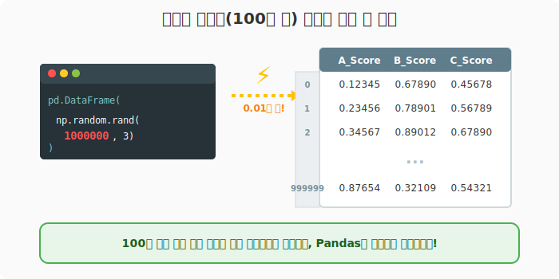

# 6.1.2 판다스 설치 및 기초 실습

> 💾 **[실습 파일 다운로드]**
> 본 강의의 전체 실습 코드를 직접 실행해 볼 수 있는 주피터 노트북 파일입니다. 아래 링크를 클릭하여 다운로드 후 VS Code에서 열어보세요.
> - [📥 pandas_intro_practice.ipynb 파일 다운로드](./pandas_intro_practice.ipynb) (클릭 또는 마우스 우클릭 후 '다른 이름으로 링크 저장')

## 🪄 [실습 1] 데이터 생성과 필터링 동작 원리

VS Code나 주피터 노트북을 열고 `practice_01.py` (또는 `practice_01.ipynb`) 파일을 생성하여 단계별로 코드를 작성해 봅니다.

### 1단계: 데이터 준비하기

먼저 판다스 라이브러리를 불러오고, 파이썬의 기본 자료구조인 딕셔너리(`dict`)를 이용하여 가상의 학생 데이터를 준비합니다.

```python
import pandas as pd

# 1. 딕셔너리를 활용하여 데이터 준비
data = {
    'Name': ['Alice', 'Bob', 'Charlie', 'Diana'],
    'Age': [25, 30, 35, 28],
    'Score': [85, 92, 78, 95]
}
```

이 코드는 아직 데이터를 정의하기만 했을 뿐, 판다스의 강력한 기능이 적용된 상태는 아닙니다.

### 2단계: 데이터프레임(DataFrame)으로 변환하기

준비된 딕셔너리를 판다스의 표 형태 구조인 `DataFrame`으로 변환하여 출력해 봅니다. 이전에 작성한 코드 아래에 다음 코드를 추가하세요.

```python
# 2. DataFrame으로 변환 및 출력
df = pd.DataFrame(data)

print("--- 원본 데이터 ---")
print(df)
```

**[실행 결과]**
```text
--- 원본 데이터 ---
      Name  Age  Score
0    Alice   25     85
1      Bob   30     92
2  Charlie   35     78
3    Diana   28     95
```

딕셔너리가 행과 열을 가진 2차원 표 형태로 깔끔하게 변환된 것을 확인할 수 있습니다.

### 3단계: 조건 필터링 (90점 초과 학생 찾기)

이제 판다스의 강력한 필터링 기능을 활용하여 `Score`가 90점을 초과하는 우수 학생만 추출해 보겠습니다. 코드의 맨 아래에 다음을 추가하여 실행해 보세요.

```python
# 3. 데이터 필터링: Score가 90을 초과하는 우수 학생만 추출
excellent_students = df[df['Score'] > 90]

print("\n--- 90점 초과 우수 학생 ---")
print(excellent_students)
```

**[실행 결과]**
```text
--- 90점 초과 우수 학생 ---
    Name  Age  Score
1    Bob   30     92
3  Diana   28     95
```

아래 데이터 변환 애니메이션은 위 파이썬 코드에서 `df[df['Score'] > 90]` 구문이 어떻게 동작하여 원본 데이터프레임(왼쪽)에서 조건을 만족하는 행들만 필터링한 후 새로운 결과 데이터프레임(오른쪽)을 만들어내는지를 직관적으로 보여줍니다.



---

## [실습 2] 왜 판다스를 써야 할까요? (초대용량 데이터 처리)

이번에는 `practice_02.py` 파일을 새로 만들고, 판다스가 얼마나 빠르고 강력한지 체감해 보는 실습을 진행합니다.

### 1단계: 100만 건의 거대 데이터 생성하기

Numpy의 난수 생성 기능을 활용하여 100만 행짜리 초거대 데이터프레임을 순식간에 만들어 보겠습니다.

```python
import pandas as pd
import numpy as np

# 100만 개의 행과 3개의 열을 가진 무작위 데이터 생성
data = pd.DataFrame(np.random.rand(1000000, 3), columns=['A_Score', 'B_Score', 'C_Score'])
```

수백만 건의 데이터를 엑셀로 열면 프로그램이 멈추거나 굉장히 느려지지만, 판다스는 Python, Cython, C로 최적화되어 있어 엄청난 양의 데이터를 메모리에 초고속으로 로드합니다.

### 2단계: 데이터 살짝 엿보기 (head)

100만 건을 모두 화면에 출력할 수는 없으니, `head()` 함수를 이용해 상위 3개의 데이터만 살짝 엿보겠습니다. 앞서 작성한 코드 아래에 다음을 추가합니다.

```python
# 상위 3개 행만 출력하여 데이터 확인
print("100만 건 데이터 맛보기:\n", data.head(3))
```

**[실행 결과]**
```text
100만 건 데이터 맛보기:
     A_Score   B_Score   C_Score
0   0.12345   0.67890   0.45678
1   0.23456   0.78901   0.56789
2   0.34567   0.89012   0.67890
```

이처럼 대용량 데이터를 아주 간단한 코드 몇 줄만으로 빠르고 쉽게 조작할 수 있다는 점 때문에 현재 판다스는 **파이썬 데이터 분석 1위의 표준 도구**로 쓰이고 있습니다.


