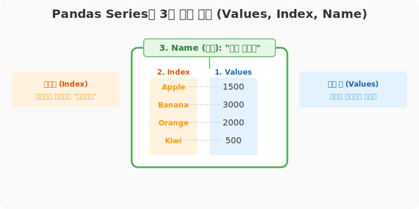
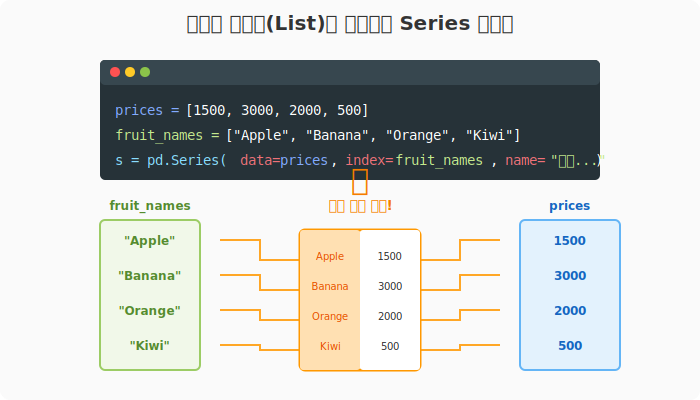

# 6.1.3 Series (시리즈) 개요

> 💾 **[실습 파일 다운로드]**
> 본 강의의 전체 실습 코드를 직접 실행해 볼 수 있는 주피터 노트북 파일입니다. 아래 링크를 클릭하여 다운로드 후 VS Code에서 열어보세요.
> - [📥 series_intro_practice.ipynb 파일 다운로드](./series_intro_practice.ipynb) (클릭 또는 마우스 우클릭 후 '다른 이름으로 링크 저장')


## 수학적 의미: 인덱스를 가진 1차원 벡터(Vector)

수학이나 컴퓨터 공학에서 말하는 1차원 배열(Vector)은 데이터가 일렬로 나열된 형태를 말합니다. 


순수 배열은 오직 `0번 칸`, `1번 칸`과 같은 **숫자 위치(Position)**로만 데이터에 접근할 수 있다는 치명적인 한계가 있습니다.

판다스의 `Series(시리즈)`는 이 1차원 벡터의 각 원소에 **고유한 주소 값(Index Label)**을 단단히 결합(Mapping)시킨 확장된 자료 구조입니다. 
- 내부적으로는 초고속 연산을 위한 C언어 기반의 NumPy 배열을 사용하면서도,
- 외부적으로는 파이썬의 딕셔너리(해시맵)처럼 `Apple`, `Banana`와 같은 직관적인 문자열 이름표를 통해 데이터에 즉각적으로 접근할 수 있게 해줍니다.

## 비유로 이해하기: 이름표가 붙어 있는 1열 서랍장


데이터의 나열을 눈에 보이는 사물로 상상해 본다면, 시리즈는 **위아래로 길게 쌓여 있는 1열짜리 서랍장**과 같습니다.

1. **서랍장 내부의 물건 (`Values`)**: 각 서랍장 칸마다 들어있는 실제 데이터 값입니다. (예: `1500`, `3000`)
2. **서랍장 겉면에 붙은 포스트잇 (`Index`)**: 우리가 특정 서랍을 쉽게 찾기 위해 겉면에 네임펜으로 적어 붙인 이름표입니다. (예: `Apple`, `Banana`). 이 이름표 덕분에 "위에서 두 번째 서랍 열어봐!" 대신 **"Banana 서랍 열어봐!"**라고 직관적인 명령을 내릴 수 있습니다.
3. **서랍장 꼭대기의 명패 (`Name`)**: 이 1열 서랍장 전체가 어떤 물건들을 모아둔 것인지 알려주는 대표 간판입니다. (예: `과일 단가표`)

표(Table)의 관점에서 본다면, **엑셀 시트에서 세로로 길게 한 줄(Column)만 똑 떼어내어 가져온 형태**와 정확히 일치합니다.

---

### [1단계] Series의 핵심 3요소

판다스의 Series 객체는 다음 세 가지 주요 속성을 가집니다.
1. **Values (값)**: 실제 데이터가 담기는 공간입니다. 내부적으로 초고속 연산을 위한 NumPy 배열(`ndarray`) 형태로 저장됩니다.
2. **Index (인덱스/이름표)**: 값을 식별할 수 있는 레이블 키입니다. 기본값으로 `0, 1, 2...` 숫자가 배정되지만, 문자열(`'a', 'b', 'c'`)이나 날짜 등 원하는 형태의 이름표를 붙일 수 있습니다.
3. **Name (이름/명패)**: 이 시리즈 데이터 전체의 묶음 이름을 지정할 수 있습니다. 데이터프레임의 열(Column) 이름으로 자동 사용됩니다.



---

## 🪄 [실습 1] Series 생성 맛보기

파이썬 리스트(List)를 기반으로 직접 인덱스와 이름을 지정하여 시리즈를 조립해 봅시다.

```python
import pandas as pd

# 1. 과일의 가격 데이터를 가지는 리스트 준비
prices = [1500, 3000, 2000, 500]

# 2. 각 데이터에 매칭될 이름표(Index) 준비
fruit_names = ["Apple", "Banana", "Orange", "Kiwi"]

# 3. Series 조립하기! (데이터명: '과일 단가표')
s = pd.Series(data=prices, index=fruit_names, name="과일 단가표")

print("🍎 판다스 Series 생성 완료:\n")
print(s)

# 내부 속성 훔쳐보기
print("\n--- 내부 구조 ---")
print("1) 값(values):", s.values)
print("2) 인덱스(index):", s.index)
print("3) 이름(name):", s.name)
```

**[실행 결과]**
```text
🍎 판다스 Series 생성 완료:

Apple     1500
Banana    3000
Orange    2000
Kiwi       500
Name: 과일 단가표, dtype: int64

--- 내부 구조 ---
1) 값(values): [1500 3000 2000  500]
2) 인덱스(index): Index(['Apple', 'Banana', 'Orange', 'Kiwi'], dtype='object')
3) 이름(name): 과일 단가표
```



> **핵심 요약:** Series는 데이터(values), 데이터의 주소(index), 데이터의 테마(name)가 하나로 결합된 스마트한 1차원 데이터 보관함입니다!