## 6.2.1 Series 생성과 구조 활용

> 💾 **[실습 파일 다운로드]**
> 본 강의의 전체 실습 코드를 직접 실행해 볼 수 있는 주피터 노트북 파일입니다. 아래 링크를 클릭하여 다운로드 후 VS Code에서 열어보세요.
> - [📥 series_creation_practice.ipynb 파일 다운로드](./series_creation_practice.ipynb) (클릭 또는 마우스 우클릭 후 '다른 이름으로 링크 저장')

## 🧮 수학적 의미: 1차원 매핑 함수 (Mapping Function)

기본적인 1차원 배열(Array)이 `x[0], x[1]`처럼 순차적인 **숫자 위치(Position)**로만 데이터에 접근하는 선형적 구조라면, Pandas의 시리즈(Series)는 이보다 한 차원 더 진화한 형태입니다. 

시리즈는 이름표가 모여 있는 **인덱스 도메인(Index Domain)**의 원소들이 실제 데이터가 있는 **값 코도메인(Value Codomain)**의 원소들로 1대1 투사(Mapping)되는 **함수 기록지**와 같은 역할을 합니다. 

즉, $f(\text{Index}) = \text{Value}$ 의 관계가 성립하는 자료구조입니다.

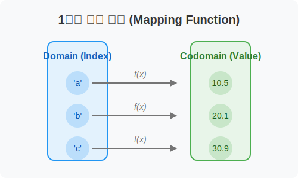

## 🏷️ 비유로 이해하기: 이름표가 달린 포스트잇 묶음

수첩에 적어둔 전화번호부나 친구들의 성적표를 상상해 보세요. 단순히 숫자들만 덩그러니 적혀 있다면 누구의 점수인지 알 수 없을 것입니다. 하지만 각 점수(데이터)마다 `[철수, 영희, 민수]` 라는 견출지(이름표)를 붙여둔다면 어떨까요? 

`영희`라는 이름표(Index)를 당기면 그 밑에 찰싹 붙어 있는 `95점` (Value)이라는 값이 함께 딸려오는 구조입니다. 단순한 숫자에 고유한 라벨을 붙여 생명력을 불어넣은 것이 바로 시리즈입니다.

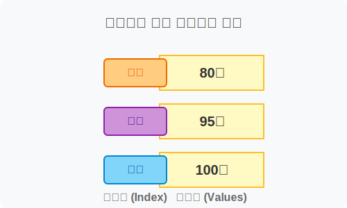

---

## 🪄 [실습 1] Series 생성: 다양한 재료로 만들기

시리즈는 파이썬의 리스트(List), 딕셔너리(Dict), 넘파이 배열(ndarray) 등 다양한 재료로 만들 수 있습니다.

#### 1. 리스트를 사용한 가장 기본적인 생성
리스트를 넣으면, 판다스가 알아서 `0, 1, 2...` 형태의 기본 이름표(Index)를 붙여줍니다. `name` 속성으로 데이터의 주제를 정할 수 있습니다.

```python
import pandas as pd
import numpy as np

# 리스트로 생성 (np.nan은 결측값/빈 값을 의미합니다)
s = pd.Series([1, 3, 5, np.nan, 6, 8], name='first')
print(s)
```
**[실행 결과]**
```text
0    1.0
1    3.0
2    5.0
3    NaN
4    6.0
5    8.0
Name: first, dtype: float64
```

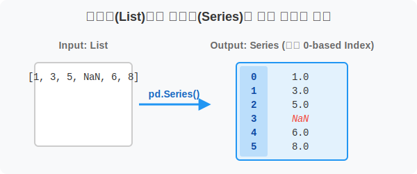

#### 2. 직접 이름표(Index) 달기
데이터와 이름표의 개수만 같다면, 언제든지 원하는 문자나 날짜로 인덱스를 부여할 수 있습니다. 이미 만들어진 시리즈의 `index` 속성에 새 리스트를 덮어씌워도 됩니다.

```python
# 기존의 시리즈 s에 알파벳 인덱스 부여!
s.index = list('abcdef')
print("알파벳 이름표가 붙은 시리즈:\n")
print(s)
```
**[실행 결과]**
```text
알파벳 이름표가 붙은 시리즈:

a    1.0
b    3.0
c    5.0
d    NaN
e    6.0
f    8.0
Name: first, dtype: float64
```

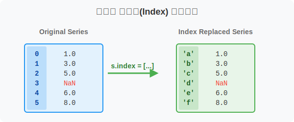

#### 3. 딕셔너리(Dict)를 사용하여 한 방에 만들기
딕셔너리의 `Key`가 이름표(Index)가 되고, `Value`가 데이터가 되는 아주 편리한 방법입니다.

```python
# 친구들의 나이 데이터
age_dict = {'철수': 15, '영희': 16, '민수': 14, '수진': 15}
age_series = pd.Series(age_dict, name='친구 나이')
print(age_series)
```
**[실행 결과]**
```text
철수    15
영희    16
민수    14
수진    15
Name: 친구 나이, dtype: int64
```

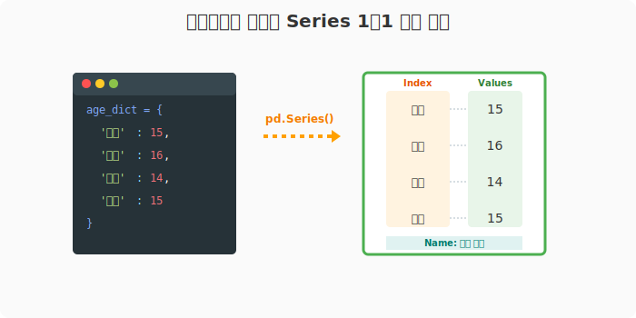

---

## 🪄 [실습 2] Series 해부하기 (주요 속성)

시리즈 객체가 가진 고유한 핵심 변수들을 알아봅니다. 데이터 분석 시 수시로 꺼내 보게 됩니다.

```python
print("1) 이름(name):", s.name)
# 출력: first

print("2) 인덱스(index):", s.index)
# 출력: Index(['a', 'b', 'c', 'd', 'e', 'f'], dtype='object')

print("3) 순수 데이터(values):", s.values)
# 출력: [ 1.  3.  5. nan  6.  8.]  <-- 내부적으로 NumPy 배열로 보관됨!

print("4) 모양(shape):", s.shape)
# 출력: (6,)  <-- 1차원이며 크기는 6

print("5) 총 데이터 개수(size):", s.size)
# 출력: 6
```

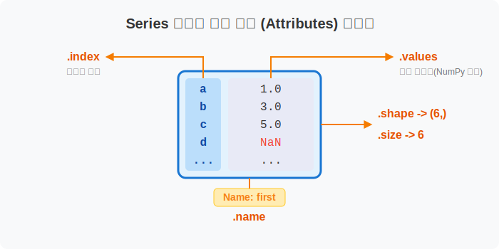

---

## 🪄 [실습 3] 원하는 데이터 추출하기 (인덱싱 및 슬라이싱)

이름표가 생겼으니 엑셀에서 특정 행을 골라내듯 편하게 데이터를 뽑아낼 수 있습니다.

#### 하나씩 뽑기 (인덱싱)
새로 만든 문자열 이름표(`'b'`, `'e'`)로도 뽑고, 원래 있던 위치 순번(`1`, `4`번째)으로도 뽑을 수 있습니다.

```python
# 문자열 등 '직접 지어준 이름표(Label)'로 접근
print(s['b'], s['e'])
# 출력: 3.0 6.0

# 주의: 위치 기반의 기본 인덱스가 문자로 덮여도 내부적인 숫자 순번은 여전히 유효합니다!
print(s[1], s[4])
# 출력: 3.0 6.0
```

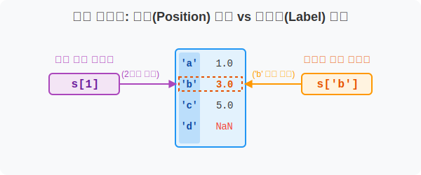

#### 범위를 잘라내기 (슬라이싱)
여기가 매우 중요합니다! **문자열 레이블 슬라이싱**과 **숫자 위치 슬라이싱**의 동작 방식이 다릅니다.

1. **문자열(Label) 슬라이싱**: 끝나는 이름표까지 **포함(Include)**해서 가져옵니다.
```python
# 'c'부터 'e'까지 달라고 하면 'e'도 줍니다.
print(s['c':'e'])
```
**[실행 결과]**
```text
c    5.0
d    NaN
e    6.0
Name: first, dtype: float64
```

2. **숫자 위치(Position) 슬라이싱**: 끝나는 번호 앞까지만 자릅니다 (파이썬 기본 규칙).
```python
# 1번부터 4번 "전"까지! 즉 1, 2, 3번 데이터만 가져옵니다.
s1 = s[1:4]
print(s1)
```
**[실행 결과]**
```text
b    3.0
c    5.0
d    NaN
Name: first, dtype: float64
```

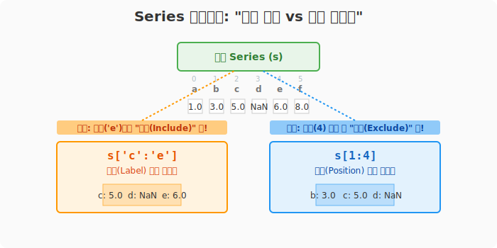

> **단일 원소 수정하기**
> 슬라이싱으로 뽑아낸 `s1`의 0번째(즉, 'b' 위치) 값을 변경하면 어떻게 될까요?
> ```python
> s1[0] = 10
> print(s1)
> ```
> 값은 `10.0`으로 바뀝니다. 주의할 점은 이것이 원본 `s`에도 반영될 수 있다는 것입니다. (뷰 상태로 반환되었기 때문입니다.)

---

## 🪄 [실습 4] 여러 개를 콕 집어 뽑기 (고급/팬시 인덱싱)

파이썬 리스트에서는 안 되는 기능입니다! 뽑고 싶은 이름표나 순번 여러 개를 리스트(`[]`)로 묶어서 넘겨주면, 그 데이터들만 쏙 뽑아서 **새로운 시리즈**로 만들어 줍니다.

```python
# 새 सीरीज 준비
test_scores = pd.Series([90, 85, 78, 95, 88, 100], index=list('abcdef'), name='score')

# 1. 위치 순번 1번, 3번, 5번만 뽑기 (대괄호를 두 번 씁니다 [[ ]])
print(test_scores[[1, 3, 5]])
```
**[실행 결과]**
```text
b     85
d     95
f    100
Name: score, dtype: int64
```

```python
# 2. 내 마음대로 문자열 이름표 순서 섞어서 뽑기
print(test_scores[['a', 'f', 'd']])
```
**[실행 결과]**
```text
a     90
f    100
d     95
Name: score, dtype: int64
```

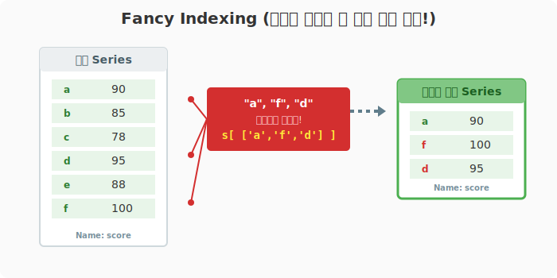

---

## 🪄 [실습 5] 판다스의 꽃, 조건부 검색 (불리언 인덱싱)

100만 건의 데이터가 있을 때 "점수가 90점 이상인 데이터만 찾아줘!" 같은 필터링을 루프(for 문) 없이 한 방에 처리합니다.

#### 1. 조건식 만들어보기 (거름망 준비)
데이터에 조건을 주면 `True`와 `False`로 이루어진 논리(Boolean) 시리즈가 생성됩니다.

```python
series_a = pd.Series([3, 6, -3, 0, -4, 8, -7])

# 조건: 0보다 큰가?
print(series_a > 0)
```
**[실행 결과]**
```text
0     True
1     True
2    False
3    False
4    False
5     True
6    False
dtype: bool
```

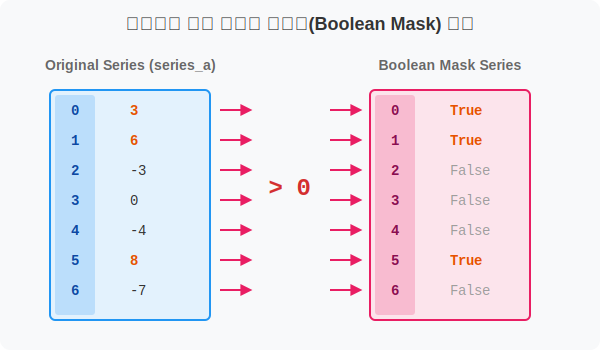

#### 2. 조건식을 데이터에 씌우기 (필터링 찌익-!)
`[ ]` 대괄호 안에 방금 만든 조건식(`True/False` 시리즈)을 쏙 집어넣으면, `True`인 것만 살아남습니다.

```python
# 0보다 큰 데이터만 뽑는다!
positive_only = series_a[series_a > 0]
print(positive_only)
```
**[실행 결과]**
```text
0    3
1    6
5    8
dtype: int64
```

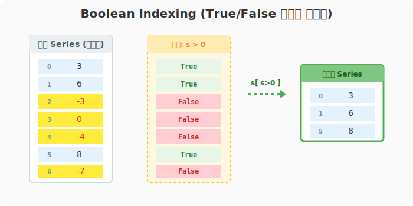

#### 3. 다중 조건 검색 (여러 필터 겹치기)
`&` (그리고, AND) 나 `|` (또는, OR) 기호를 사용하여 조건을 병합할 수 있습니다. **주의: 각 조건은 반드시 괄호 `()` 로 싸주어야 합니다!**

```python
# 0보다 크면서(양수) & 2로 나누어 떨어지는(짝수) 값
even_positive = series_a[(series_a > 0) & (series_a % 2 == 0)]
print(even_positive)
```
**[실행 결과]**
```text
1    6
5    8
dtype: int64
```

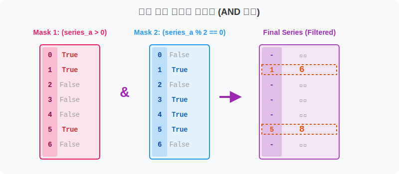