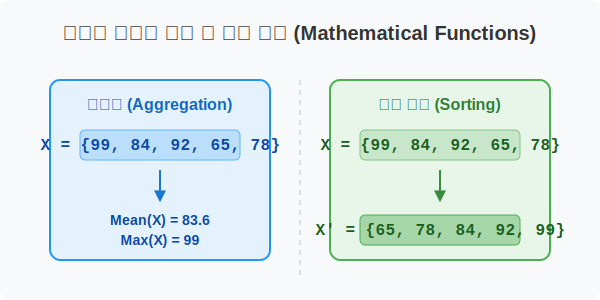
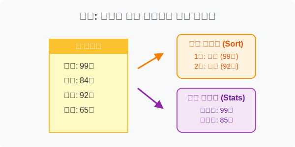
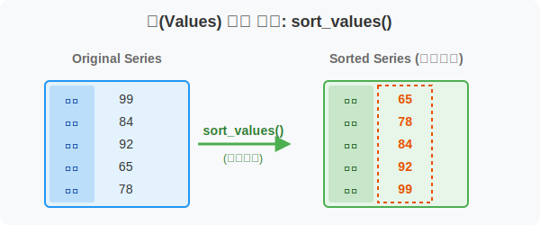
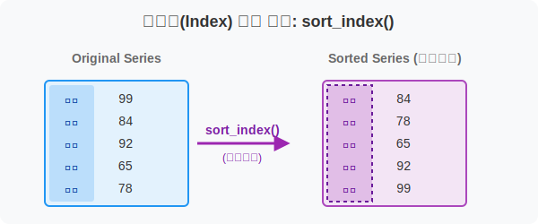
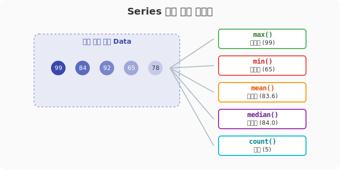
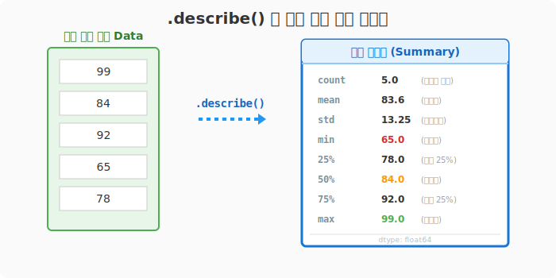
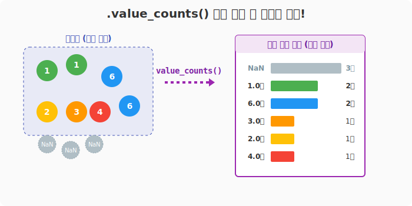
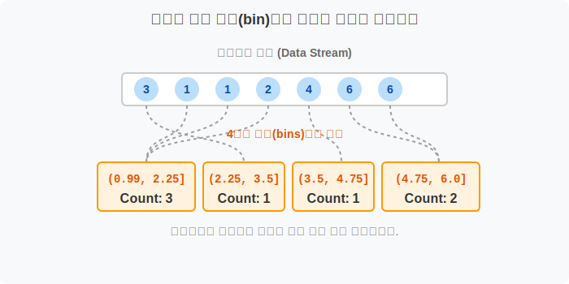

## 6.2.2 Series 필수 함수 활용하기

> 💾 **[실습 파일 다운로드]**
> 본 강의의 전체 실습 코드를 직접 실행해 볼 수 있는 주피터 노트북 파일입니다. 아래 링크를 클릭하여 다운로드 후 VS Code에서 열어보세요.
> - [📥 series_functions_practice.ipynb 파일 다운로드](./series_functions_practice.ipynb) (클릭 또는 마우스 우클릭 후 '다른 이름으로 링크 저장')

## 🧮 수학적 의미: 집합의 대푯값 계산 및 기수 정렬

시리즈 함수는 1차원 벡터의 속성을 파악하기 위해 최댓값, 최솟값, 평균 같은 수학적 대푯값(Representative value)을 산출하거나, 주어진 데이터의 크기에 따라 벡터의 요소들을 기수 정렬(Sorting)하는 연산을 제공합니다.



## 🏷️ 비유로 이해하기: 학급 성적표 석차 매기기와 요약 보고서

- 반 아이들의 성적이 적힌 종이(Series)를 점수순으로 한 줄로 세우거나(정렬), 가장 시험을 잘 본 학생과 반 평균 점수를 찾아내는(통계) 작업과 같습니다.
- 또한, "우리 반에 A등급, B등급 맞은 학생이 각각 몇 명이지?" 하고 개수를 세어보는 투표 개표(Value Counts) 작업도 한 줄의 코드로 해결할 수 있습니다.



---

## 🪄 [실습 1] 데이터의 순서 세우기 (정렬: sort)

VS Code나 주피터 노트북을 열고 `pandas_01.py` 파일을 생성하여 단계별로 실습을 진행합니다. 데이터 분석의 기본은 '가장 높은 값'과 '가장 낮은 값'을 눈으로 확인하는 것입니다. `sort_values()`와 `sort_index()`를 사용합니다.

### 1단계: 학생 성적 데이터 준비하기

```python
import pandas as pd

# 학생들의 성적 데이터 생성 (인덱스는 학생 이름)
st_names = ['희빈', '수영', '현수', '지호', '지민']
p = pd.Series([99, 84, 92, 65, 78], index=st_names)

# 명패 달아주기
p.name = '수학성적'
p.index.name = '이름'

print("--- 원본 데이터 ---")
print(p)
```
**[실행 결과]**
```text
이름
희빈    99
수영    84
현수    92
지호    65
지민    78
Name: 수학성적, dtype: int64
```

### 2단계: 값(Values) 기준 정렬: 1등부터 줄 세우기
값이 낮은 것부터 높은 것으로 세우려면 `sort_values()`를 쓰고, 높은 것부터 세우려면 괄호 안에 `ascending=False`(오름차순=거짓)를 넘겨줍니다. 앞선 코드 아래에 다음을 추가해 보세요.

```python
# 점수가 낮은 학생부터 (오름차순, 기본값)
print(p.sort_values())
```
**[실행 결과]**
```text
이름
지호    65
지민    78
수영    84
현수    92
희빈    99
Name: 수학성적, dtype: int64
```



```python
# 점수가 높은 1등부터 (내림차순)
print(p.sort_values(ascending=False))
```

### 3단계: 이름표(Index) 기준 정렬: 가나다순 출석부 세우기
점수가 아니라 이름 순서대로 정렬하려면 `sort_index()`를 사용합니다. 이어서 코드를 추가합니다.

```python
# 학생 이름(가나다) 순서로 정렬
print(p.sort_index())
```
**[실행 결과]**
```text
이름
수영    84
지민    78
지호    65
현수    92
희빈    99
Name: 수학성적, dtype: int64
```



---

## 🪄 [실습 2] 기본 통계량 뽀개기

이번에는 `pandas_02.py` 파일을 만들고, 통계 함수들을 알아봅니다. 

### 1단계: 기본 통계량 확인하기
앞선 실습과 동일하게 데이터 `p`를 먼저 준비한 후, 데이터를 개별로 보는 것을 넘어 전체 상황을 판단하기 위한 기초 통계 함수들을 추가합니다.

```python
import pandas as pd

st_names = ['희빈', '수영', '현수', '지호', '지민']
p = pd.Series([99, 84, 92, 65, 78], index=st_names)

print("최고 점수 (max):", p.max())
print("최저 점수 (min):", p.min())
print("학급 평균 점수 (mean):", p.mean())
print("정중앙 중간값 (median):", p.median())
print("총 학생 수 (count):", p.count())
```
**[실행 결과]**
```text
최고 점수 (max): 99
최저 점수 (min): 65
학급 평균 점수 (mean): 83.6
정중앙 중간값 (median): 84.0
총 학생 수 (count): 5
```



---

## 🪄 [실습 3] 1초 만에 데이터 요약하기 (describe)

`pandas_03.py` 파일을 생성하고 진행합니다.

### 1단계: 요약 보고서 출력하기
통계량을 하나하나 뽑을 필요 없이, 판다스의 요약 마법사인 `describe()` 함수를 호출하면 데이터의 형태를 한눈에 파악할 수 있는 종합 보고서를 출력해줍니다.

```python
import pandas as pd

st_names = ['희빈', '수영', '현수', '지호', '지민']
p = pd.Series([99, 84, 92, 65, 78], index=st_names)

# 통계 요약 보고서 출력
print(p.describe())
```
**[실행 결과]**
```text
count     5.000000  (데이터 개수)
mean     83.600000  (평균값)
std      13.258959  (표준편차: 데이터가 얼마나 퍼져있는지)
min      65.000000  (최솟값)
25%      78.000000  (하위 25% 지점의 값)
50%      84.000000  (정중앙 중간값)
75%      92.000000  (상위 25% 지점의 값)
max      99.000000  (최댓값)
Name: 수학성적, dtype: float64
```



---

## 🪄 [실습 4] 데이터 파악의 핵심 (value_counts) ⭐️

`pandas_04.py` 파일을 생성합니다. `value_counts()`는 각 데이터 항목이 몇 번 등장했는지(빈도수)를 내림차순으로 세어주는 기능입니다. 실무 데이터 분석에서 **가장 많이 쓰는 함수 Top 3** 안에 들 정도로 매우 중요합니다!

### 1단계: 설문조사 기초 데이터 준비

```python
import pandas as pd
import numpy as np

# 설문조사 데이터 느낌의 시리즈 (결측값 NaN과 None 포함)
# 1은 '매우 불만족', 6은 '매우 만족' 등을 나타낸다고 상상해봅시다.
s = pd.Series([3, 1, 1, 2, None, np.nan, 4, 6, 6, np.nan])

print("--- 원본 설문 데이터 ---")
print(s)
```

### 2단계: 항목별 등장 횟수 세기
기본적으로 `NaN`(결측치)은 무시하고, 가장 많이 나온 숫자부터 위에서 아래로 개수를 보여줍니다. 작성한 코드 아래에 다음을 추가하세요.

```python
print(s.value_counts())
```
**[실행 결과]**
```text
1.0    2   (1점이 2번 나왔음)
6.0    2   (6점이 2번 나왔음)
3.0    1
2.0    1
4.0    1
dtype: int64
```

### 3단계: 결측치(NaN) 빈도도 함께 확인하기
데이터를 분석할 때 '빈 칸(무응답)이 몇 개나 있는지' 아는 것은 매우 중요합니다. 이번에는 `dropna=False` 옵션을 넣어보겠습니다.

```python
print(s.value_counts(dropna=False))
```
**[실행 결과]**
```text
NaN    3   (누락된 값이 3개나 있음!)
1.0    2
6.0    2
3.0    1
2.0    1
4.0    1
dtype: int64
```



### 4단계: 연속된 값을 여러 구간(bin)으로 나누어 분포 보기
히스토그램의 원리와 똑같습니다. 범위(구간)를 지정해 주면 "해당 범위에 속한 숫자가 몇 개인지" 카운트합니다.

```python
# 전체 숫자를 4개의 구간(bins)으로 쪼개서 개수 확인하기
# sort=False 를 지정하면, 빈도순이 아니라 "구간 순서(작은 범위->큰 범위)"대로 정렬해 보여줍니다.
print(s.value_counts(bins=4, sort=False))
```
**[실행 결과]**
```text
(0.994, 2.25]    3   (1.0부터 2.25 사이에 3개의 값이 존재함)
(2.25, 3.5]      1   (2.25부터 3.5 사이에 1개의 값이 존재함)
(3.5, 4.75]      1
(4.75, 6.0]      2
dtype: int64
```



괄호 모양 `(왼쪽, 오른쪽]`은 **왼쪽 값은 포함하지 않고, 오른쪽 값은 포함한다**는 뜻의 '반 열린 구간(Half-open bin)' 수학적 표기법입니다.

> **💡 Matplotlib 연계 꿀팁 (시각화)**
> `value_counts()`로 얻어낸 빈도수 데이터 뒤에 `.plot(kind='bar')` 를 붙이면 한 줄의 코드로 막대그래프를 그릴 수 있습니다! (주피터 노트북 환경에서 유용합니다)
> ```python
> s.value_counts().plot(kind='bar', color='skyblue')
> ```