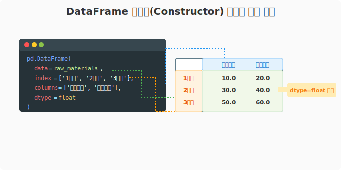

## 6.2.3 DataFrame 클래스 생성자 분석

**[수학적 의미: 이기종 행렬(Heterogeneous Matrix) 공간 선언]**
수학에서 특정 차원과 형태를 가진 행렬을 정의($A_{m \times n}$)하듯, 판다스에서 DataFrame 클래스 생성자는 $m$개의 행(Index)과 $n$개의 열(Columns)을 가지는 데이터를 메모리 공간에 어떻게 적재할지 규칙을 선언하는 초기화(Initialization) 함수입니다.

**[비유로 이해하기: 건물 뼈대(Framework)를 세우는 주문서]**
- `data`: 건물을 채울 벽돌과 가구들입니다. (리스트, 딕셔너리, 넘파이 배열 등)
- `index`: 각 층의 이름표입니다. (1층, 2층, 3층... 또는 2020년, 2021년...)
- `columns`: 각 층에 들어갈 방의 용도입니다. (거실, 안방, 주방... 또는 이름, 나이, 직업...)
- 즉, **"이 재료(`data`)를 가져다가, 행 이름표(`index`)와 열 이름표(`columns`)를 붙여서 엑셀 표를 하나 만들어줘!"**라는 주문서입니다.

---

### [1단계] DataFrame 생성자의 기본 구조

판다스에서 제공하는 원본 데이터프레임 구조체의 생성자는 아주 유연하게 설계되어 있습니다.

```python
class pandas.DataFrame(data=None, index=None, columns=None, dtype=None, copy=None)
```

#### 🛠 주요 파라미터(설정값) 해설
1. **`data` (가장 중요)**: 데이터프레임을 채울 원본 데이터입니다. 리스트의 리스트(2차원), 딕셔너리, Numpy 배열(ndarray), 또는 다른 Series 객체를 넣을 수 있습니다.
2. **`index` (행 레이블)**: 세로줄(행)의 이름표입니다. 빈칸으로 두면 기본적으로 `[0, 1, 2...]` 번호가 자동으로 매겨집니다.
3. **`columns` (열 레이블)**: 가로줄(열)의 이름표입니다. 빈칸으로 두면 역시 `[0, 1, 2...]` 번호가 매겨집니다.
4. **`dtype` (자료형 강제)**: `float32`, `int64`처럼 데이터의 형식을 강제로 지정할 때 씁니다. 생략하면 판다스가 알아서 제일 적당한 타입으로 추론(Inference)해 줍니다.
5. **`copy` (복사본 여부)**: 원본 데이터를 완전히 분리해서 새로운 복사본을 만들지(`True`), 아니면 원본의 메모리를 그대로 빌려 쓸지(`False`) 결정합니다.

---

### [2단계] 파라미터 조작해보기 (코드 실습)

아무 옵션도 주지 않았을 때와, 우리가 직접 `index`와 `columns`를 지정했을 때의 차이를 비교해 봅니다.

```python
import pandas as pd
import numpy as np

# 1. 원시 재료 (3행 2열의 Numpy 배열)
raw_materials = np.array([[10, 20], [30, 40], [50, 60]])

# ----------------------------------------
# 케이스 A: 알아서 만들어줘! (기본값)
# ----------------------------------------
df_default = pd.DataFrame(data=raw_materials)

print("--- [A] 알아서 만들어진 표 (기본값) ---")
print(df_default)

# ----------------------------------------
# 케이스 B: 주문서에 상세 옵션 적기
# ----------------------------------------
df_custom = pd.DataFrame(
    data=raw_materials,
    index=['1일차', '2일차', '3일차'],  # 세로줄 이름 지정
    columns=['오전매출', '오후매출'],     # 가로줄 이름 지정
    dtype=float                         # 소수점으로 만들어줘!
)

print("\n--- [B] 상세 주문서가 적용된 표 ---")
print(df_custom)
```

**[실행 결과]**
```text
--- [A] 알아서 만들어진 표 (기본값) ---
    0   1    <-- 열 이름표를 생략했더니 0, 1로 생김
0  10  20
1  30  40
2  50  60
^-- 행 이름표를 생략했더니 0, 1, 2로 생김

--- [B] 상세 주문서가 적용된 표 ---
       오전매출  오후매출
1일차    10.0    20.0   <-- dtype=float 덕분에 .0 이 붙음
2일차    30.0    40.0
3일차    50.0    60.0
```



> **요약:** DataFrame 생성자에게 엑셀 시트의 헤더(Columns)와 좌측 주소(Index)를 직접 알려주면 데이터가 훨씬 읽기 편한 구조로 재탄생합니다. 다음 장부터는 이 생성자를 활용하는 다양한 실전 기법들을 다룹니다.