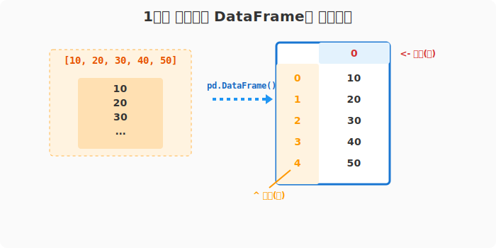
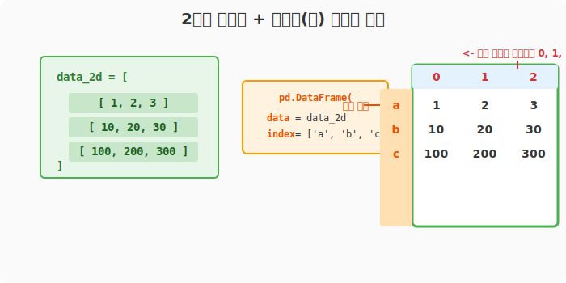
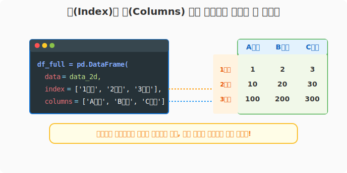
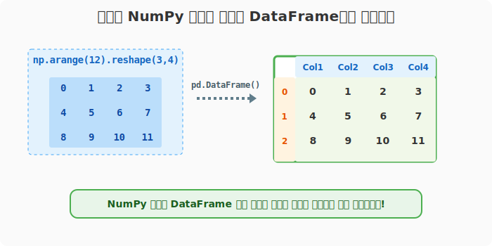

## 6.2.4 2차원 행렬(Matrix)로 데이터프레임 만들기

**[수학적/전산학적 의미: 다차원 배열의 관계형 매핑]**
수학의 $m \times n$ 크기의 2차원 구형 행렬(Rectangular Matrix) 데이터를 판다스의 DataFrame으로 캐스팅(Casting)하는 과정입니다. 이때 단순한 좌표(0, 1, 2...)로 구성된 공간을 문자열 레이블로 참조 가능한 연관 배열(Associative Array) 구조체로 확장 매핑합니다.

**[비유로 이해하기: 아무 이름 없는 엑셀 표에 머리글 씌우기]**
- 친구가 엑셀 파일에 숫자만 잔뜩 입력해놓고, 첫 번째 줄에 열 이름(A, B, C...)을 안 적어둔 상황을 떠올려 보세요.
- **2차원 행렬**은 그저 "숫자 덩어리"입니다. 여기에 판다스를 통해 `index`와 `columns`라는 **"이름표 테이프"**를 붙여주어 제대로 된 표로 둔갑시키는 작업입니다.

---

### [1단계] 1차원 리스트로 만들면 열이 하나인 표가 됩니다

데이터프레임은 본질적으로 2차원 구조이지만, 1차원 리스트를 강제로 집어넣으면 "세로로 긴 1개의 열(Column)"을 가진 표로 취급합니다. 이때 이름표를 생략하면 행과 열 모두 0부터 시작하는 숫자가 자동으로 붙습니다.

```python
import pandas as pd

# 1차원 리스트 주입
df = pd.DataFrame([10, 20, 30, 40, 50])

print("--- 1차원 리스트 -> 데이터프레임 ---")
print(df)
```
**[실행 결과]**
```text
--- 1차원 리스트 -> 데이터프레임 ---
    0   <-- 기본 생성된 Columns(열 이름표)
0  10   <-- 여기서부터는 기본 생성된 Index(행 이름표)
1  20
2  30
3  40
4  50
```



---

### [2단계] 2차원 리스트(List of Lists)로 온전한 표 만들기

이번엔 여러 개의 리스트를 품고 있는 '리스트 속의 리스트(2차원)'를 넣어보겠습니다. 행(Index) 이름표도 함께 부여해 봅니다.

```python
# 3행 3열짜리 2차원 리스트
data_2d = [
    [1, 2, 3],
    [10, 20, 30],
    [100, 200, 300]
]

# 데이터와 함께 index 이름표 지정
df_2d = pd.DataFrame(data=data_2d, index=list('abc'))

print("--- 2차원 리스트 + 행 인덱스 지정 ---")
print(df_2d)
```
**[실행 결과]**
```text
--- 2차원 리스트 + 행 인덱스 지정 ---
     0    1    2   <-- 열 이름은 생략해서 0, 1, 2
a    1    2    3
b   10   20   30
c  100  200  300
```



---

### [3단계] 열 이름표(Columns)까지 완벽하게 붙이기

데이터에 `index`(행 이름)와 `columns`(열 이름)를 모두 직접 지정하면 완벽한 테이블 구조가 완성됩니다.

```python
# 이번엔 열 이름표(Columns)까지 지정해 보겠습니다.
df_full = pd.DataFrame(
    data=data_2d, 
    index=['1번방', '2번방', '3번방'], 
    columns=['A타입', 'B타입', 'C타입']
)

print("--- 완벽하게 라벨링된 표 ---")
print(df_full)

print("\n[현재 세팅된 이름표 확인]")
print("행 이름:", df_full.index.tolist())
print("열 이름:", df_full.columns.tolist())
```
**[실행 결과]**
```text
--- 완벽하게 라벨링된 표 ---
       A타입  B타입  C타입
1번방    1    2    3
2번방   10   20   30
3번방  100  200  300

[현재 세팅된 이름표 확인]
행 이름: ['1번방', '2번방', '3번방']
열 이름: ['A타입', 'B타입', 'C타입']
```



---

### [4단계] 최강 조합: NumPy 배열을 DataFrame으로 바꾸기

실제 머신러닝이나 데이터 전처리 작업에서는 NumPy로 초고속 계산을 수행한 뒤, 최종 결과를 보기 좋게 포장하기 위해 DataFrame으로 변환하는 경우가 매우 많습니다.

```python
import numpy as np
import pandas as pd

# 1. 0~11까지의 숫자를 3행 4열로 쪼갠 넘파이 배열 생성
np_array = np.arange(12).reshape(3, 4)

df_np = pd.DataFrame(data=np_array, columns=['Col1', 'Col2', 'Col3', 'Col4'])

print("--- NumPy 배열 기반 데이터프레임 ---")
print(df_np)
```
**[실행 결과]**
```text
--- NumPy 배열 기반 데이터프레임 ---
   Col1  Col2  Col3  Col4
0     0     1     2     3
1     4     5     6     7
2     8     9    10    11
```



> **🔥 파이썬 실습 꿀팁: 난수로 난이도 높이기**
> 로또 번호 시뮬레이션용 데이터프레임을 만들고 싶다면 `np.random`과 결합하세요!
> ```python
> # 1부터 45사이의 난수로 5행 6열 배열 생성
> lotto_df = pd.DataFrame(np.random.randint(1, 46, (5, 6)), 
>                         columns=['번호1', '번호2', '번호3', '번호4', '번호5', '보너스'])
> print(lotto_df)
> ```