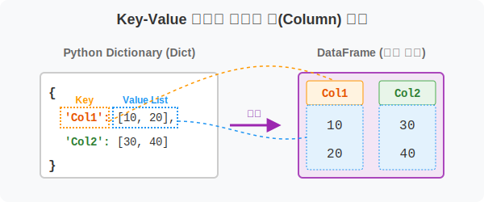
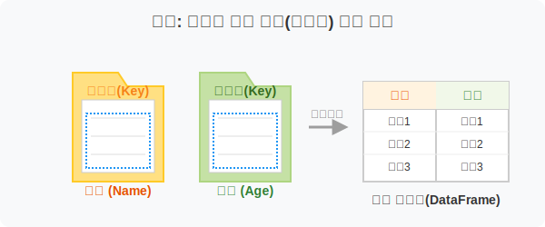
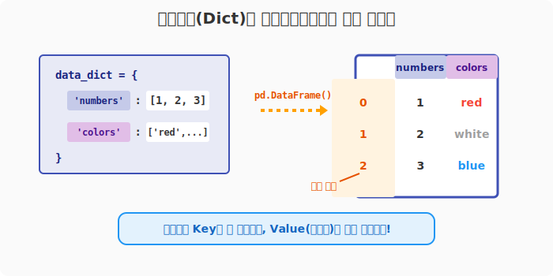
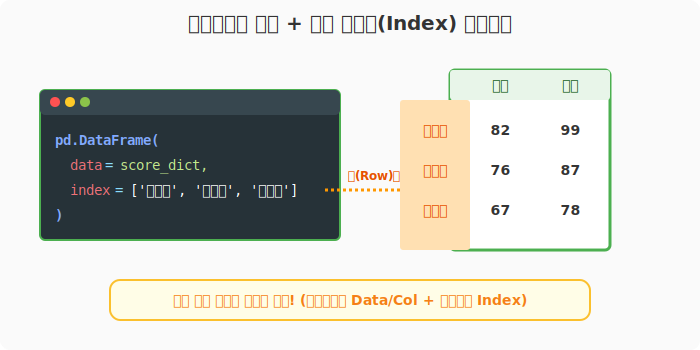

## 6.2.5 딕셔너리(Dict)로 데이터프레임 만들기

> 💾 **[실습 파일 다운로드]**
> 본 강의의 전체 실습 코드를 직접 실행해 볼 수 있는 주피터 노트북 파일입니다. 아래 링크를 클릭하여 다운로드 후 VS Code에서 열어보세요.
> - [📥 df_from_dict_practice.ipynb 파일 다운로드](./df_from_dict_practice.ipynb) (클릭 또는 마우스 우클릭 후 '다른 이름으로 링크 저장')

## 🧮 수학적 의미: 키-값 기반의 다형성 열(Column) 매핑

수학에서 집합 $X$의 각 원소가 대응하는 종속 집합 $Y$를 가지는 형태를 프로그래밍에서는 `Key: Value` 쌍(Dict)으로 표현합니다. 딕셔너리를 데이터프레임으로 변환하는 과정은 각 열의 최상단 라벨(Column Header)을 `Key`로, 해당 열에 쭉 이어질 세로 데이터 벡터(Column Vector)들을 `Value` 리스트로 매핑하여 관계 대수 체계를 세우는 것입니다.



## 🏷️ 비유로 이해하기: 부서별로 서류 묶음 끼워 넣기

- 엑셀 시트에서 '이름'이라는 칸(Key)을 만들고 밑으로 쭈욱 이름을 적어 내려가고(Value), 옆 칸에 '나이'라는 칸(Key)을 만들고 나이를 쭈욱 적는(Value) 과정과 완벽하게 일치합니다.
- 파이썬 딕셔너리의 특징 덕분에 **열(Column) 이름을 가장 직관적으로 지정**할 수 있는 최고의 방법입니다. 실무에서 가장 많이 쓰이는 데이터프레임 생성법 중 하나입니다!



---

## 🪄 [실습 1] 딕셔너리로 표 만들기

파이썬 딕셔너리의 `Key`는 자동으로 데이터프레임의 열(Column) 제목이 됩니다.

```python
import pandas as pd

# '열 제목' : [세로줄에 들어갈 데이터 목록] 형태로 딕셔너리를 만듭니다.
data_dict = {
    'numbers': [1, 2, 3], 
    'colors': ['red', 'white', 'blue']
}

df = pd.DataFrame(data_dict)

print("--- 딕셔너리로 생성한 표 ---")
print(df)
```
**[실행 결과]**
```text
--- 딕셔너리로 생성한 표 ---
   numbers colors
0        1    red
1        2  white
2        3   blue
```



> **관찰 포인트:** `Key`였던 'numbers'와 'colors'가 열 이름표(Columns)로 맨 위에 자리 잡았습니다. 세로줄(Index) 이름표는 지정하지 않았으니 자동으로 `0, 1, 2`가 매겨집니다.

---

## 🪄 [실습 2] 내부 구조 뜯어보기

판다스의 뼈대인 인덱스와 컬럼이 어떤 객체로 저장되었는지 속성값을 통해 확인할 수 있습니다.

```python
print("열 이름표 (Columns):", df.columns)
print("행 이름표 (Index):", df.index)
```
**[실행 결과]**
```text
열 이름표 (Columns): Index(['numbers', 'colors'], dtype='object')
행 이름표 (Index): RangeIndex(start=0, stop=3, step=1)
```

1. **`df.columns`**: 딕셔너리의 `Key`들이 순서대로 문자열 인덱스 객체(`Index(dtype='object')`)로 들어갔습니다.
2. **`df.index`**: 사용자가 정의하지 않았으므로 판다스가 `RangeIndex`라는 메모리 절약형 자동 생성 인덱스를 붙여줍니다.

---

## 🪄 [실습 3] 내가 원하는 행 이름표(Index)까지 붙이기

열(Columns) 이름표는 딕셔너리 `Key`로 해결했지만, 각 행(Index)이 누군지(예: 사람 이름) 명시하고 싶다면 생성자에서 `index=...` 파라미터를 추가해주면 됩니다.

```python
# 학생 3명의 국어, 수학 점수 데이터
score_dict = {
    '국어': [82, 76, 67], 
    '수학': [99, 87, 78]
}

# 딕셔너리를 넘기면서, 어느 학생의 점수인지 행 인덱스를 달아줍니다.
df_scores = pd.DataFrame(
    data=score_dict, 
    index=['김국진', '신영희', '이길순']
)

print("--- 행 인덱스까지 완벽하게 지정된 성적표 ---")
print(df_scores)
```
**[실행 결과]**
```text
--- 행 인덱스까지 완벽하게 지정된 성적표 ---
      국어  수학
김국진  82  99
신영희  76  87
이길순  67  78
```



위 데이터프레임의 속성을 다시 들여다보면, 이제 `index`도 숫자가 아닌 문자열 이름표로 바뀌어 있습니다.

```python
print("행 이름표 (Index):", df_scores.index)
# 출력: Index(['김국진', '신영희', '이길순'], dtype='object')
```

> **🔥 파이썬 실습 꿀팁: 데이터 길이 불일치 주의!**
> 딕셔너리 안의 Value 리스트들은 반드시 길이가 일치해야 합니다. (예를 들어 '국어' 점수는 3개인데 '수학' 점수를 2개만 주면 판다스는 에러를 뿜어냅니다!)
> 엑셀에서 표를 그릴 때 세로줄 칸 수가 맞지 않으면 표가 삐뚤어지는 이치와 같습니다.