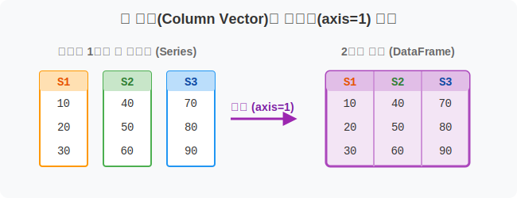
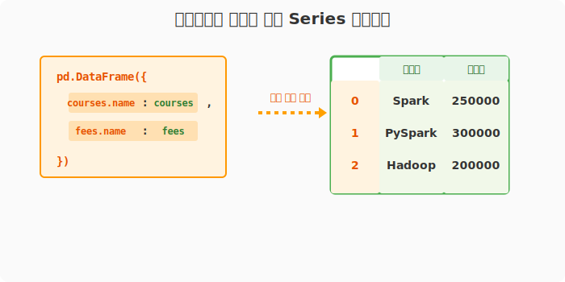
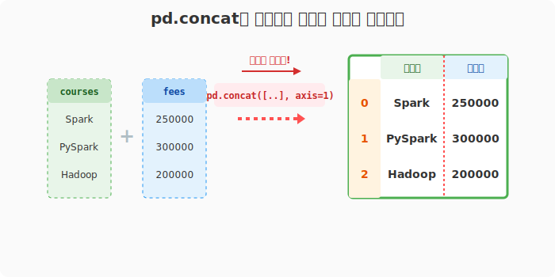
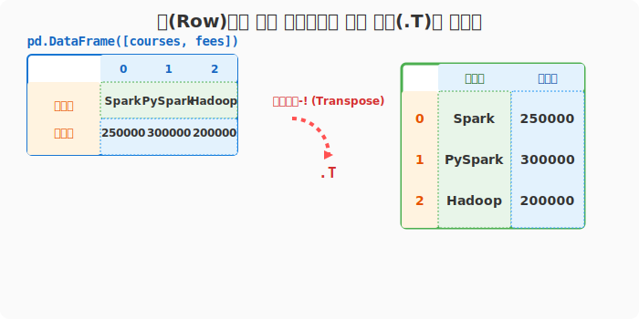
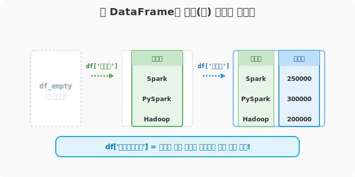

## 6.2.6 단일 Series들을 모아서 DataFrame으로 조립하기

> 💾 **[실습 파일 다운로드]**
> 본 강의의 전체 실습 코드를 직접 실행해 볼 수 있는 주피터 노트북 파일입니다. 아래 링크를 클릭하여 다운로드 후 VS Code에서 열어보세요.
> - [📥 df_from_series_practice.ipynb 파일 다운로드](./df_from_series_practice.ipynb) (클릭 또는 마우스 우클릭 후 '다른 이름으로 링크 저장')

## 🧮 수학적 의미: 열 벡터(Column Vector)의 결합(Concatenation)

1차원 열 벡터(Column Vector) 여러 개를 옆으로 나란히 병합(Concatenation)하여 하나의 2차원 행렬(Matrix)로 승격시키는 선형대수학적 구조 확장입니다. 축 방향(`axis`)을 어디로 설정하느냐에 따라 식을 수직으로 얹을지, 수평으로 붙일지가 결정됩니다.



## 🏷️ 비유로 이해하기: 낱장으로 나뒹구는 서류를 바인더에 끼워 넣기

- Series 하나하나는 부서원 한 명이 작성한 **낱장 서류 1줄**입니다.
- 이 낱장들을 클립으로 묶거나(`dict`), 스테이플러로 나란히 찍거나(`pd.concat`), 빈 바인더에 한 장씩 끼워 넣으면(`빈 DataFrame에 열 추가`) 완벽한 한 권의 장부(DataFrame)가 탄생합니다.


---

## 🪄 [실습 1] 조립을 기다리는 기초 시리즈 준비하기

VS Code나 주피터 노트북을 열고 `pandas_01.py` 파일을 생성하여 단계별로 실습을 진행합니다.

### 1단계: 재료(Series) 2개 준비
먼저 데이터프레임을 조립할 기초 블록인 '강의명'과 '수강료' 시리즈 2개를 준비합니다.

```python
import pandas as pd

courses = pd.Series(["Spark", "PySpark", "Hadoop"], name='과목명')
fees = pd.Series([250000, 300000, 200000], name='수강료')

print("--- 준비된 재료 (Series) ---")
print(courses)
print(fees)
```
**[실행 결과]**
```text
--- 준비된 재료 (Series) ---
0      Spark
1    PySpark
2     Hadoop
Name: 과목명, dtype: object

0    250000
1    300000
2    200000
Name: 수강료, dtype: int64
```

---

## 🪄 [실습 2] 딕셔너리(Dict)를 클립으로 사용해 조립하기

앞서 작성한 실습 코드에 이어서 추가로 작성해 봅니다.

### 1단계: 딕셔너리 바인딩
딕셔너리의 특징을 이용하여 `열 이름표 : 시리즈` 형태로 묶어주는 가장 정석적이고 안정적인 방법입니다.

```python
# 시리즈가 원래 가진 name을 키 필드로 씁니다.
df_dict = pd.DataFrame({
    courses.name: courses, 
    fees.name: fees
})

print("--- [방법 1] 딕셔너리 바인딩 ---")
print(df_dict)
```
**[실행 결과]**
```text
--- [방법 1] 딕셔너리 바인딩 ---
       과목명     수강료
0    Spark  250000
1  PySpark  300000
2   Hadoop  200000
```



---

## 🪄 [실습 3] pd.concat 으로 옆으로 나란히 풀칠하기 (강력 추천!)

### 1단계: axis를 활용한 수평 결합
여러 개의 시리즈를 병합할 때 실무에서 가장 많이 쓰는 마법의 함수 `pd.concat`입니다. `axis` 방향키만 잘 돌려주면 가로나 세로로 자유자재로 붙일 수 있습니다. 앞선 코드 아래에 다음을 추가해 보세요.

```python
# axis=1 (행 기준 유지, 기둥을 "옆으로(가로)" 추가!)
# 시리즈가 가진 name이 자동으로 열 이름표가 됩니다.
df_concat_col = pd.concat([courses, fees], axis=1)

print("--- [방법 2] 옆으로 나란히 합체 (axis=1) ---")
print(df_concat_col)
```
**[실행 결과]**
```text
--- [방법 2] 옆으로 나란히 합체 (axis=1) ---
       과목명     수강료
0    Spark  250000
1  PySpark  300000
2   Hadoop  200000
```



> **주의: `axis=0` (기본값) 이라면?**
> 옆으로 붙는 게 아니라, 아래로(수직) 이어 붙어 **거대한 1차원 시리즈 1개**로 붕괴합니다!
> ```python
> pd.concat([courses, fees], axis=0)
> # 출력:
> # 0      Spark
> # 1    PySpark
> # ...
> # 0     250000
> # 1     300000
> ```

---

## 🪄 [실습 4] DataFrame에 냅다 넣고, 뒤집기 (Transpose, T)

### 1단계: 행으로 쌓인 표 전치하기
데이터프레임 생성자에 빈 리스트로 시리즈들을 뭉텅이로 넣으면 어떻게 될까요? 판다스는 1차원 시리즈 하나를 통째로 **"가로 한 줄(행)"** 로 판단해 버립니다.

```python
# 시리즈를 행(가로줄) 취급해서 만든 표
df_row = pd.DataFrame([courses, fees])
print("--- [방법 3] 행으로 층층이 쌓인 표 ---")
print(df_row)
```
**[실행 결과]**
```text
--- [방법 3] 행으로 층층이 쌓인 표 ---
           0        1       2
과목명    Spark  PySpark  Hadoop
수강료   250000   300000  200000
```

### 2단계: 전치 행렬(.T)로 스위치
수학에서 행렬의 가로세로를 바꿀 때 쓰이는 **전치 행렬(Transpose)** 속성인 `.T`를 사용해 표를 직각으로 세워 해결할 수 있습니다. 계속해서 다음 코드를 추가합니다.

```python
# 빙그르르-! 행과 열 뒤집기
df_transposed = df_row.T

print("\n--- 행과 열을 스위치(.T)한 결과 ---")
print(df_transposed)
```
**[실행 결과]**
```text
--- 행과 열을 스위치(.T)한 결과 ---
       과목명     수강료
0    Spark  250000
1  PySpark  300000
2   Hadoop  200000
```



---

## 🪄 [실습 5] 빈 바인더에 서류 한 장씩 꽂아 넣기 (점진적 추가)

### 1단계: 빈 데이터프레임에 기둥 세우기
미리 뼈대를 다 짜고 만들 필요 없이, 빈 껍데기(`pd.DataFrame()`)만 하나 던져두고 나중에 시리즈를 열(Column) 단위로 하나씩 대입해 채워나가는 건축가 스타일입니다.

```python
# 1. 뼈대만 있는 텅 빈 DataFrame 생성
df_empty = pd.DataFrame()

# 2. 열 추가 (기둥을 하나씩 세웁니다)
df_empty[courses.name] = courses
df_empty[fees.name] = fees

print("--- [방법 4] 빈 뼈대에 기둥 세우기 ---")
print(df_empty)
```
**[실행 결과]**
```text
--- [방법 4] 빈 뼈대에 기둥 세우기 ---
       과목명     수강료
0    Spark  250000
1  PySpark  300000
2   Hadoop  200000
```

