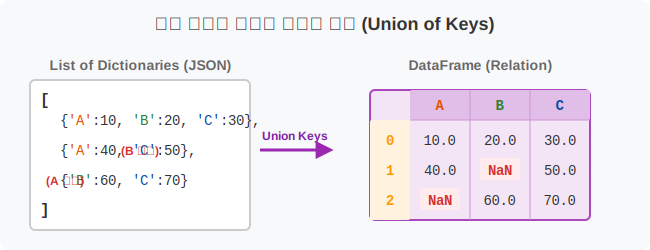
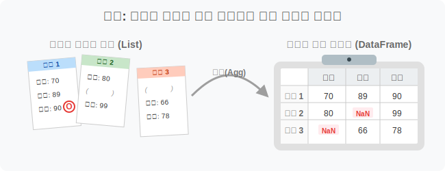
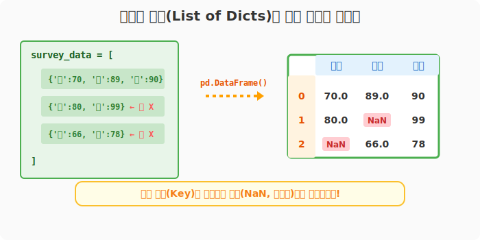
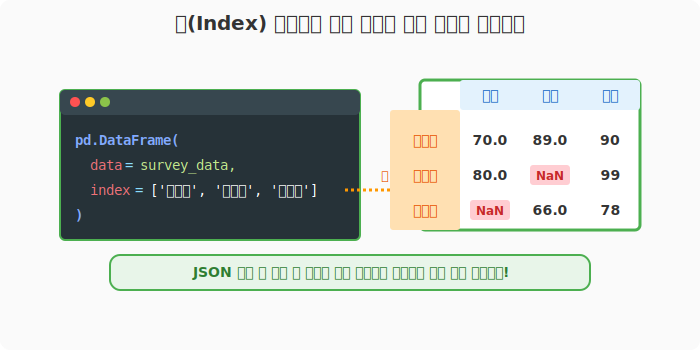

## 6.2.7 여러 개의 딕셔너리를 묶어서(List) 표 만들기

> 💾 **[실습 파일 다운로드]**
> 본 강의의 전체 실습 코드를 직접 실행해 볼 수 있는 주피터 노트북 파일입니다. 아래 링크를 클릭하여 다운로드 후 VS Code에서 열어보세요.
> - [📥 df_from_dict_list_practice.ipynb 파일 다운로드](./df_from_dict_list_practice.ipynb) (클릭 또는 마우스 우클릭 후 '다른 이름으로 링크 저장')

## 🧮 수학적 의미: 가변 스키마를 가지는 객체들의 테이블 맵핑

비정형 데이터베이스(NoSQL)나 웹 API(JSON) 구조에서 흔히 볼 수 있는 `List of Dictionaries` 형태를 2차원 관계형 테이블(DataFrame)로 변환하는 작업입니다. 각 딕셔너리 객체는 하나의 행(Row/Record)으로 맵핑되며, 딕셔너리의 집합 속 모든 `Key`들을 통합(Union)하여 열(Column) 헤더를 구성합니다.



## 🏷️ 비유로 이해하기: 설문지 뭉치 취합하기

- 딕셔너리 하나하나는 사람 한 명이 작성해서 제출한 **설문지 1장(행, Row)**입니다.
- 어떤 사람은 '수학점수' 칸을 비워두고, 어떤 사람은 '국어점수' 칸을 비워두었습니다.
- 판다스는 이 설문지 여러 장을 모아서(리스트) 전체 통계를 볼 수 있는 **거대한 종합 현황판(DataFrame)**으로 예쁘게 그려냅니다. 만약 어떤 사람이 안 적은 칸이 있다면 그곳은 빈칸(NaN)으로 남겨둡니다.



---

## 🪄 [실습 1] JSON 데이터 다루듯, 리스트 안에 딕셔너리 넣기

VS Code나 주피터 노트북을 열고 `pandas_01.py` 파일을 생성하여 단계별로 실습을 진행합니다.

### 1단계: 가변 데이터를 가진 리스트 준비
학생 3명이 각자 자신의 성적을 제출했습니다. 하지만 응시한 과목이 조금씩 다릅니다. 이 데이터를 리스트에 합쳐서 판다스에 던져봅니다.

```python
import pandas as pd

# 학생 3명의 설문지(딕셔너리)를 하나의 리스트로 묶습니다.
# (이 구조는 서버에서 받아오는 JSON 데이터 형태와 완벽히 같습니다)
survey_data = [
    {'국어': 70, '수학': 89, '영어': 90},  # 1번 학생 (전과목 다 응시)
    {'국어': 80, '영어': 99},              # 2번 학생 (수학 안 봄)
    {'수학': 66, '영어': 78}               # 3번 학생 (국어 안 봄)
]

# DataFrame 조립!
df = pd.DataFrame(survey_data)

print("--- 제출받은 설문지 종합 현황판 ---")
print(df)
```
**[실행 결과]**
```text
--- 제출받은 설문지 종합 현황판 ---
     국어    수학  영어
0  70.0  89.0  90
1  80.0   NaN  99
2   NaN  66.0  78
```



---

### 2단계: 빈칸(NaN, 결측치)의 자동 생성 원리 이해하기

위 결과를 자세히 보면, 2번 학생의 수학 칸과 3번 학생의 국어 칸에 **`NaN (Not a Number)`** 이라는 글자가 들어간 것을 볼 수 있습니다.

> **💡 판다스의 똑똑한 빈칸 처리 메커니즘**
> 리스트 속 딕셔너리 구조로 데이터프레임을 만들면, 판다스는 모든 설문지(`Dict`)를 훑어보고 존재하는 **모든 `Key`의 종류를 끌어모아 열(Column) 테이블 헤더**로 만듭니다. (여기서는 '국어', '수학', '영어').
> 
> 이후 각 행을 채울 때, 해당 `Key` 값이 딕셔너리에 없다면 자동으로 '데이터 없음'을 뜻하는 `NaN` (결측치)으로 채워 넣어 표의 격자 형태가 붕괴되는 것을 막아줍니다!

---

## 🪄 [실습 2] 행 이름표(Index) 명시해서 합치기

이번에는 `pandas_02.py` 파일을 새로 생성합니다. 

### 1단계: 사용자 정의 인덱스 적용하기
0, 1, 2 번호 대신 제출자의 이름을 명확하게 박아넣어 훨씬 보기 좋은 데이터를 완성합니다.

```python
import pandas as pd

survey_data = [
    {'국어': 70, '수학': 89, '영어': 90},  # 1번 학생 (전과목 다 응시)
    {'국어': 80, '영어': 99},              # 2번 학생 (수학 안 봄)
    {'수학': 66, '영어': 78}               # 3번 학생 (국어 안 봄)
]

# index 파라미터로 명단(학생 이름)을 맞춰서 넘겨줍니다.
df_named = pd.DataFrame(
    data=survey_data, 
    index=['김국진', '신영희', '이길순']
)

print("--- 이름표가 붙은 종합 성적표 ---")
print(df_named)
```
**[실행 결과]**
```text
--- 이름표가 붙은 종합 성적표 ---
       국어    수학  영어
김국진  70.0  89.0  90
신영희  80.0   NaN  99
이길순   NaN  66.0  78
```



> **🔥 실전 데이터 분석 팁!**
> 웹 파싱(크롤링)이나 공공 API(RestAPI) 호출을 통해 받아오는 데이터의 99%는 이처럼 `리스트 안에 딕셔너리`가 들어있는 JSON 구조입니다. 이 원리를 이해하면 웹 세상의 모든 데이터를 클릭 한 번에 엑셀 시트처럼 다룰 수 있게 됩니다!