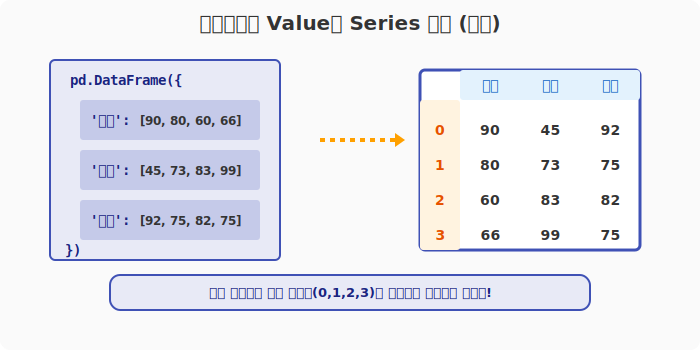
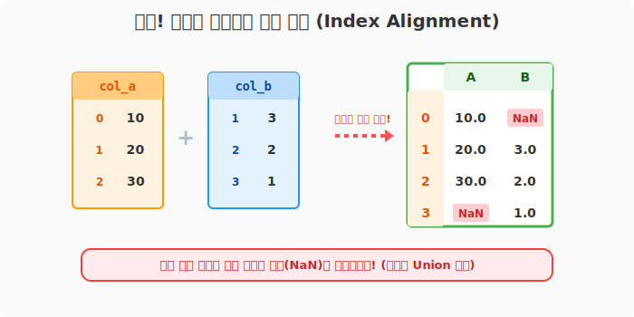
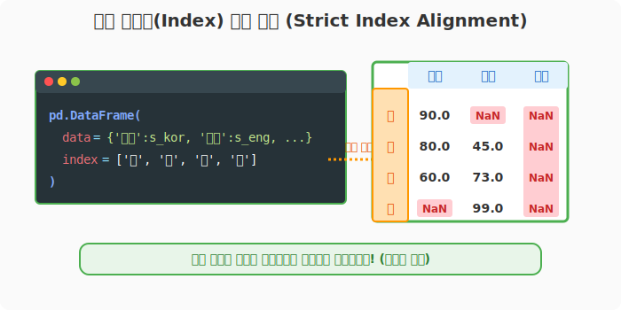

## 6.2.8 딕셔너리의 Value에 Series 넣기 (인덱스 정렬의 마법)

**[수학적 의미: 인덱스 정렬(Index Alignment) 연산]**
단순 리스트를 딕셔너리로 묶어 데이터프레임을 만들면 0, 1, 2... 순서대로 단순 병합이 일어납니다. 하지만 각자의 고유한 주소 공간(Index)을 가진 Series들을 딕셔너리로 결합하면, 판다스는 내부적으로 합집합(Union) 연산을 수행하여 **"동일한 인덱스를 가진 데이터들끼리만"** 정확히 매핑하여 결합하는 강력한 **인덱스 정렬(Index Alignment)** 기능을 지원합니다.

**[비유로 이해하기: 퍼즐 조각 맞춰 끼우기]**
- '국어 성적표', '영어 성적표'라는 각각의 파일철(Series)이 있습니다.
- 어떤 성적표엔 '장비'가 빠져있고, 다른 성적표엔 '관우'가 빠져있습니다.
- 판다스에게 이 성적표들을 주면, 판다스는 순서대로 대충 합치는 것이 아니라 **"이름(Index)"을 기준**으로 똑같은 사람끼리 퍼즐 조각처럼 알아서 끼워 맞춰줍니다. 제출 안 한 빈칸은 자동으로 빵구(`NaN`) 처리를 해줍니다.

---

### [1단계] 기본 시리즈들을 모아서 조립하기

이름표(Index)가 없는 기본 시리즈 3개를 딕셔너리의 파츠(Value)로 사용하여 조립해 봅니다.

```python
import pandas as pd

# 1. 재료: 기본 시리즈 3개 생성
s1 = pd.Series([90, 80, 60, 66])
s2 = pd.Series([45, 73, 83, 99])
s3 = pd.Series([92, 75, 82, 75])

# 2. 딕셔너리의 Value 자리에 시리즈 대입
df_basic = pd.DataFrame({'국어': s1, '영어': s2, '수학': s3})

print("--- 기본 시리즈 병합 ---")
print(df_basic)
```
**[실행 결과]**
```text
--- 기본 시리즈 병합 ---
   국어  영어  수학
0  90  45  92
1  80  73  75
2  60  83  82
3  66  99  75
```



> 세 시리즈 모두 기본 인덱스(`0, 1, 2, 3`)를 갖고 있으므로, 아주 깔끔하게 4행 3열의 표가 만들어졌습니다. 여기에 `df_basic.index = ['노', '장', '박', '강']` 으로 사람 이름을 덮어씌워줄 수도 있습니다.

---

### [2단계] 주의! 판다스의 "인덱스 강력 본드(Index Alignment)"

시리즈를 재료로 쓸 때 판다스는 **무조건 시리즈가 가지고 있던 원래의 `Index`(이름표)** 를 최우선 기준으로 삼아 달라붙습니다. 인덱스가 서로 어긋나 있으면 어떤 일이 벌어질까요?

```python
# 1번 시리즈는 인덱스가 0, 1, 2
col_a = pd.Series([10, 20, 30], index=[0, 1, 2])

# 2번 시리즈는 인덱스가 1, 2, 3 (0번이 없고 3번이 있음!)
col_b = pd.Series([3, 2, 1], index=[1, 2, 3])

df_misaligned = pd.DataFrame({'A': col_a, 'B': col_b})

print("--- 엇갈린 인덱스의 병합 결과 ---")
print(df_misaligned)
```
**[실행 결과]**
```text
--- 엇갈린 인덱스의 병합 결과 ---
      A    B
0  10.0  NaN   <-- A엔 0번이 있지만 B엔 없어서 NaN
1  20.0  3.0   <-- 1, 2번은 둘 다 있어서 결합 성공!
2  30.0  2.0
3   NaN  1.0   <-- B엔 3번이 있지만 A엔 없어서 NaN
```



판다스는 에러를 내지 않고, 0번부터 3번까지 모든 행을 만든 다음 **자신의 인덱스 번호가 맞는 곳에만 쏙 들어가고 나머지는 빈칸(`NaN`)**으로 둡니다.

---

### [3단계] 엇갈린 이름표(Index)를 깔끔하게 통제하기

실무에서는 부서마다 보내온 데이터의 사람 이름이나 날짜가 들쭉날쭉한 경우가 많습니다. DataFrame을 만들 때 아예 **기준이 되는 전체 명단(Index)**을 줘버리면, 판다스가 알아서 그 명단에 맞춰서 데이터를 걸러줍니다.

```python
# '노', '장', '박' 만 있는 데이터
s_kor = pd.Series([90, 80, 60], index=['노', '장', '박'])

# '장', '박', '강' 만 있는 데이터 ('노'가 없음)
s_eng = pd.Series([45, 73, 99], index=['장', '박', '강'])

# 이름표가 아예 없는 데이터 (0, 1, 2, 3)
s_math = pd.Series([92, 75, 82, 75])

# "내 기준은 무조건 ['노', '장', '박', '강'] 이다!" 라고 선언
df_strict = pd.DataFrame(
    {'국어': s_kor, '영어': s_eng, '수학': s_math},
    index=['노', '장', '박', '강']   # 기준 명부
)

print("--- 명부(Index)를 강제한 결합 결과 ---")
print(df_strict)
```
**[실행 결과]**
```text
--- 명부(Index)를 강제한 결합 결과 ---
     국어    영어  수학
노  90.0   NaN NaN
장  80.0  45.0 NaN
박  60.0  73.0 NaN
강   NaN  99.0 NaN
```



> **분석 결과 해설:**
> 1. `국어`는 원래 '노, 장, 박'이 있었으므로 그 자리에 쏙 들어갑니다.
> 2. `영어`는 '노'가 없으므로 `NaN`, '장, 박, 강' 자리에 들어갑니다.
> 3. `수학`은 인덱스가 `0, 1, 2, 3`이었습니다. 우리가 강제한 글자 인덱스('노, 장, 박, 강')와 **하나도 매칭되는 것이 없으므로 전멸(`NaN`)** 합니다!
> 
> *판다스는 데이터 병합 시 언제나 **Index(이름표) 매칭**이 최우선이라는 점을 잊지 마세요!*