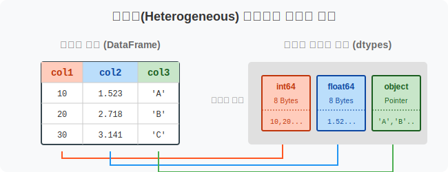
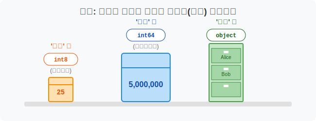
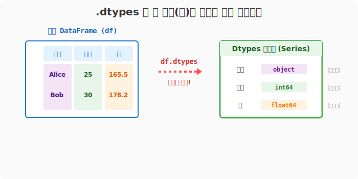
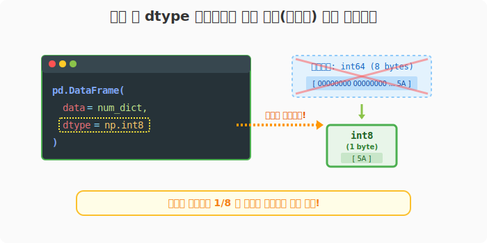
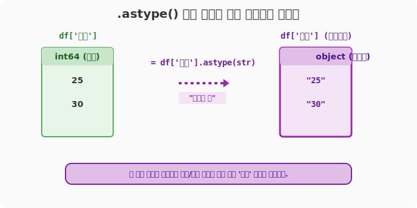

## 6.2.9 열과 전체 자료형 속성(dtypes) 다루기

> 💾 **[실습 파일 다운로드]**
> 본 강의의 전체 실습 코드를 직접 실행해 볼 수 있는 주피터 노트북 파일입니다. 아래 링크를 클릭하여 다운로드 후 VS Code에서 열어보세요.
> - [📥 df_dtypes_practice.ipynb 파일 다운로드](./df_dtypes_practice.ipynb) (클릭 또는 마우스 우클릭 후 '다른 이름으로 링크 저장')

## 🧮 컴퓨터 과학적 의미: 이기종(Heterogeneous) 데이터의 자료형 명세

데이터프레임의 각 열(Column)은 독립적인 벡터이므로 서로 다른 메모리 크기와 형태를 가지는 자료형(Data Type)을 수용할 수 있습니다. `dtypes` 속성은 각 컬럼 벡터가 C/C++ 레벨에서 어떤 바이트 크기(예: `int64`, `float32`, `object`)로 할당되어 있는지 보여주는 명세서(Specification)와 같습니다.



## 🏷️ 비유로 이해하기: 부서별 창고의 보관함 규격 확인하기

- '나이' 열은 작은 숫자만 들어가므로 **소형 보관함(`int8`)** 만 있어도 충분합니다.
- '소득' 열은 엄청나게 큰 숫자가 들어가므로 **초대형 보관함(`int64`)** 이 필요합니다.
- '이름' 열은 글자가 들어가므로 숫자가 아닌 **텍스트 전용 보관함(`object`)** 에 담아야 합니다.
- `dtypes` 명령은 이 보관함들이 부서별로 어떤 사이즈로 짜여 있는지 한눈에 보여주는 도면입니다.



---

## 🪄 [실습 1] 현재 데이터프레임의 자료형 확인하기 (`dtypes`)

기본적으로 판다스는 우리가 넣은 데이터를 보고 "이 정도면 충분하겠지" 하고 자동으로 넉넉하게 자료형을 잡아줍니다. 정수형은 `int64`(64비트 정수), 실수형은 `float64`(64비트 실수), 문자는 `object`가 기본입니다.

```python
import pandas as pd
import numpy as np

# 임의의 데이터 딕셔너리
data_dict = {
    '이름': ['Alice', 'Bob'],
    '나이': [25, 30],
    '키': [165.5, 178.2]
}

df = pd.DataFrame(data=data_dict)

print("--- 원본 데이터프레임 ---")
print(df)

# 각 열의 보관함 규격 확인하기!
print("\n--- 열별 자료형(dtypes) 확인 ---")
print(df.dtypes)
```

**[실행 결과]**
```text
--- 원본 데이터프레임 ---
      이름  나이      키
0  Alice  25  165.5
1    Bob  30  178.2

--- 열별 자료형(dtypes) 확인 ---
이름     object   <-- 문자열은 object로 처리됨
나이      int64   <-- 정수는 자동으로 64비트 공간 할당
키     float64   <-- 소수점은 자동으로 64비트 공간 할당
dtype: object
```



---

## 🪄 [실습 2] 메모리 다이어트! 생성할 때 자료형 강제하기 (`dtype`)

엄청나게 큰 빅데이터를 다룰 때 모든 숫자를 `int64`로 잡으면 메모리(RAM)가 펑 터질 수 있습니다. "나이는 100을 넘기 힘드니 아주 작은 상자(`int8`)에 담아!" 라고 미리 강제할 수 있습니다.

```python
# 숫자 데이터만 있는 딕셔너리
num_dict = {'수학': [90, 80], '영어': [100, 95]}

# 데이터프레임을 만들 때, 모든 상자를 '8비트 정수(int8)'로 강제 통일!
df_tiny = pd.DataFrame(data=num_dict, dtype=np.int8)

print("--- 초소형 상자(int8)가 적용된 dtypes ---")
print(df_tiny.dtypes)
```

**[실행 결과]**
```text
--- 초소형 상자(int8)가 적용된 dtypes ---
수학    int8
영어    int8
dtype: object
```
> **💡 RAM 절약 효과:** `int64`는 숫자 하나당 8바이트를 차지하지만, `int8`은 단 1바이트만 차지합니다. 메모리 사용량을 1/8로 줄인 셈입니다!



---

## 🪄 [실습 3] 이미 만들어진 표의 자료형 바꾸기 (`astype`)

일단 생성된 이후에 "앗, 이 열은 숫자가 아니라 문자로 바꿔서 저장해야겠어"라고 생각이 든다면 `astype()` 함수를 사용해 트랜스포머처럼 형태를 변환시킵니다.

```python
# '나이' 열을 정수(int64)에서 문자열(str)로 변환해 덮어씌웁니다.
df['나이'] = df['나이'].astype(str)

print("--- 변환 후 자료형 확인 ---")
print(df.dtypes)
```

**[실행 결과]**
```text
--- 변환 후 자료형 확인 ---
이름     object
나이     object   <-- int64에서 object(문자)로 성공적으로 변환됨!
키     float64
dtype: object
```



> **주의점:** 숫자가 포함된 문자열 열을 다시 숫자로 바꾸려면 `pd.to_numeric(df['열이름'])` 을 사용하는 것이 에러를 방지하는 가장 안전한 실무 패턴입니다.