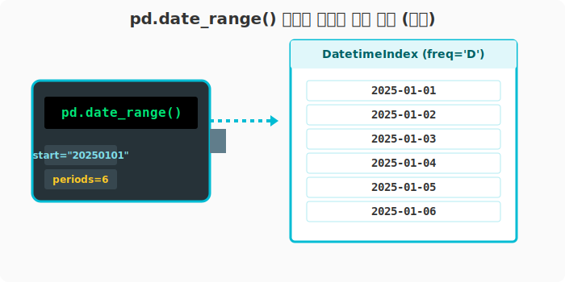
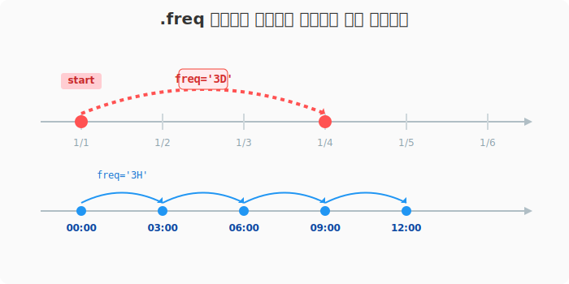
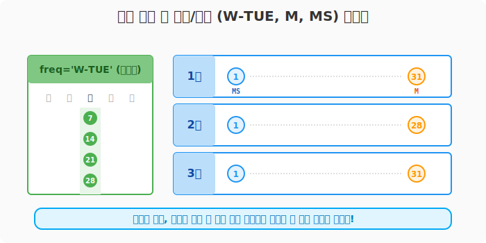

## 6.2.10 날짜 자동 생성기: pd.date_range()

**[수학적 의미: 일정한 주기를 갖는 시간 시퀀스(Time Sequence) 생성]**
수학에서 등차수열(공차가 일정한 수열)을 만들듯, 시작점(`start`)과 끝점(`end`) 사이에서 일정한 시간 간격(`freq`)을 공차로 삼아 연속된 **시간(Datetime) 벡터**를 자동으로 생성해 주는 함수입니다. 시계열(Time-series) 분석을 할 때 필수적인 기준 축(Index)이 됩니다.

**[비유로 이해하기: 회사 캘린더 자동 폭격기]**
- 매주 월요일 점심 식단표를 짜야 하거나, 매달 1일마다 월간 보고서를 써야 한다고 가정해 보세요.
- 달력을 보고 일일이 날짜를 세어 엑셀에 적어 넣는 대신, 판다스에게 "오늘부터 10번 동안 매주 화요일 날짜만 찍어줘"라고 명령하면 알아서 캘린더를 쫙 뽑아주는 마법의 함수입니다.

---

### [1단계] 가장 기본적인 날짜 시퀀스 뽑기 (일별)

기준 시작 날짜와 몇 개를 뽑을지(`periods`)만 지정하면, 기본적으로 '하루 단위(일별)'로 날짜를 생성어 `DatetimeIndex`라는 특별한 시계열 구조체로 반환합니다.

```python
import pandas as pd

# 2025년 1월 1일 연속된 6일의 날짜를 생성합니다.
dates = pd.date_range(start="20250101", periods=6)

print("--- 6일치 기본 날짜 생성 ---")
print(dates)
```

**[실행 결과]**
```text
--- 6일치 기본 날짜 생성 ---
DatetimeIndex(['2025-01-01', '2025-01-02', '2025-01-03', '2025-01-04',
               '2025-01-05', '2025-01-06'],
              dtype='datetime64[ns]', freq='D')
```



> 출력 결과의 `freq='D'`는 간격이 하루(Day)임을 의미합니다. 반환된 배열의 원소를 하나 뽑아보면 파이썬 문자열이 아닌 판다스의 전용 객체 `Timestamp`임을 확인할 수 있습니다.

#### 끝나는 날짜 지정하기 (end)
개수(`periods`) 대신 종료일(`end`)을 줄 수도 있습니다. (종료일도 배열에 포함됩니다.)

```python
dates_by_end = pd.date_range(start="20250101", end='20250110')
print("\n--- 1월 1일부터 10일까지 ---")
print(dates_by_end)
```

---

### [2단계] 내 맘대로 주기(Frequency) 조정하기

가장 강력한 기능입니다. `freq` 옵션을 주물러서 단위를 마음대로 늘렸다 줄였다 할 수 있습니다.

#### 1) 간격을 넓히기: "3일마다", "3시간마다"
- `3D`: 3일 (Day) 간격
- `3H`: 3시간 (Hour) 간격

```python
# 3일 간격으로 6번 반복
dates_3d = pd.date_range("2025-01-01", periods=6, freq='3D')
print("--- 3일 간격 생성 ---")
print(dates_3d)

# 3시간 간격으로 6번 반복 (시간 개념 추가!)
dates_3h = pd.date_range("2025-01-01", periods=6, freq='3H')
print("\n--- 3시간 간격 생성 ---")
print(dates_3h)
```
**[실행 결과]**
```text
--- 3일 간격 생성 ---
DatetimeIndex(['2025-01-01', '2025-01-04', '2025-01-07', '2025-01-10',
               '2025-01-13', '2025-01-16'],
              dtype='datetime64[ns]', freq='3D')

--- 3시간 간격 생성 ---
DatetimeIndex(['2025-01-01 00:00:00', '2025-01-01 03:00:00',
               '2025-01-01 06:00:00', '2025-01-01 09:00:00',
               '2025-01-01 12:00:00', '2025-01-01 15:00:00'],
              dtype='datetime64[ns]', freq='3H')
```



---

### [3단계] "특정 요일", "월말/월초" 단위로 뽑아내기

회사 업무를 할 때 가장 피가 되고 살이 되는 기능입니다. 특정 요일이나 급여일(말일)만 계산해야 할 때 유용합니다.

#### 1) 특정 요일만 뽑기 (예: 주간회의 일자)
- `W`: 일주일 간격 (기본적으로 일요일 시작)
- `W-TUE`: 매주 화요일
- `W-FRI`: 매주 금요일

```python
# 2025년 1월 1일 이후 다가오는 첫 화요일부터 4번 생성을 시작합니다.
tuesdays = pd.date_range("2025-01-01", periods=4, freq='W-TUE')

print("--- 다가오는 화요일 연속 4주 ---")
print(tuesdays)
```
**[실행 결과]**
```text
--- 다가오는 화요일 연속 4주 ---
DatetimeIndex(['2025-01-07', '2025-01-14', '2025-01-21', '2025-01-28'],
              dtype='datetime64[ns]', freq='W-TUE')
```

#### 2) 단위의 기준이 월말이냐 월초냐? (`M` vs `MS`)
- `M` (Month End): 월별 **마지막 날**을 기준으로 생성합니다.
- `MS` (Month Start): 월별 **1일**을 기준으로 생성합니다.

```python
# 월 말일 (월급날 결산용)
month_ends = pd.date_range("2025-01-01", periods=3, freq='M')
print("--- 매월 말일 3번 ---")
print(month_ends)

# 월 초일 (월별 새로운 시작용)
month_starts = pd.date_range("2025-01-01", periods=3, freq='MS')
print("\n--- 매월 1일 3번 ---")
print(month_starts)
```
**[실행 결과]**
```text
--- 매월 말일 3번 ---
DatetimeIndex(['2025-01-31', '2025-02-28', '2025-03-31'],
              dtype='datetime64[ns]', freq='M')

--- 매월 1일 3번 ---
DatetimeIndex(['2025-01-01', '2025-02-01', '2025-03-01'],
              dtype='datetime64[ns]', freq='MS')
```



> **🔥 파이썬 실습 꿀팁:**
> 이 `date_range`로 생성한 시간 객체를 향후 다룰 DataFrame의 `Index`로 끼워 넣으면, 주식 차트나 기상청 온도 기록 같은 완벽한 **시계열 데이터프레임**이 뚝딱 완성됩니다! (다음 장에서 확인하세요)