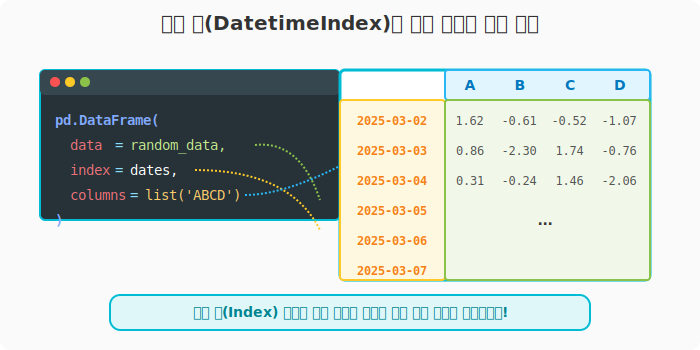
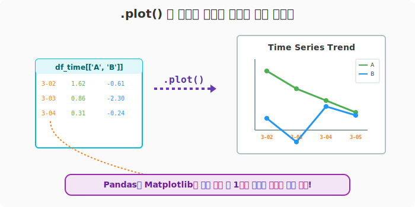

## 6.2.11 시간(Datetime) 인덱스를 가진 시계열 데이터프레임 구조화

**[수학적/데이터 과학적 의미: 시계열 매트릭스(Time Series Matrix)]**
$T$라는 시간 축(Time Axis) 위에 정사영된 관측치(Observations)들의 다차원 배열입니다. 단순한 라벨 문자열이나 고정된 정수가 아니라, **흐르는 시간(Datetime객체)을 인덱스 축으로 설정**함으로써 주식 가격 예측, 기상 예측 등 시간에 따른 변화량을 분석하는 완벽한 시계열 분석(Time Series Analysis) 구조를 완성합니다.

**[비유로 이해하기: 은행의 일일 거래 장부]**
- 매일매일 날짜가 적혀있는 은행의 입출금 장부를 생각해 보세요. 
- 이 장부의 가장 왼쪽 줄('Index')은 무조건 **날짜**입니다. 
- 그리고 나머지 칸('Columns')들에는 A지점 매출액, B지점 매출액 등의 값이 기록됩니다.
- 이전 장에서 배운 `date_range()` 자동 날짜 생성기를 이 장부의 왼쪽 줄로 통째로 꽂아 넣는 과정입니다.

---

### [1단계] 캘린더 생성기(date_range)로 날짜 축 준비하기

먼저 데이터프레임의 왼쪽 기둥이 될 시간 축 데이터를 뽑아냅니다. 3월 2일부터 시작하는 6일 치의 일일 캘린더입니다.

```python
import pandas as pd
import numpy as np

# 1. 2025년 3월 2일부터 6일간의 연속된 날짜를 생성
dates = pd.date_range(start="20250302", periods=6)

print("--- 준비된 캘린더 축 (Index) ---")
print(dates)
```
**[실행 결과]**
```text
--- 준비된 캘린더 축 (Index) ---
DatetimeIndex(['2025-03-02', '2025-03-03', '2025-03-04', '2025-03-05',
               '2025-03-06', '2025-03-07'],
              dtype='datetime64[ns]', freq='D')
```

---

### [2단계] 난수(Random) 데이터와 결합하여 시계열 표 완성하기

실제 주식 시장 데이터라고 상상하며, `numpy`를 이용해 가짜 변동성 데이터(난수)를 생성한 뒤 날짜 인덱스와 결합합니다.

```python
# 2. 넘파이 난수(표준정규분포)를 이용해 6행 4열짜리 변동성 데이터 생성
# (날짜가 6일이므로, 행의 개수를 반드시 6으로 맞춰야 조립됩니다!)
random_data = np.random.randn(6, 4)

# 3. 데이터, 날짜 축(index), 컬럼명(columns)을 모아서 데이터프레임 합체!
df_time = pd.DataFrame(
    data=random_data, 
    index=dates,                 # 위에서 만든 시간축을 좌측 인덱스에 삽입!
    columns=list("ABCD")         # ['A', 'B', 'C', 'D'] 로 컬럼명 지정
)

print("\n🏢 완성된 시계열 데이터프레임:\n")
print(df_time)
```
**[실행 결과]**
```text
🏢 완성된 시계열 데이터프레임:

                   A         B         C         D
2025-03-02  1.624345 -0.611756 -0.528172 -1.072969
2025-03-03  0.865408 -2.301539  1.744812 -0.761207
2025-03-04  0.319039 -0.249370  1.462108 -2.060141
2025-03-05 -0.322417 -0.384054  1.133769 -1.099891
2025-03-06 -0.172428 -0.877858  0.042214  0.582815
2025-03-07 -1.100619  1.144724  0.901591  0.502494
```



> **데이터 분석가의 렌즈:**
> 좌측의 날짜가 단순한 문자열이 아니라 판다스의 고유한 `DatetimeIndex` 객체 구조 속에 들어있다는 것이 핵심입니다. 덕분에 향후 이 표에서 "금요일 데이터만 평균 내줘!", "3월 3일부터 5일 사이의 B열 값 누적합을 구해줘!" 같은 복잡한 시간 기반 연산이 단 한 줄의 코드로 돌파 가능해집니다.

---

> **💡 Matplotlib 연계 꿀팁 (시계열 차트 그리기)**
> 날짜가 인덱스로 설정된 데이터프레임은 `.plot()`을 호출하는 순간, X축이 날짜로 완벽하게 자동 맵핑된 시계열 트렌드 꺾은선 그래프를 그려줍니다!
> ```python
> import matplotlib.pyplot as plt
> 
> # A열과 B열의 날짜별 변화 추이 그리기
> df_time[['A', 'B']].plot(title="Time Series Trend", figsize=(8,4))
> plt.show()
> ```

