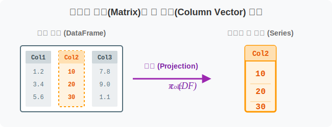
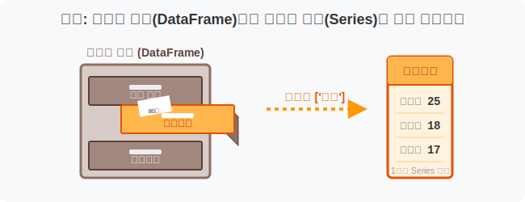
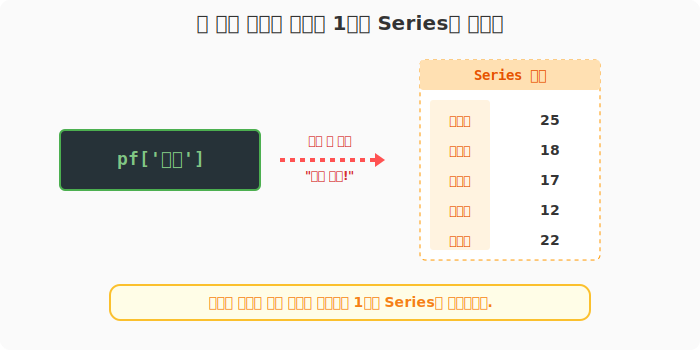
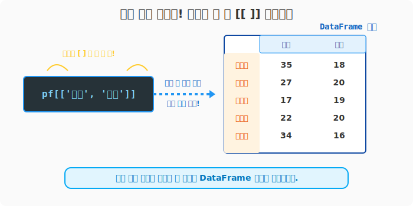
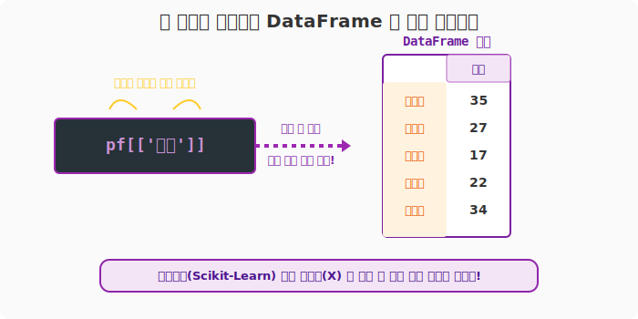

## 6.3.1 DataFrame에서 열(Column)만 쏙 뽑아내기

> 💾 **[실습 파일 다운로드]**
> 본 강의의 전체 실습 코드를 직접 실행해 볼 수 있는 주피터 노트북 파일입니다. 아래 링크를 클릭하여 다운로드 후 VS Code에서 열어보세요.
> - [📥 column_selection_practice.ipynb 파일 다운로드](./column_selection_practice.ipynb) (클릭 또는 마우스 우클릭 후 '다른 이름으로 링크 저장')

## 🧮 수학적 의미: 다차원 행렬의 열 벡터(Column Vector) 투영

전체 $m \times n$ 매트릭스(데이터프레임)에서 특정 차원(특징)에 해당하는 열 벡터 하나 혹은 여러 개를 부분 집합으로 투영(Projection)하여 추출하는 연산입니다.



## 🏷️ 비유로 이해하기: 수많은 서랍장 중 원하는 서랍만 당겨보기

- 당신은 '중간고사', '기말고사', '출석'이라는 서랍이 3개 달린 거대한 책상(DataFrame)을 샀습니다.
- 여기서 '중간고사' 서랍장 하나만 쑤욱 열어보면 그 안엔 학생들의 점수(Series)가 세로로 층층이 들어있습니다.
- 혹은 양손으로 '기말고사'와 '출석' 서랍을 **동시에** 쑤욱 열면, 작은 2칸짜리 책상(DataFrame)이 따로 떨어져 나오는 것과 같습니다.



---

## 🪄 [실습 0] 준비물: 성적표 데이터 생성하기

먼저 실습을 위한 가상의 학급 성적표를 만듭니다.

```python
import pandas as pd

# 학생 5명의 성적 데이터프레임
pf = pd.DataFrame(
    data=[
        [25, 35, 8, 18],
        [18, 27, 10, 20],
        [17, 17, 10, 19],
        [12, 22, 9, 20],
        [22, 34, 8, 16]
    ],
    index=['윤일형', '강수희', '홍소희', '유한빈', '신수빈'],
    columns=['중간', '기말', '과제', '출석']
)

print("--- 📚 원본 통합 성적표 ---")
print(pf)
```
**[실행 결과]**
```text
--- 📚 원본 통합 성적표 ---
     중간  기말  과제  출석
윤일형  25  35   8  18
강수희  18  27  10  20
홍소희  17  17  10  19
유한빈  12  22   9  20
신수빈  22  34   8  16
```

---

## 🪄 [실습 1] 한 과목만 쏙! 단일 열 참조 (Series 반환)

가장 간단한 방법은 데이터프레임 변수에 **대괄호 `[ ]`**를 하나 치고 열 이름표를 문자열로 적는 것입니다. (파이썬 딕셔너리에서 Key로 Value를 찾는 문법과 완벽히 동일합니다.)

```python
# '중간' 고사 점수만 뽑아줘!
midterm_scores = pf['중간']

print("--- 단일 열 추출 결과 ---")
print(midterm_scores)
print("\n자료형 확인:", type(midterm_scores))
```
**[실행 결과]**
```text
--- 단일 열 추출 결과 ---
윤일형    25
강수희    18
홍소희    17
유한빈    12
신수빈    22
Name: 중간, dtype: int64

자료형 확인: <class 'pandas.core.series.Series'>
```



> **관찰 포인트:** 1개의 열만 뽑으면 2차원의 표 모양이 무너지며, **1차원 선형 구조인 `Series`**로 신분 강등(?)이 일어납니다.

---

## 🪄 [실습 2] 두 과목 이상 동시에 묶어서 뽑기 (다중 열 참조)

"기말고사와 출석 점수만 따로 떼서 보고싶어!" 
이럴 때는 대괄호 안에 **'열 이름들을 리스트 형태로 묶어서'** 한 번 더 씌워줍니다. (즉, **대괄호가 두 겹 `[[ ]]`** 이 됩니다.)

```python
# 리스트 형태 ['기말', '출석', '중간'] 를 대괄호 [] 안에 집어넣습니다.
# (순서를 내 맘대로 바꿀 수도 있습니다!)
multi_cols = pf[['기말', '출석', '중간']]

print("--- 여러 열 추출 결과 ---")
print(multi_cols)
print("\n자료형 확인:", type(multi_cols))
```
**[실행 결과]**
```text
--- 여러 열 추출 결과 ---
     기말  출석  중간
윤일형  35  18  25
강수희  27  20  18
홍소희  17  19  17
유한빈  22  20  12
신수빈  34  16  22

자료형 확인: <class 'pandas.core.frame.DataFrame'>
```



> **관찰 포인트:** 여러 열을 뽑았으므로 여전히 가로세로를 가진 표 모양입니다. 따라서 결과물도 원래와 똑같은 **`DataFrame`** 자료형을 유지합니다. 

---

## 🪄 [실습 3] 하나를 뽑더라도 표 모양(DataFrame) 살리기

가끔은 1개의 열만 뽑지만 모양은 여전히 2차원 표(DataFrame)로 예쁘게 유지하고 싶을 때가 있습니다. (특히 머신러닝 모델에 데이터를 넣을 때 이런 모양을 요구합니다.)
이때는 1개를 뽑더라도 **대괄호를 두 겹 `[[ ]]`** 쳐주면 됩니다.

```python
# 대괄호 하나: 시리즈!
print(type(pf['기말']))          # Series 반환

# 대괄호 두 개: 데이터프레임!
df_single_col = pf[['기말']]
print(type(df_single_col))       # DataFrame 반환

print("\n--- 2차원 표로 유지된 기말고사 ---")
print(df_single_col)
```
**[실행 결과]**
```text
<class 'pandas.core.series.Series'>
<class 'pandas.core.frame.DataFrame'>

--- 2차원 표로 유지된 기말고사 ---
     기말
윤일형  35
강수희  27
홍소희  17
유한빈  22
신수빈  34
```

