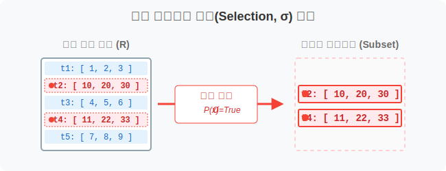
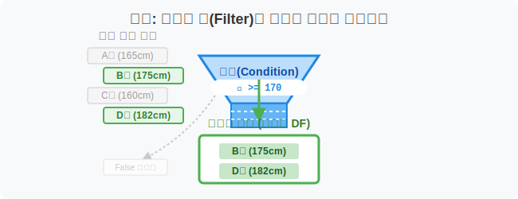
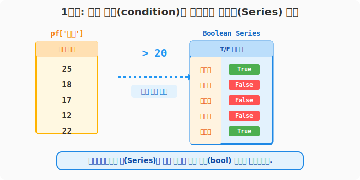
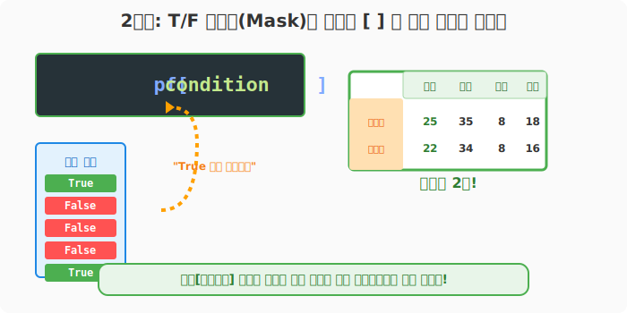
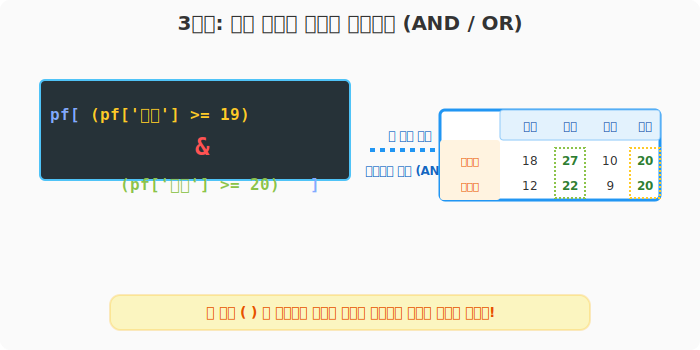
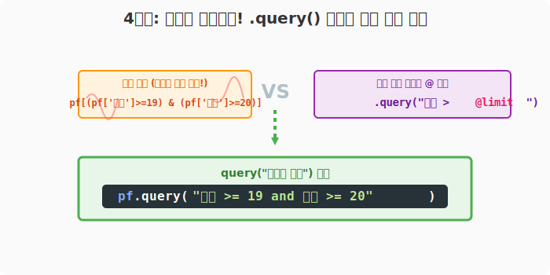

## 6.3.2 조건식을 이용한 행(Row) 추출 (Boolean Indexing)

> 💾 **[실습 파일 다운로드]**
> 본 강의의 전체 실습 코드를 직접 실행해 볼 수 있는 주피터 노트북 파일입니다. 아래 링크를 클릭하여 다운로드 후 VS Code에서 열어보세요.
> - [📥 conditional_selection_practice.ipynb 파일 다운로드](./conditional_selection_practice.ipynb) (클릭 또는 마우스 우클릭 후 '다른 이름으로 링크 저장')

## 🧮 수학적 의미: 조건부 부분집합(Conditional Subset) 추출

전체 데이터 튜플(Tuple) 집합에서, 특정 속(Attribute) 값이 주어진 논리 조건식($P(x) = True$)을 만족하는 튜플들만 골라내어 새로운 부분 집합(Subset)을 반환하는 관계 대수학의 **선택(Selection, $\sigma$)** 연산입니다.



## 🏷️ 비유로 이해하기: 체에 걸러내기 (Filtering)

- 체육 시간에 줄 서 있는 학생 100명(행, Row)이 있습니다.
- 선생님이 "키가 170 이상인 사람만 남아!" 라고 외칩니다. (조건 부여)
- 이 조건을 만족하는 학생(`True`)만 살아남고, 만족하지 못하는 학생(`False`)은 사라져서 더 작은 집단(새로운 DataFrame)이 뚝딱 만들어지는 과정입니다.



---

## 🪄 [실습 1] 준비물: 성적표 데이터

VS Code나 주피터 노트북을 열고 `pandas_01.py` 파일을 생성하여 실습을 진행합니다.

### 1단계: 가상의 학급 성적표 만들기

```python
import pandas as pd

pf = pd.DataFrame(
    data=[
        [25, 35, 8, 18],
        [18, 27, 10, 20],
        [17, 17, 10, 19],
        [12, 22, 9, 20],
        [22, 34, 8, 16]
    ],
    index=['윤일형', '강수희', '홍소희', '유한빈', '신수빈'],
    columns=['중간', '기말', '과제', '출석']
)

print("--- 📚 원본 성적표 ---")
print(pf)
```
**[실행 결과]**
```text
     중간  기말  과제  출석
윤일형  25  35   8  18
강수희  18  27  10  20
홍소희  17  17  10  19
유한빈  12  22   9  20
신수빈  22  34   8  16
```

---

## 🪄 [실습 2] 참새와 독수리 분리하기: 논리 배열(Boolean Series) 생성

작성한 코드 아래에 다음 코드를 추가합니다.

### 1단계: 조건식을 통한 True/False 판별
먼저 조건을 작성하여 각 행이 조건에 맞는지 판별합니다.
`pf['중간'] > 20` 이라는 수식을 적으면, 학생 5명 전원에게 이 질문을 던져 `True/False` 답안지(Series)를 만듭니다.

```python
# 질문: '중간' 점수가 20점 초과인가?
condition = pf['중간'] > 20

print("--- 질문에 대한 답안지 (True/False) ---")
print(condition)
```
**[실행 결과]**
```text
윤일형     True   (25점이니 참!)
강수희    False   (18점이니 거짓)
홍소희    False
유한빈    False
신수빈     True   (22점이니 참!)
Name: 중간, dtype: bool
```



---

## 🪄 [실습 3] 답안지를 적용해 진짜 데이터 뽑아내기

계속해서 동일한 파일에 아래 코드를 추가합니다.

### 1단계: 불리언 인덱싱 적용
위에서 구한 `True/False` 답안지(`condition`)를 **데이터프레임의 대괄호 `[ ]`** 안에 쏙 집어넣으면, `True`인 학생의 행(Row)만 살아남은 새 표가 나옵니다. 실무에서는 보통 1단계와 합쳐서 **한 줄로** 적습니다.

```python
# "중간 > 20" 인 학생만 남겨라!
df_filtered = pf[pf['중간'] > 20]

print("--- 필터링 완료된 데이터프레임 ---")
print(df_filtered)
```
**[실행 결과]**
```text
     중간  기말  과제  출석
윤일형  25  35   8  18
신수빈  22  34   8  16    <-- 조건(중간>20)을 만족하는 2명만 생존!
```



---

## 🪄 [실습 4] 여러 개의 필터 동시에 씌우기 (AND / OR)

이번에는 `pandas_02.py` 파일을 생성해 봅니다. 앞서 만든 성적표 데이터(`pf`) 생성 코드를 파일 상단에 먼저 복사해 넣은 뒤 진행합니다.

### 1단계: 다중 조건(AND/OR) 필터링
"출석은 19 이상 **그리고(AND)** 기말은 20 이상인 사람"을 찾고 싶을 때는 `&` (그리고) 기호와 `|` (또는) 기호를 합쳐서 넣습니다.
> **🚨 절대 주의!** 여러 조건을 묶을 때는 반드시 **각 조건을 괄호 `( )`로 감싸야** 에러가 나지 않습니다!!

```python
# 출석 >= 19  AND  기말 >= 20
df_multi_filter = pf[(pf['출석'] >= 19) & (pf['기말'] >= 20)]

print("--- 다중 조건(AND) 필터링 결과 ---")
print(df_multi_filter)
```
**[실행 결과]**
```text
     중간  기말  과제  출석
강수희  18  27  10  20
유한빈  12  22   9  20
```



---

## 🪄 [실습 5] 꿀팁: 데이터베이스처럼 우아하게 검색하기 (query)

앞서 만든 `pandas_02.py` 코드 아래에 다음 내용을 추가합니다.

### 1단계: query() 함수를 이용한 문자열 검색
`pf[pf['중간'] > 20]` 방식은 코드가 길어지면 괄호가 너무 많아서 눈이 아픕니다. 데이터 분석가들은 SQL 같은 문자열 검색 기능인 `.query()`를 애용합니다.

```python
# 1) 문자열로 깔끔하게 검색
print("--- query() 함수를 이용한 검색 ---")
print(pf.query("중간 > 20"))

# 2) 외부 파이썬 변수를 쓸 때는 앞에 @ 골뱅이를 붙입니다!
limit_score = 15
print("\n--- 파이썬 변수 참조 (@ 기호) ---")
print(pf.query("과제 < @limit_score & 기말 >= 30"))
```
**[실행 결과]**
```text
--- query() 함수를 이용한 검색 ---
     중간  기말  과제  출석
윤일형  25  35   8  18
신수빈  22  34   8  16

--- 파이썬 변수 참조 (@ 기호) ---
     중간  기말  과제  출석
윤일형  25  35   8  18
신수빈  22  34   8  16
```



> `pf[ ... ]` 문법과 결과는 100% 동일하지만, 사람의 눈으로 읽기 월등히 깨끗한 코드 작성이 가능합니다.