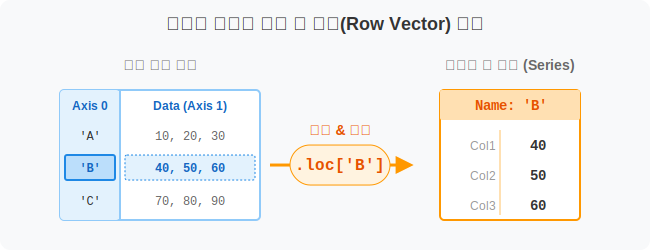
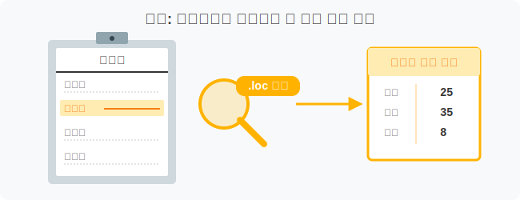
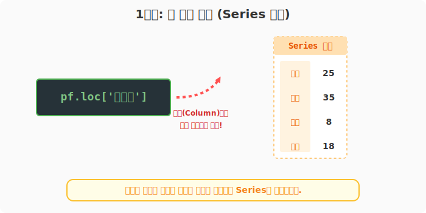
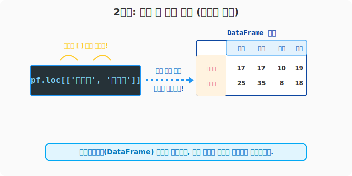
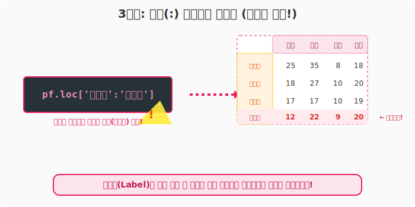
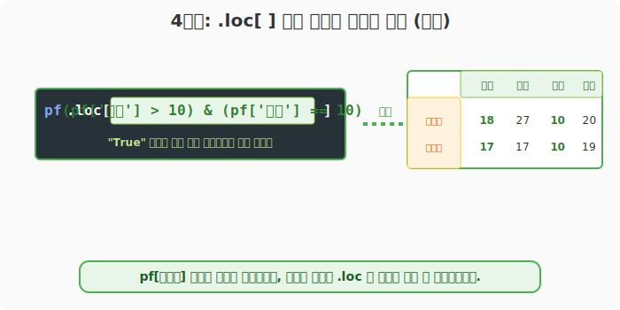

## 6.3.3 `.loc[]` 를 이용한 행(Row) 타게팅

> 💾 **[실습 파일 다운로드]**
> 본 강의의 전체 실습 코드를 직접 실행해 볼 수 있는 주피터 노트북 파일입니다. 아래 링크를 클릭하여 다운로드 후 VS Code에서 열어보세요.
> - [📥 row_selection_loc_practice.ipynb 파일 다운로드](./row_selection_loc_practice.ipynb) (클릭 또는 마우스 우클릭 후 '다른 이름으로 링크 저장')

## 🧮 수학적 의미: 인덱스 레이블 기반 벡터 투영

데이터프레임(Matrix) 공간에서, 인덱스 축(Axis 0)에 부여된 사람이 읽을 수 있는 명시적 레이블(Label, 문자열 등)을 키형태로 사용하여 특정 행 벡터(Row Vector)들의 집합을 추출하는 과정입니다.



## 🏷️ 비유로 이해하기: 출석부에서 이름표로 사람 찾기

- 앞서서 컬럼을 뽑을 때는 다짜고짜 `df['기말']` 처럼 썼습니다. 하지만 행(가로줄)을 뽑을 때는 헷갈리지 말라고 판다스가 **`.loc` (Location의 약자)** 이라는 전용 돋보기를 만들어 두었습니다.
- "선생님이 출석부에서 '윤일형!' 하고 이름을 부르면 그 학생의 성적 한 줄이 튀어나오고, '강수희부터 유한빈까지!' 라고 부르면 여러 명의 성적이 표 형태로 튀어나오는 것"과 같습니다.



---

## 🪄 [실습 0] 준비물: 성적표 데이터

```python
import pandas as pd

pf = pd.DataFrame(
    data=[
        [25, 35, 8, 18],
        [18, 27, 10, 20],
        [17, 17, 10, 19],
        [12, 22, 9, 20],
        [22, 34, 8, 16]
    ],
    index=['윤일형', '강수희', '홍소희', '유한빈', '신수빈'],
    columns=['중간', '기말', '과제', '출석']
)

print("--- 📚 원본 성적표 ---")
print(pf)
```

---

## 🪄 [실습 1] 한 명의 데이터만 콕 집어 뽑기 (단일 행)

`.loc['이름표']` 를 사용합니다. 단일 열을 뽑을 때처럼 표(DataFrame) 모양이 무너지며 **시리즈(Series)** 형태로 세로로 길게 반환됩니다.

```python
# '윤일형' 학생의 모든 성적 정보를 가져와 줘!
row_single = pf.loc['윤일형']

print("--- '윤일형' 성적표 (Series) ---")
print(row_single)
```
**[실행 결과]**
```text
중간    25
기말    35
과제     8
출석    18
Name: 윤일형, dtype: int64
```



> **표 모양 유지하기 꿀팁!**
> 대괄호를 두 번 쳐서 `pf.loc[['윤일형']]` 라고 쓰면 데이터가 하나여도 2차원 DataFrame 자료형을 유지한 채 반환됩니다.

---

## 🪄 [실습 2] 여러 명의 데이터를 동시에 뽑기 (명단 넘기기)

뽑고 싶은 사람들의 이름표를 파이썬 리스트 `[ ]`로 묶어서 넘겨줍니다.

```python
# '홍소희'와 '윤일형' 학생을 콕 집어서 뽑기 (순서도 마음대로 바꿀 수 있습니다!)
multi_rows = pf.loc[['홍소희', '윤일형']]

print("--- 여러 명 동시 추출 (DataFrame) ---")
print(multi_rows)
```
**[실행 결과]**
```text
     중간  기말  과제  출석
홍소희  17  17  10  19
윤일형  25  35   8  18
```



---

## 🪄 [실습 3] "여기부터 여기까지 다 나와!" (슬라이싱)

이름표를 기준으로 **콜론(`:`)**을 사용해 범위를 지정할 수 있습니다. 

> **🚨 반드시 외워야 할 주의사항:**
> 파이썬 리스트 슬라이싱 `[1:4]` 에서는 마지막 4번째가 제외되지만, **판다스의 `.loc['A':'C']` 레이블 슬라이싱에서는 마지막 끝점('C')까지 포함되어 반환됩니다!** (위 이미지의 팁을 참고하세요)

```python
# '윤일형' 학생부터 '유한빈' 학생까지 싹 다 뽑아줘!
sliced_rows = pf.loc['윤일형':'유한빈']

print("--- 이름 슬라이싱 결과 (마지막 유한빈 포함!) ---")
print(sliced_rows)
```
**[실행 결과]**
```text
     중간  기말  과제  출석
윤일형  25  35   8  18
강수희  18  27  10  20
홍소희  17  17  10  19
유한빈  12  22   9  20
```



---

## 🪄 [실습 4] loc 안에 조건식(Boolean) 넣기

이전 장에서 배운 "조건부 참조" 문법은 사실 이 `.loc` 돋보기 안에도 똑같이 들어갈 수 있습니다. 판다스 내부 규칙상 `.loc[ 조건식 ]` 처럼 쓰는 것이 더 실수가 적은 정석적인 문법입니다.

```python
# 1) 중간고사가 20점을 넘는 학생들
print("--- [조건 1] 중간 > 20 ---")
print(pf.loc[pf['중간'] > 20])

# 2) 다중 조건: 중간이 10점 초과이고(AND) 과제 점수가 만점(10점)인 학생!
print("\n--- [조건 2] 중간 > 10 AND 과제 == 10 ---")
print(pf.loc[(pf['중간'] > 10) & (pf['과제'] == 10)])
```
**[실행 결과]**
```text
--- [조건 1] 중간 > 20 ---
     중간  기말  과제  출석
윤일형  25  35   8  18
신수빈  22  34   8  16

--- [조건 2] 중간 > 10 AND 과제 == 10 ---
     중간  기말  과제  출석
강수희  18  27  10  20
홍소희  17  17  10  19
```

