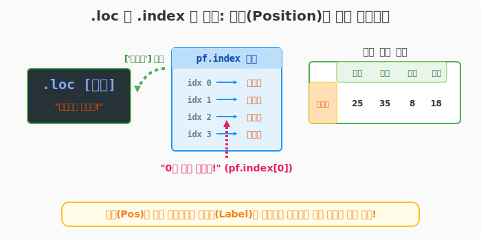
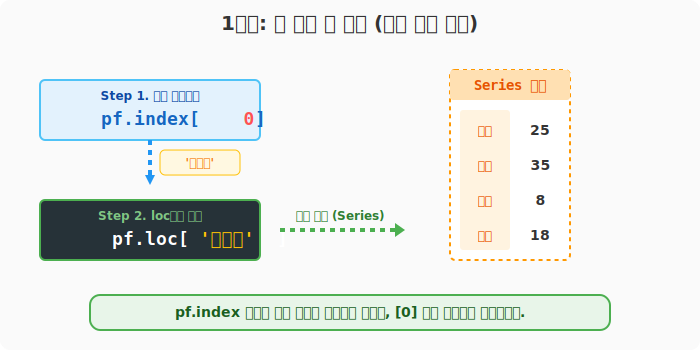
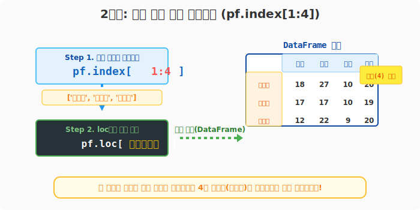

## 6.3.4 `.loc` 와 `.index` 콤보로 순번(i) 기반 행 참조하기

**[전산학적 의미: 인덱스 배열(Index Array)의 간접 참조]**
`.loc`은 근본적으로 '이름표(Label)' 기반 검색기입니다. 따라서 숫자로 된 '순번(Position)'을 직접 넣으면 에러가 날 수 있습니다. 하지만 데이터프레임의 인덱스 배열 구조체인 `df.index` 자체를 배열처럼 슬라이싱(`df.index[i]`)한 뒤, 그 결과를 다시 `.loc`에게 전달하는 방식의 **간접 메모리 오프셋 참조(Indirect Offset Referencing)**를 구현할 수 있습니다.

**[비유로 이해하기: 출석부 번호로 이름 알아내서 부르기]**
- 선생님(loc)은 무조건 '이름(Label)'으로만 학생을 부릅니다. 
- 조교에게 "출석부(`pf.index`)에서 첫 번째 줄에 있는 애 이름 좀 알려줘" 라고 물어봅니다. 조교가 "윤일형입니다!"(`pf.index[0]`) 라고답합니다.
- 선생님은 비로소 "윤일형 일어섯!"(`.loc['윤일형']`) 이라고 외칠 수 있게 됩니다. 이를 한 줄로 합친 것이 `.loc[ pf.index[0] ]` 입니다.



---

### [준비물] 성적표 데이터

```python
import pandas as pd

pf = pd.DataFrame(
    data=[
        [25, 35, 8, 18],
        [18, 27, 10, 20],
        [17, 17, 10, 19],
        [12, 22, 9, 20],
        [22, 34, 8, 16]
    ],
    index=['윤일형', '강수희', '홍소희', '유한빈', '신수빈'],
    columns=['중간', '기말', '과제', '출석']
)
```

---

### [1단계] 첫 번째 행 검색하기 (단일 우회 참조)

이름을 모르지만 무조건 "첫 번째 행"을 뽑아야 한다고 가정합시다. `pf.index[0]`을 사용하여 첫 번째 행의 진짜 이름표를 낚아채서 `.loc`에 던져줍니다.

```python
# pf.index[0] 은 '윤일형' 이라는 문자열을 반환합니다.
print("1번 타자 이름:", pf.index[0])

# 그 이름을 다시 loc 에게 전달합니다.
first_row = pf.loc[pf.index[0]]

print("\n--- 첫 번째 행 성적 (Series 반환) ---")
print(first_row)
```
**[실행 결과]**
```text
1번 타자 이름: 윤일형

--- 첫 번째 행 성적 (Series 반환) ---
중간    25
기말    35
과제     8
출석    18
Name: 윤일형, dtype: int64
```



> **데이터프레임 유지 팁!** 
> 위 결과를 표(DataFrame) 모양으로 유지하고 싶다면 대괄호 개수를 늘려 파이썬 리스트 형태로 던져줍니다: `pf.loc[ [pf.index[0]] ]`

---

### [2단계] 범위로 쪼개기 (Index 슬라이싱)

'두 번째부터 네 번째까지' 같은 범위(슬라이싱)도 똑같은 원리로 작동합니다. 조교에게 "출석부 1번부터 3번까지 명단 좀 가져와"라고 시키는 것과 같습니다. (파이썬 기본 리스트 슬라이싱이므로 마지막 번호는 제외됩니다!)

```python
# 1번 인덱스('강수희') 부터 4번 인덱스('신수빈') "전"까지의 명단을 가져옵니다.
range_names = pf.index[1:4]
print("뽑힌 명단:", range_names.tolist())

# 그 명단을 loc 에 통째로 집어넣습니다!
sliced_df = pf.loc[range_names]

print("\n--- 슬라이싱된 행 데이터프레임 ---")
print(sliced_df)
```
**[실행 결과]**
```text
뽑힌 명단: ['강수희', '홍소희', '유한빈']

--- 슬라이싱된 행 데이터프레임 ---
     중간  기말  과제  출석
강수희  18  27  10  20
홍소희  17  17  10  19
유한빈  12  22   9  20
```



---

### [3단계] 행 뽑은 뒤, 원하는 과목(열)만 추가로 뽑기 (체인링)

2단계에서 행(학생 명단)을 뽑아서 작은 데이터프레임을 만들었습니다. 데이터 분석 시, 이 작아진 데이터프레임의 뒤에 **연달아 `[['기말', '과제']]` 대괄호를 붙여서 특정 열만 추가로 걸러내는 것**이 가능합니다! 이를 메소드 체이닝(Method Chaining) 기법이라고도 부릅니다.

```python
# 1. pf.loc[pf.index[1:4]] 로 학생 3명을 뽑고,
# 2. 뒤이어 [['기말', '과제']] 를 덧붙여 열을 필터링합니다.
final_df = pf.loc[pf.index[1:4]][['기말', '과제']]

print("--- 특정 행 + 특정 열 동시 추출 결과 ---")
print(final_df)
```
**[실행 결과]**
```text
--- 특정 행 + 특정 열 동시 추출 결과 ---
     기말  과제
강수희  27  10
홍소희  17  10
유한빈  22   9
```


> **😎 판다스 꿀팁:**
> 사실 번호(순서) 기반으로만 데이터를 찾을 거라면 뒤에서 배울 **`.iloc` (Integer Location) 함수**를 쓰는 것이 훨씬 직관적입니다. 하지만 이 기법은 `.index` 구조체가 리스트처럼 돌아가는 원리를 깨닫는 데 아주 좋은 예제입니다.