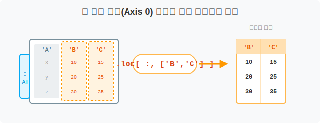
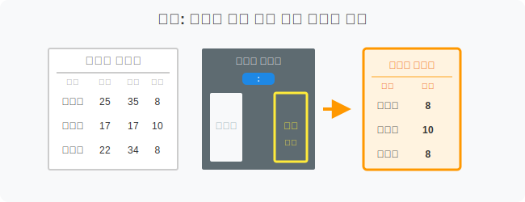
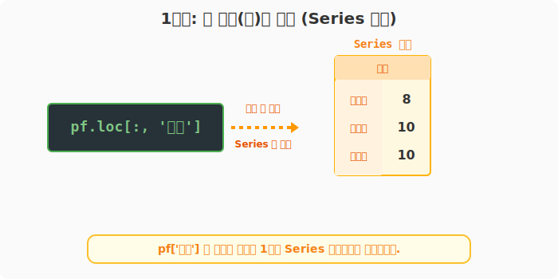
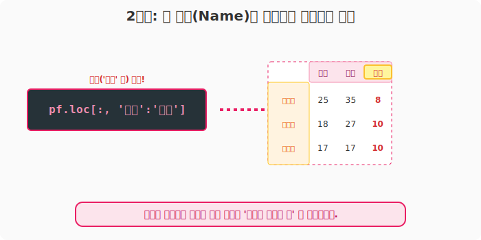
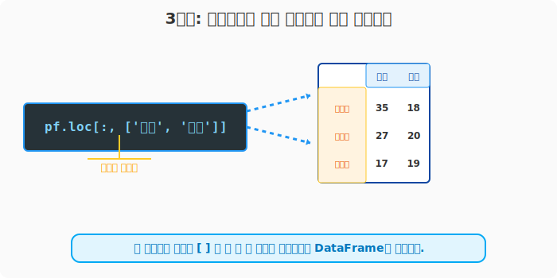

## 6.3.5 `.loc` 돋보기로 열(Column)만 쏙 뽑아보기

> 💾 **[실습 파일 다운로드]**
> 본 강의의 전체 실습 코드를 직접 실행해 볼 수 있는 주피터 노트북 파일입니다. 아래 링크를 클릭하여 다운로드 후 VS Code에서 열어보세요.
> - [📥 col_selection_loc_practice.ipynb 파일 다운로드](./col_selection_loc_practice.ipynb) (클릭 또는 마우스 우클릭 후 '다른 이름으로 링크 저장')

## 🧮 수학적 의미: 첫 번째 차원(Axis 0) 전체에 대한 무조건부 투영

앞선 6.3.1 장에서는 데이터프레임에 바로 `df['컬럼명']` 형태의 대괄호를 써서 열(Column)을 뽑아보았습니다. 하지만 판다스의 정석적인 행렬 참조 문법인 `.loc[행, 열]` 구조에서는, 앞쪽 '행(Row)' 자리에 **모든 것을 의미하는 콜론(`:`) 와일드카드**를 배치함으로써 수학적 무조건부 선택(Universal Selection, $\forall$)을 수행하고, 뒤쪽 '열(Column)' 자리에만 내가 원하는 속성 축을 명시하는 방식으로 열 벡터를 투영(Projection)합니다.



## 🏷️ 비유로 이해하기: 출석부에 구멍 뚫어서 보기

- 선생님이 학생들의 성적표를 들고 있습니다.
- 성적표의 앞부분 학생 이름('윤일형', '홍소희' 등)은 가리지 않고 전부 열어둡니다. (이것이 행 자리에 들어가는 **콜론 `:`** 의 마법입니다)
- 그리고 가로줄을 가리는 판때기를 이용해서 오직 '기말'과 '과제' 점수 칸만 뚫어서 봅니다. 그러면 전교생의 '기말', '과제' 점수만 쫙 보이게 됩니다!



---

## 🪄 [실습 0] 준비물: 성적표 데이터

```python
import pandas as pd

pf = pd.DataFrame(
    data=[
        [25, 35, 8, 18],
        [18, 27, 10, 20],
        [17, 17, 10, 19]
    ],
    index=['윤일형', '강수희', '홍소희'],
    columns=['중간', '기말', '과제', '출석']
)
print("--- 📚 원본 성적표 ---")
print(pf)
```

---

## 🪄 [실습 1] 한 과목만 쏙! (단일 열 참조)

`.loc[행, 열]` 형태에서 **콤마(`,`)** 앞의 자리는 행을 뜻합니다. 여기에 묻고 따지지 말고 싹 다 가져오라는 뜻의 **`:`** (콜론)만 달랑 하나 적어줍니다.

```python
# 행은 "전부 다(:)", 열은 "'과제'" 만!
col_single = pf.loc[:, '과제']

print("--- [1단계] 전교생 과제 점수 (Series 반환) ---")
print(col_single)
```
**[실행 결과]**
```text
--- [1단계] 전교생 과제 점수 (Series 반환) ---
윤일형     8
강수희    10
홍소희    10
Name: 과제, dtype: int64
```



> 열 하나만 뽑았기 때문에 1차원 `Series`로 붕괴합니다. 표 모양(`DataFrame`)을 유지하고 싶다면 뒤를 `pf.loc[:, ['과제']]` 처럼 대괄호를 한 겹 더 씌우면 됩니다!

---

## 🪄 [실습 2] 여기서부터 저기까지 다 가져와! (열 슬라이싱)

`.loc`의 가장 강력한 장점입니다. 행을 슬라이싱(`'강수희':'홍소희'`)했던 것처럼, 열 이름도 문자열인 채로 범위 슬라이싱이 가능합니다! 

> **🚨 주의사항:** `.loc`의 레이블 슬라이싱에서는 항상 **끝 이름표까지 포함**되어 나옵니다.

```python
# 행은 "전부 다(:)", 열은 "'중간'부터 '과제' 열까지 싹 다!"
col_sliced = pf.loc[:, '중간':'과제']

print("--- [2단계] 중간부터 과제까지 슬라이싱 ---")
print(col_sliced)
```
**[실행 결과]**
```text
--- [2단계] 중간부터 과제까지 슬라이싱 ---
     중간  기말  과제
윤일형  25  35   8
강수희  18  27  10
홍소희  17  17  10
```



---

## 🪄 [실습 3] 콕, 콕 찝어서 가져오기 (리스트 참조)

중간에 있는 과목들은 건너뛰고, 오직 '기말'과 '출석' 두 개의 열만 골라서 보고 싶을 때는 대괄호 `[ ]` 리스트로 묶어서 두 번째 인자로 넘깁니다.

```python
# 행은 "전부 다(:)", 열은 "['기말', '출석'] 만 핀셋으로 집어서!"
col_multi = pf.loc[:, ['기말', '출석']]

print("--- [3단계] 기말과 출석만 골라내기 ---")
print(col_multi)
```
**[실행 결과]**
```text
--- [3단계] 기말과 출석만 골라내기 ---
     기말  출석
윤일형  35  18
강수희  27  20
홍소희  17  19
```



> **😎 데이터 분석 실무 팁:**
> 사실 그냥 열만 추출할 거라면 처음에 배운 `pf[['기말', '출석']]` 문법이 타자 치기엔 제일 편합니다. 하지만 복잡한 빅데이터 처리 파이프라인(Pipeline)을 작성할 때는, 문법의 일관성과 혼동 방지를 위해 항상 **`.loc[행, 열]`** 패턴을 잃지 않는 코딩 스타일이 버그를 90% 이상 줄여줍니다!