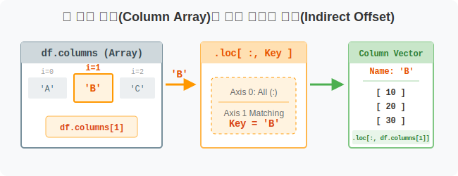
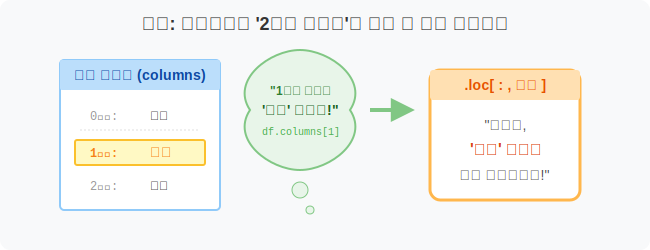
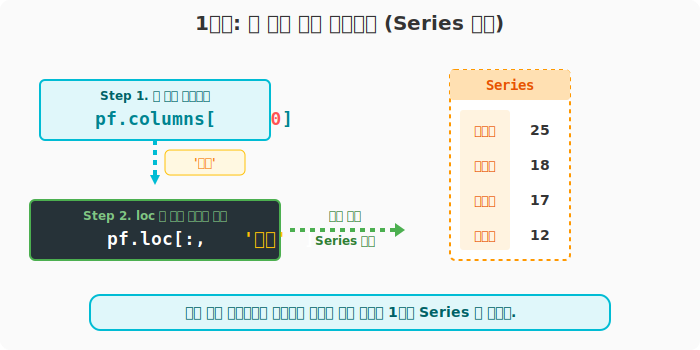
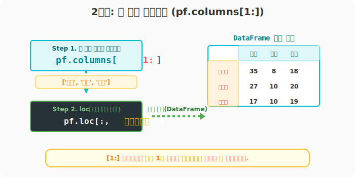
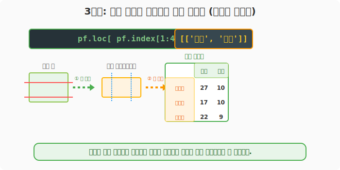

## 6.3.6 `.loc` 와 `.columns` 콤보로 순번(i) 기반 열 참조하기

> 💾 **[실습 파일 다운로드]**
> 본 강의의 전체 실습 코드를 직접 실행해 볼 수 있는 주피터 노트북 파일입니다. 아래 링크를 클릭하여 다운로드 후 VS Code에서 열어보세요.
> - [📥 col_selection_loc_i_practice.ipynb 파일 다운로드](./col_selection_loc_i_practice.ipynb) (클릭 또는 마우스 우클릭 후 '다른 이름으로 링크 저장')

## 🧮 전산학적 의미: 열 벡터 배열(Column Array)의 간접 참조

`6.3.4` 장에서 `.index` 배열을 잘라 `.loc`에 밀어 넣었듯, 두 번째 축(Axis 1)의 레이블 배열인 `.columns` 속성을 활용해 열(Column) 이름을 동적으로 추출하여 `.loc`의 두 번째 파라미터 자리에 던져주는 **간접 메모리 오프셋 참조(Indirect Offset Referencing)** 방식입니다.



## 🏷️ 비유로 이해하기: 과목 이름 대신 '2교시 과목' 부르기

- 여러분은 '중간', '기말', '과제'라는 과목명이 적혀있는 시간표(`pf.columns`)를 들고 있습니다.
- "기말고사 점수표 가져와!"(`.loc[:, '기말']`) 라고 이름을 직접 부를 수도 있지만, "우리 반 시간표에서 두 번째(인덱스 1) 과목 점수표 가져와!" 라고 우회해서 시킬 수도 있습니다.
- 컴퓨터가 "아, 시간표(`pf.columns`) 두 번째 과목이 기말고사구나. 그럼 기말고사 점수표 줍니다!" 라고 번역해서 처리해 주는 과정입니다.



---

## 🪄 [실습 0] 준비물: 성적표 데이터

```python
import pandas as pd

pf = pd.DataFrame(
    data=[
        [25, 35, 8, 18],
        [18, 27, 10, 20],
        [17, 17, 10, 19],
        [12, 22, 9, 20],
        [22, 34, 8, 16]
    ],
    index=['윤일형', '강수희', '홍소희', '유한빈', '신수빈'],
    columns=['중간', '기말', '과제', '출석']
)
```

---

## 🪄 [실습 1] 첫 번째 열(Column)만 빼오기

어떤 데이터프레임이든 상관없이 '무조건 제일 앞의 열 1개'를 뽑고 싶을 널리 쓰이는 패턴입니다. 자동화 스크립트를 짤 때 데이터의 컬럼명이 매번 바뀐다면 이 방법이 필수적입니다.

```python
# pf.columns[0] 은 '중간' 이라는 문자열을 반환합니다.
print("첫 번째 열 이름:", pf.columns[0])

# 그 문자열을 loc의 두 번째 인자(열 자리)에 던집니다.
first_col = pf.loc[:, pf.columns[0]]

print("\n--- 첫 번째 과목 점수 (Series) ---")
print(first_col)
```
**[실행 결과]**
```text
첫 번째 열 이름: 중간

--- 첫 번째 과목 점수 (Series) ---
윤일형    25
강수희    18
홍소희    17
유한빈    12
신수빈    22
Name: 중간, dtype: int64
```



> 표 형태(`DataFrame`)로 감싸서 받고 싶다면, 열 이름을 뽑아낼 때부터 리스트로 묶어(`[ pf.columns[0] ]`) 넘겨주면 됩니다!

---

## 🪄 [실습 2] 특정 범위의 열(Column) 그룹 뭉터기로 뽑기 (슬라이싱)

'두 번째 열부터 끝까지 다!' 같은 파이썬 리스트 슬라이싱 기법을 그대로 적용할 수 있습니다.

```python
# 1번 인덱스('기말') 부터 끝까지의 컬럼명 명단을 가져옵니다.
col_slice = pf.columns[1:]
print("뽑힌 컬럼 명단:", col_slice.tolist())

# 뽑힌 명단을 냅다 loc에 집어넣습니다!
df_sliced_cols = pf.loc[:, col_slice]

print("\n--- 두 번째 과목부터 끝까지의 성적 ---")
print(df_sliced_cols)
```
**[실행 결과]**
```text
뽑힌 컬럼 명단: ['기말', '과제', '출석']

--- 두 번째 과목부터 끝까지의 성적 ---
     기말  과제  출석
윤일형  35   8  18
강수희  27  10  20
홍소희  17  10  19
유한빈  22   9  20
신수빈  34   8  16
```



---

## 🪄 [실습 3] 메소드 체이닝 (행도 자르고 열도 자르고!)

앞서 `6.3.4` 장에서 배운 행 뽑기와 이어서 활용해 봅시다. 행 자리에는 `.index[1:4]` 명단을 주고, 거기서 반환된 결과에 다시 대괄호 `[['기말', '과제']]`를 열어 원하는 열만 추가로 골라낼 수 있습니다. 

```python
# 1. 1~3번 학생의 모든 성적을 뽑는다 (pf.loc[pf.index[1:4]])
# 2. 거기서 '기말'과 '과제' 열만 살린다 ([['기말', '과제']])
chain_df = pf.loc[pf.index[1:4]][['기말', '과제']]

print("--- 우회 검색 체인 액션 결과 ---")
print(chain_df)
```
**[실행 결과]**
```text
--- 우회 검색 체인 액션 결과 ---
     기말  과제
강수희  27  10
홍소희  17  10
유한빈  22   9
```



> **😎 데이터 분석 팁:**
> 사실 숫자 인덱스 번호를 가지고 다룰 거라면 이어지는 장에서 배울 **`.iloc`** 함수 하나면 모든 것이 해결됩니다. 하지만 속성(`index`, `columns`) 배열 객체를 파이썬 기본 리스트 다루듯 자유자재로 뽑아 쓸 수 있어야 진정한 판다스 고수로 거듭날 수 있습니다!