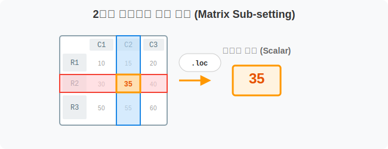
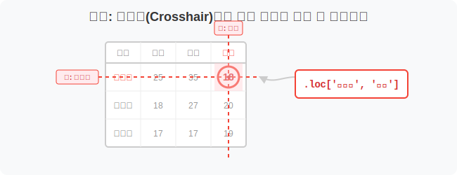
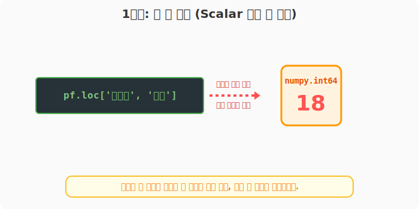
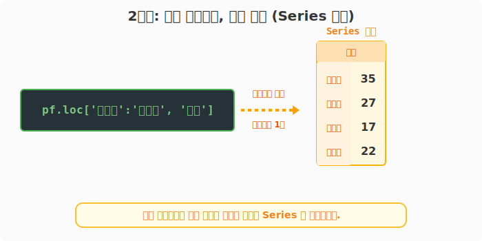
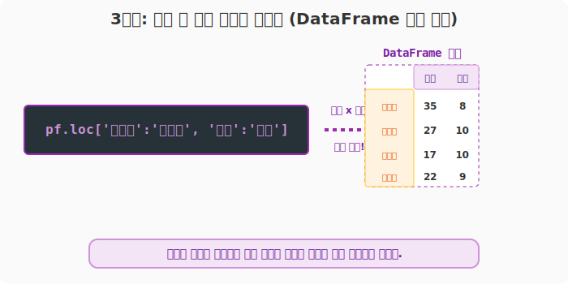
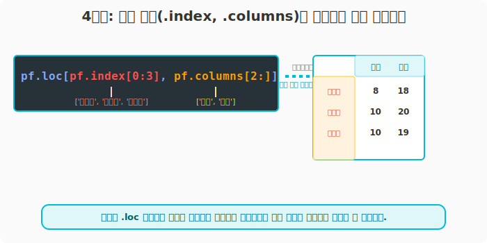

## 6.3.7 `.loc[행, 열]` 교차점 투영 (행과 열 동시 참조)

> 💾 **[실습 파일 다운로드]**
> 본 강의의 전체 실습 코드를 직접 실행해 볼 수 있는 주피터 노트북 파일입니다. 아래 링크를 클릭하여 다운로드 후 VS Code에서 열어보세요.
> - [📥 row_col_selection_practice.ipynb 파일 다운로드](./row_col_selection_practice.ipynb) (클릭 또는 마우스 우클릭 후 '다른 이름으로 링크 저장')

## 🧮 수학적/전산학적 의미: 2차원 부분집합 교차 투영 (Matrix Sub-setting)

데이터프레임을 가장 완벽하게 다루는 행렬 대수(Matrix Algebra) 방식의 참조입니다. 첫 번째 차원(Axis 0, 행 레이블)과 두 번째 차원(Axis 1, 열 레이블)의 조건을 콤마(`,`)를 기준으로 동시에 명시하여 2차원 공간상의 교차점(Intersection), 혹은 더 작은 부분 행렬(Sub-matrix)을 추출합니다.



## 🏷️ 비유로 이해하기: 십자선(Crosshair)으로 조준하기

- 영화에서 저격수가 스코프를 볼 때 가로줄과 세로줄이 교차하는 점을 조준하는 것과 똑같습니다.
- 가로줄(행)을 '윤일형'으로 긋고, 세로줄(열)을 '출석'으로 그으면 오차가 만나는 단 한 칸(Cell)의 데이터가 특정됩니다.
- 가로줄을 넓은 붓으로 '윤일형부터 유한빈까지' 칠하고, 세로줄도 '중간부터 기말까지' 칠하면 겹치는 직사각형 모양의 작은 표(DataFrame)가 오려져려 나옵니다.



---

## 🪄 [실습 1] 한 칸의 데이터(Scalar) 정확히 조준하기

VS Code나 주피터 노트북을 열고 `pandas_01.py` 파일을 생성하여 단계별로 실습을 진행합니다.

### 1단계: 가상의 학급 성적표 생성
```python
import pandas as pd

pf = pd.DataFrame(
    data=[
        [25, 35, 8, 18],
        [18, 27, 10, 20],
        [17, 17, 10, 19],
        [12, 22, 9, 20],
        [22, 34, 8, 16]
    ],
    index=['윤일형', '강수희', '홍소희', '유한빈', '신수빈'],
    columns=['중간', '기말', '과제', '출석']
)
print("--- 📚 원본 성적표 ---")
print(pf)
```

---

### 2단계: 단일 칸 조준 추출
정확히 학생 1명, 과목 1개를 지정하여 가장 깊숙한 안쪽의 단일 값을 끄집어냅니다. (이 경우 1차원 구조마저 붕괴되어 파이썬 기본 자료형인 정수나 실수가 튀어나옵니다.)

```python
# 가로 타겟: '윤일형', 세로 타겟: '출석'
target_score = pf.loc['윤일형', '출석']

print("--- [1단계] 단일 칸 조준 추출 ---")
print("윤일형 학생의 출석 점수:", target_score)
print("반환된 타입:", type(target_score))
```
**[실행 결과]**
```text
--- [1단계] 단일 칸 조준 추출 ---
윤일형 학생의 출석 점수: 18
반환된 타입: <class 'numpy.int64'>
```



---

## 🪄 [실습 2] 특정 열만 지정하고, 행은 여러 명 뽑기 (Series 반환)

작성한 코드 아래에 다음 코드를 추가합니다.

### 1단계: 행 슬라이스 + 단일 열 추출
가로 타겟을 여러 명 그룹(슬라이싱)으로 넓히고, 세로는 하나의 열에 고정시키면 세로로 긴 결과물(`Series`)이 떨어집니다.

```python
# 가로 타겟: '윤일형'부터 '유한빈'까지 (4명)
# 세로 타겟: '기말' (1과목)
col_series = pf.loc['윤일형':'유한빈', '기말']

print("--- [2단계] 행 슬라이스 + 단일 열 추출 ---")
print(col_series)
```
**[실행 결과]**
```text
--- [2단계] 행 슬라이스 + 단일 열 추출 ---
윤일형    35
강수희    27
홍소희    17
유한빈    22
Name: 기말, dtype: int64
```



---

## 🪄 [실습 3] 진정한 부분집합 행렬 뜯어내기 (DataFrame 반환)

계속해서 아래 코드를 추가합니다.

### 1단계: 작아진 형태의 부분 데이터프레임 추출
행과 열 양쪽 모두 리스트나 슬라이싱을 달아주면, 교차하는 면적 자체가 작은 표 형태가 되므로 `DataFrame`이 반환됩니다.

```python
# 가로(행) 타겟: '윤일형' 부터 '유한빈' 까지 
# 세로(열) 타겟: '기말' 부터 '과제' 까지
sub_matrix = pf.loc['윤일형':'유한빈', '기말':'과제']

print("--- [3단계] 작아진 형태의 부분 데이터프레임 ---")
print(sub_matrix)
```
**[실행 결과]**
```text
--- [3단계] 작아진 형태의 부분 데이터프레임 ---
     기말  과제
윤일형  35   8
강수희  27  10
홍소희  17  10
유한빈  22   9
```



---

## 🪄 [실습 4] 응용: 우회적인 번호 속성 배열 사용하기

새로운 실습을 위해 `pandas_02.py` 파일을 생성합니다. 성적표 데이터(`pf`) 생성 코드를 상단에 복사한 뒤 실습을 진행합니다.

### 1단계: 배열 번호를 활용한 동적 슬라이싱
`6.3.4`장과 `6.3.6`장에서 배운 오프셋 배열 참조 방식을 십자선에 대입해 응용할 수 있습니다. 이름표(문자열) 대신 `index` 나 `columns` 배열을 찢어서 넣어봅시다.

```python
# 행은 0번 학생부터 2번 학생까지! (파이썬 기본 슬라이싱이라 마지막 3번은 제외됨!) 
# 열은 2번째 과목('과제') 부터 끝까지!
dynamic_sliced = pf.loc[pf.index[0:3], pf.columns[2:]]

print("--- [4단계] 배열 번호를 활용한 동적 슬라이싱 ---")
print(dynamic_sliced)
```
**[실행 결과]**
```text
--- [4단계] 배열 번호를 활용한 동적 슬라이싱 ---
     과제  출석
윤일형   8  18
강수희  10  20
홍소희  10  19
```



> 이처럼 `.loc`는 하나의 큰 규칙 안에서, 행과 열의 추출 방식을 레고 블록처럼 마음대로 조립해 쓸 수 있는 최고의 무기입니다.