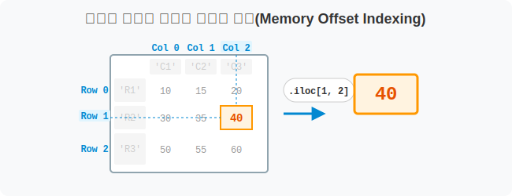
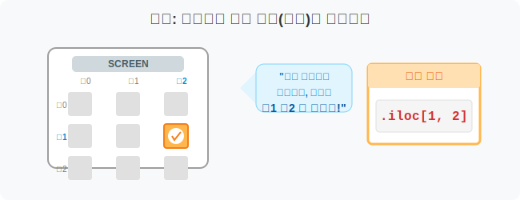
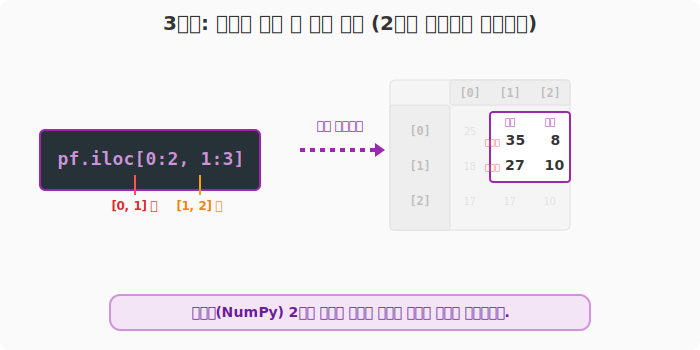

## 6.3.8 `.iloc[행, 열]` 좌표 번호(Integer Location) 기반 참조

> 💾 **[실습 파일 다운로드]**
> 본 강의의 전체 실습 코드를 직접 실행해 볼 수 있는 주피터 노트북 파일입니다. 아래 링크를 클릭하여 다운로드 후 VS Code에서 열어보세요.
> - [📥 iloc_selection_practice.ipynb 파일 다운로드](./iloc_selection_practice.ipynb) (클릭 또는 마우스 우클릭 후 '다른 이름으로 링크 저장')

## 🧮 전산학적/수학적 의미: 다차원 배열의 메모리 오프셋 참조(Memory Offset Indexing)

`.loc`가 "문자열 레이블(이름표)"라는 사람 친화적인 메타데이터를 기반으로 데이터를 투영했다면, **`.iloc` (Integer Location)** 은 내부적으로 연속 할당된 메모리의 물리적 좌표(0, 1, 2... 순서)를 사용하여 직접 접근하는 방식입니다. C언어나 기본 파이썬의 넘파이(NumPy) 2차원 배열 인덱싱과 100% 동일하게 작동합니다.



## 🏷️ 비유로 이해하기: 극장 좌석표 예매하기

- `.loc`: "예매자 이름이 '윤일형'인 사람의 티켓 주세요!" (이름 검색)
- `.iloc`: "앞에서 두 번째 줄(행1), 왼쪽에서 세 번째 칸(열2) 좌석 주세요!" (좌표 검색)
- 컴퓨터 입장에서는 '이름 검색'보다 '좌표 검색'이 훨씬 빠릅니다.



---

## 🪄 [실습 0] 준비물: 성적표 데이터

```python
import pandas as pd

pf = pd.DataFrame(
    data=[
        [25, 35, 8, 18],     # 0번 행
        [18, 27, 10, 20],    # 1번 행
        [17, 17, 10, 19]     # 2번 행
    ],
    index=['윤일형', '강수희', '홍소희'],     # 신경쓰지 마세요! iloc은 이름표를 무시합니다.
    columns=['중간', '기말', '과제', '출석'] # 여기도 신경쓰지 마세요!
)
print("--- 📚 원본 성적표 ---")
print(pf)
```

---

## 🪄 [실습 1] 행(Row)만 번호로 끄집어내기

`.iloc[행번호]` 를 입력하면 해당 위치의 줄을 뽑습니다.

```python
# 1. 1번 행 (두 번째 학생 '강수희') 참조
row_idx1 = pf.iloc[1]

# 2. 1번과 2번 행 뭉터기로 참조 (리스트로 묶기)
multi_rows = pf.iloc[[1, 2]]

print("--- [1] 인덱스 1번 행 (Series) ---")
print(row_idx1)

print("\n--- [2] 인덱스 1, 2번 행 (DataFrame) ---")
print(multi_rows)
```
**[실행 결과]**
```text
--- [1] 인덱스 1번 행 (Series) ---
중간    18
기말    27
과제    10
출석    20
Name: 강수희, dtype: int64

--- [2] 인덱스 1, 2번 행 (DataFrame) ---
     중간  기말  과제  출석
강수희  18  27  10  20
홍소희  17  17  10  19
```

![.iloc[] 을 이용한 단일, 다중 행 추출](./img/iloc_row.svg)

---

## 🪄 [실습 2] 열(Column)만 번호로 끄집어내기

행 자리를 와일드카드 콜론(`:`)으로 채우고, 콤마(`,`) 뒤 열 자리에 번호를 넣습니다. 넘파이 행렬 슬라이싱과 동일합니다.

```python
# 모든 행(:) 가져오고, 열은 2번 인덱스('과제')만 가져오기
col_idx2 = pf.iloc[:, 2]

# 모든 행(:) 가져오고, 열은 1번('기말')부터 끝까지 슬라이싱!
sliced_cols = pf.iloc[:, 1:]

print("--- [1] 인덱스 2번 열 (과제) ---")
print(col_idx2)

print("\n--- [2] 1번 열부터 끝까지 슬라이싱 ---")
print(sliced_cols)
```
**[실행 결과]**
```text
--- [1] 인덱스 2번 열 (과제) ---
윤일형     8
강수희    10
홍소희    10
Name: 과제, dtype: int64

--- [2] 1번 열부터 끝까지 슬라이싱 ---
     기말  과제  출석
윤일형  35   8  18
강수희  27  10  20
홍소희  17  10  19
```

![.iloc[] 열 슬라이싱 시 끝점 포함 여부 주의](./img/iloc_col.svg)

> **🚨 치명적인 주의사항:**
> `.loc['A':'C']` 에서는 문자열 'C' 지점까지 **포함**되어 슬라이싱 되었습니다. 하지만 **`.iloc[1:3]` 은 파이썬 기본 슬라이싱이므로 마지막 번호 인덱스인 3번은 제외(미만)됩니다!!** (오직 인덱스 1, 2만 반환됩니다)

---

## 🪄 [실습 3] 십자선 교차 (행과 열 번호 동시 사용)

가장 정교한 2차원 부분집합 추출입니다. 행렬의 $[i, j]$ 좌표를 찍는 것과 같습니다.

```python
# 1번 행, 1번 열의 단일 데이터 (값 1개만 나옴)
scalar_val = pf.iloc[1, 1]

# 0번부터 2번 전(1번)까지 행 자르고,
# 1번부터 3번 전(2번)까지 열 자르기
sub_matrix = pf.iloc[0:2, 1:3]

print("--- [1] (1, 1) 단일 원소 ---")
print(scalar_val)

print("\n--- [2] 2차원 부분 데이터프레임 ---")
print(sub_matrix)
```
**[실행 결과]**
```text
--- [1] (1, 1) 단일 원소 ---
27

--- [2] 2차원 부분 데이터프레임 ---
     기말  과제
윤일형  35   8
강수희  27  10
```



---

## 🪄 [실습 4] 진정한 빛의 속도: `.at[]` 과 `.iat[]`

빅데이터를 분석하다 보면, 어떤 루프문을 돌면서 데이터프레임에서 오직 한 칸의 데이터(Scalar 단일값)만 수백만 번 조회해야 할 때가 있습니다.
이때 커다란 장갑인(`.loc` 나 `.iloc`)을 쓰기보다는, 오직 핀셋 전용으로 만들어진 초고속 탐색기 **`.at` (이름 기반 핀셋)** 과 **`.iat` (좌표 기반 핀셋)** 을 사용하면 속도가 기하급수적으로 빨라집니다.

```python
# 이름으로 한 칸 찾기 (loc의 초고속 버전)
fast_label = pf.at['강수희', '과제']

# 번호로 한 칸 찾기 (iloc의 초고속 버전)
fast_index = pf.iat[1, 2]

print("강수희 과제 점수 (.at) :", fast_label)
print("1행 2열 과제 점수 (.iat) :", fast_index)
```
> **용도 요약:** 부분 행렬(표)을 전체적으로 뜯어낼 때는 `.loc/.iloc`. 무리 중에서 단 하나의 숫자만 정확하게 빼오거나 값을 바꿀 때는 `.at/.iat`를 습관화합시다.