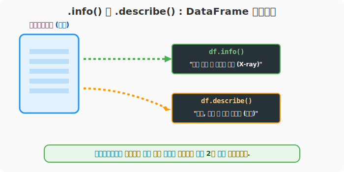
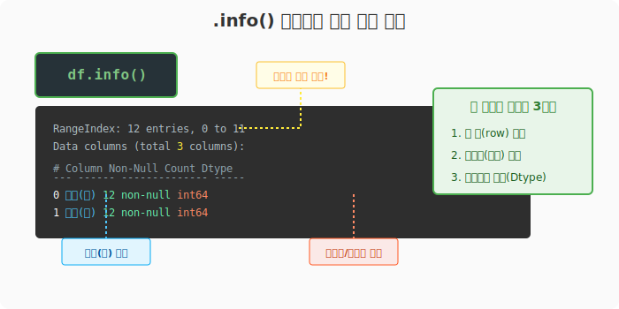
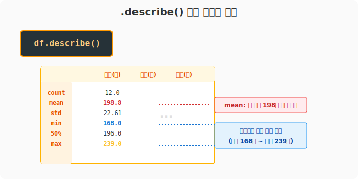
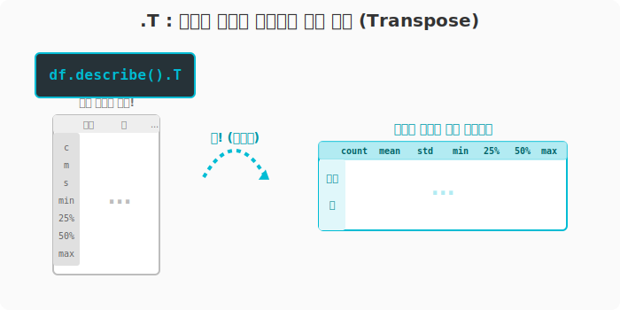

## 6.4.1 새로운 데이터와 마주했을 때: 기초 정보스캔하기

**[전산학적/수학적 의미: 메타데이터 추출 및 기술 통계량 연산]**
대규모 행렬(데이터프레임)을 메모리에 적재한 직후 분석의 방향을 설정하기 위해 필수적으로 수행하는 단계입니다. 데이터의 구조적 메타데이터(차원수, 데이터 타입, 결측치 여부)를 파악하고, 각 열(Vector)에 대한 1차 기술 통계(Descriptive Statistics - 평균, 분산, 사분위수 등)를 빠르게 연산하여 데이터의 분포와 품질을 1차적으로 검증합니다.

**[비유로 이해하기: 환자의 기초 건강검진 리포트]**
- 의사가 새로운 환자(CSV 데이터)를 만나면 무작정 메스를 대지 않습니다.
- 가장 먼저 키와 몸무게 모양새(`shape`)를 재고, 엑스레이를 찍어 뼈대와 결손 여부를 확인(`info()`)합니다.
- 마지막으로 혈압, 혈당 등의 최고/최저 수치 등 평균 생체 데이터(`describe()`)를 뽑아보고 나서야 본격적인 진단(데이터 분석)을 시작합니다!



---

### [준비물] 외부 서울시 교통사고 데이터 불러오기

실전 분석을 위해 서울시 월별 교통사고 현황이 담긴 외부 CSV 파일을 불러옵니다. `index_col=0` 옵션을 주어 0번째 열(A열, '연월')을 좌측 시간 인덱스로 곧바로 사용하도록 지시합니다. (파일 입출력의 자세한 원리는 이어지는 6.5장에서 다룹니다.)

```python
import pandas as pd

# CSV 파일 읽기 (인코딩을 한국어 설정인 euc-kr로 맞춤)
df = pd.read_csv('data/2016-01-2016-12_Seoul_Accident.csv', encoding='euc-kr', index_col=0)

# 처음 5줄만 가볍게 살펴보기 (head)
print("--- 🔬 처음 5줄 미리보기 ---")
print(df.head())
```
**[출력 결과]**
```text
--- 🔬 처음 5줄 미리보기 ---
         사고(건)  사망(명)  부상(명)
연월
2016년1월      192      5    387
2016년2월      174      6    328
2016년3월      217      7    435
2016년4월      216      7    419
2016년5월      239     13    522
```

---

### [1단계] 가장 중요한 엑스레이 촬영: `.info()`

데이터를 불러온 즉시 가장 먼저 실행해야 하는 핵심 메서드입니다. 데이터 프레임의 크기, 컬럼명, 변수 타입, 그리고 **결측치(빈 공간)의 유무**를 단번에 알려줍니다.

```python
print("--- 🩺 데이터 구조 엑스레이 촬영 ---")
df.info()
```
**[출력 결과]**
```text
<class 'pandas.core.frame.DataFrame'>
Index: 12 entries, 2016년1월 to 2016년12월
Data columns (total 3 columns):
 #   Column  Non-Null Count  Dtype
---  ------  --------------  -----
 0   사고(건)   12 non-null     int64
 1   사망(명)   12 non-null     int64
 2   부상(명)   12 non-null     int64
dtypes: int64(3)
memory usage: 384.0+ bytes
```



> **👨‍⚕️ 의사(데이터 분석가)의 진단 소견:**
> - 데이터는 총 12건(12 entries)으로 1년 치 월별 데이터입니다.
> - 열은 3개('사고(건)', '사망', '부상')입니다.
> - 세 컬럼 모두 결측치 없이 12개가 꽉 차 있습니다. (`12 non-null`)
> - 숫자들은 모두 정수형(`int64`)이므로 덧셈/뺄셈 통계 분석이 곧바로 가능합니다. (만약 `object`로 찍히면 숫자가 아닌 문자열이라는 뜻이므로 변환이 필요합니다!)

*(참고) 각 열의 자료형만 따로 보고 싶다면 `df.dtypes` 속성을 참조하면 됩니다.*

---

### [2단계] 데이터의 대략적인 크기와 수치 요약: `.describe()`

데이터가 전부 숫자(정수나 실수)인 것을 확인했다면, `.describe()`를 호출해 기초 통계량을 뽑습니다. 데이터의 분포를 대략적으로 짐작할 수 있습니다.

```python
print("--- 📊 기초 통계량 요약 리포트 ---")
summary = df.describe()
print(summary)
```
**[출력 결과]**
```text
--- 📊 기초 통계량 요약 리포트 ---
            사고(건)      사망(명)       부상(명)
count   12.000000  12.000000   12.000000
mean   198.833333   8.000000  407.833333
std     22.610671   2.954196   61.545827
min    168.000000   4.000000  328.000000
25%    182.000000   5.750000  363.500000
50%    196.000000   7.000000  402.500000
75%    216.250000  10.500000  441.250000
max    239.000000  13.000000  522.000000
```



> **👨‍⚕️ 수치 해석 소견:**
> - `mean` (평균): 한 달 평균 198건의 사고가 나고, 8명이 안타깝게 사망합니다.
> - `min` / `max`: 사고가 제일 적었던 달은 168건, 가장 많았던 달은 239건입니다.

---

### [3단계] 꿀팁: 행과 열 거꾸로 돌려보기 (Transpose)

칼럼이 너무 많을 경우 `.describe()` 등 통계표를 출력하면 옆이 다 잘려서 나오거나 보기가 어렵습니다. 이때는 속성 **`.T`** (Transpose)를 호출하여 **행과 열을 뒤집어서(전치)** 조회하면 구조가 훨씬 한눈에 들어옵니다.

```python
print("--- 🔄 피벗 스윙! 행과 열 뒤집기 ---")
# describe() 의 결과를 뒤집어서 보기 쉽게 바꿉니다.
print(df.describe().T)
```
**[출력 결과]**
```text
--- 🔄 피벗 스윙! 행과 열 뒤집기 ---
         count        mean        std    min     25%    50%     75%    max
사고(건)   12.0  198.833333  22.610671  168.0  182.00  196.0  216.25  239.0
사망(명)   12.0    8.000000   2.954196    4.0    5.75    7.0   10.50   13.0
부상(명)   12.0  407.833333  61.545827  328.0  363.50  402.5  441.25  522.0
```



> 모니터는 세로보다 가로로 넓기 때문에 열의 수가 많을 때는 `.T`를 무조건 붙이는 것이 가독성에 좋습니다!