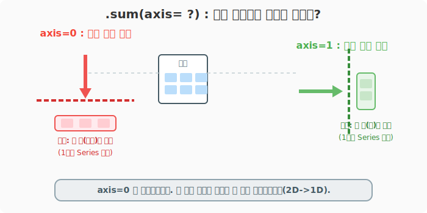
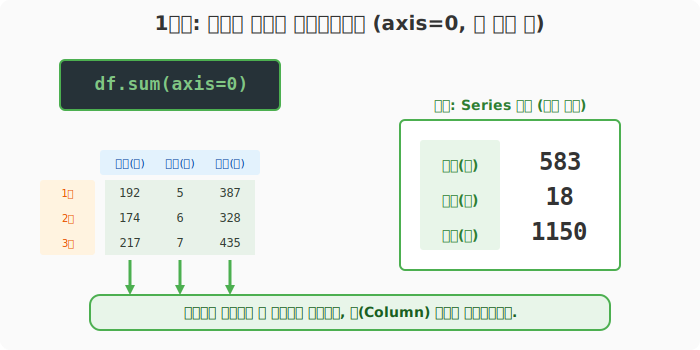
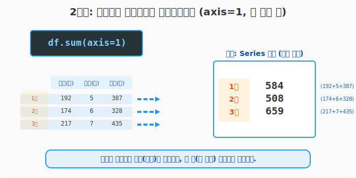
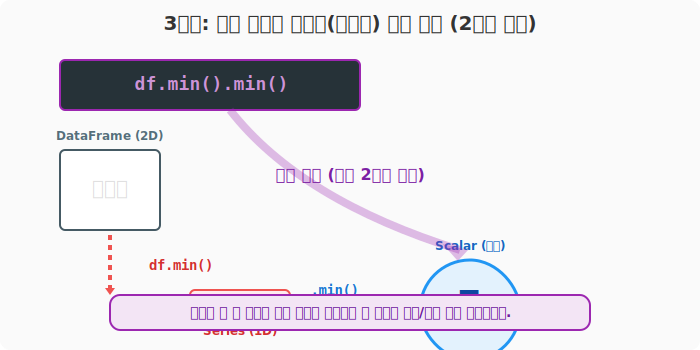

## 6.4.2 `axis` 축을 활용한 행렬 연산과 통계 추출

**[수학적 의미: 다차원 텐서(Tensor)의 축소(Reduction) 연산]**
행렬(데이터프레임) 단위로 통계 함수(`sum`, `mean`, `max` 등)를 적용할 때, 어느 차원(Dimension/Axis)을 기준으로 연산을 진행할지 결정해야 합니다. `axis=0`은 행 차원을 압축하여 열만 남기고, `axis=1`은 열 차원을 압축하여 행만 남기는 **차원 축소(Dimensionality Reduction) 연산**입니다. 연산이 완료되면 2차원 DataFrame은 1차원 Series로 찌그러집니다.

**[비유로 이해하기: 엑셀에서 가로 합계 낼래? 세로 합계 낼래?]**
- 학생 성적표가 있습니다.
- `axis=0` (수직 압축기): 위에서 아래로 꽉 눌러 찌그러트립니다. 그러면 과목별(`열`) 총점만 달랑 하나 남습니다. (예: 반 전체 국어 평균은?)
- `axis=1` (수평 압축기): 왼쪽에서 오른쪽으로 꽉 눌러 찌그러트립니다. 그러면 각 학생별(`행`) 총점만 달랑 하나 남습니다. (예: 홍길동 학생의 전 과목 총점은?)



---

### [준비물] 서울시 교통사고 데이터

```python
import pandas as pd

# CSV에서 데이터 읽어오기 (앞쪽 3개월치 일부분만 잘라서 실습합니다)
df = pd.read_csv('data/2016-01-2016-12_Seoul_Accident.csv', encoding='euc-kr', index_col=0).head(3)

print("--- 📚 1~3월 교통사고 데이터 ---")
print(df)
```
**[출력 결과]**
```text
--- 📚 1~3월 교통사고 데이터 ---
         사고(건)  사망(명)  부상(명)
연월
2016년1월      192      5    387
2016년2월      174      6    328
2016년3월      217      7    435
```

---

### [1단계] 위에서 아래로 누르기! (`axis=0`)

가장 기본이 되는 축 연산입니다. 세로 방향으로 누르기 때문에 결과적으로 각 **"항목(열, Column)별 합계"** 가 나옵니다. 파이썬과 넘파이(NumPy) 철학에 따라, 옵션을 아예 생략하면 기본값으로 무조건 `axis=0`이 작동합니다.

```python
# 세로로 찌그러트려서 항목별 합계 구하기
total_by_col = df.sum(axis=0)  # df.sum() 과 완벽히 동일!

print("--- 📉 항목별 총합 (axis=0) ---")
print(total_by_col)
```
**[출력 결과]**
```text
--- 📉 항목별 총합 (axis=0) ---
사고(건)     583
사망(명)      18
부상(명)    1150
dtype: int64
```



> 표 전체 모양이 박살나며, 결과만 담긴 1가닥짜리 줄(`Series`)로 변한 것을 꼭 관찰하세요!

---

### [2단계] 왼쪽에서 오른쪽으로 누르기! (`axis=1`)

행 별(월 별) 합계를 구하고 싶을 때 씁니다. 오른쪽 방향으로 쫘악 밀어서 눌러버리기 때문에 결과적으로 각 **"월별(행, Row) 합계"** 가 나옵니다.

```python
# 가로로 찌그러트려서 각 월별 합계 구하기
total_by_row = df.sum(axis=1)

print("--- 📈 월별 전체 숫자 합계 (axis=1) ---")
print(total_by_row)
```
**[출력 결과]**
```text
--- 📈 월별 전체 숫자 합계 (axis=1) ---
연월
2016년1월    584   (192 + 5 + 387)
2016년2월    508   (174 + 6 + 328)
2016년3월    659   (217 + 7 + 435)
dtype: int64
```



> 교통사고 분석에서 건수 단위와 명수 단위를 더하는 것은 논리적으로 큰 의미가 없지만, 연산의 작동 원리를 파악하는 데는 확실합니다.

---

### [3단계] 다양한 통계 함수들 찍어 먹기 (`mean`, `max`, `min`)

합계(`sum`) 외에도 평균, 최대, 최소 등 다양한 통계 기능을 똑같은 축(`axis`) 방식으로 뽑아낼 수 있습니다.

```python
# 1) 컬럼별 편균치 (기본값 설정됨, axis=0)
print("--- [1] 항목별 평균 ---")
print(df.mean())

# 2) 각 월별 최고로 높았던 수치 (가로 압축, axis=1)
print("\n--- [2] 월별 최고치 ---")
print(df.max(axis=1))

# 3) 전체 표 통틀어서 제일 작은 숫자 1개 찾기 (2연속 압축)
# (단일 스칼라 값이 튀어나옵니다)
print("\n--- [3] 전국(데이터) 최소 수치 ---")
print(df.min().min()) 
```
**[출력 결과]**
```text
--- [1] 항목별 평균 ---
사고(건)    194.333333
사망(명)      6.000000
부상(명)    383.333333
dtype: float64

--- [2] 월별 최고치 ---
연월
2016년1월    387
2016년2월    328
2016년3월    435
dtype: int64

--- [3] 전국(데이터) 최소 수치 ---
5
```



> **📌 심화 통계 함수: 누적합 `cumsum()`**
> `df.cumsum(axis=0)`을 쓰면 그 달까지의 누계액(누적합)이 찍힌 전체 데이터프레임이 튀어나옵니다. 주식의 누적 수익률이나 국가 예산 집행률을 시각화할 때 최강의 파괴력을 자랑합니다!