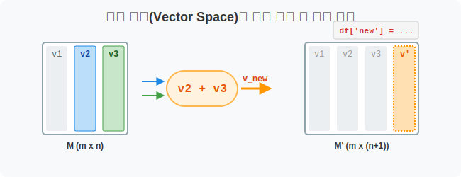
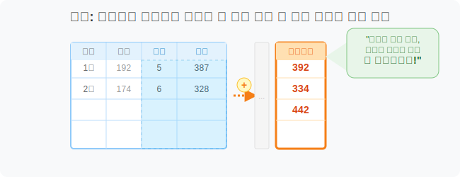
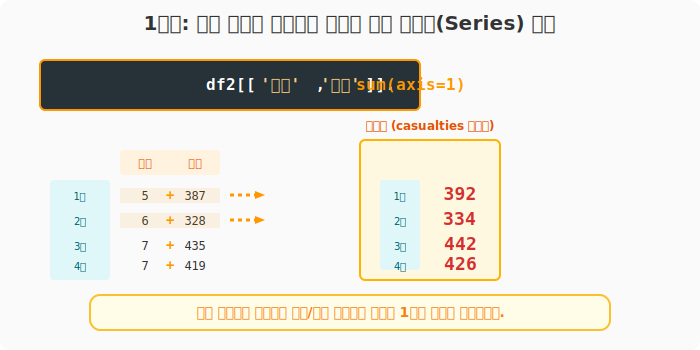
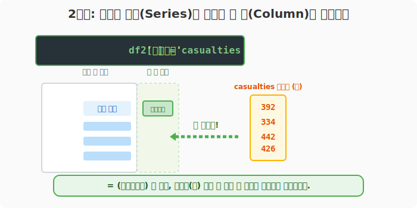
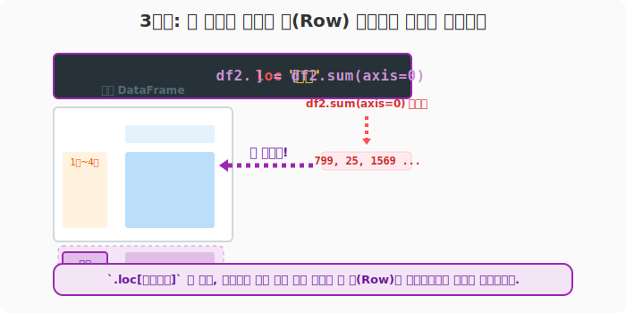

## 6.4.3 연산 결과를 새로운 공간에 할당(Assign)하기

> 💾 **[실습 파일 다운로드]**
> 본 강의의 전체 실습 코드를 직접 실행해 볼 수 있는 주피터 노트북 파일입니다. 아래 링크를 클릭하여 다운로드 후 VS Code에서 열어보세요.
> - [📥 df_modify_assign_practice.ipynb 파일 다운로드](./df_modify_assign_practice.ipynb) (클릭 또는 마우스 우클릭 후 '다른 이름으로 링크 저장')

## 🧮 전산학적/수학적 의미: 열 공간(Column Space) 및 차원의 확장

기존 데이터프레임 매트릭스에 존재하는 열 벡터(Column Vectors)들을 선형 결합(Linear Combination) 등의 수식으로 연산한 뒤, 그 결과로 생성된 새로운 벡터를 매트릭스의 새로운 축(새로운 칼럼이나 새로운 행)으로 연결(Concatenate)하여 구조를 확장하는 과정입니다.



## 🏷️ 비유로 이해하기: 엑셀에서 '총합' 컬럼 직접 만들기

- 엑셀에서 여러 셀의 값을 드래그해서 더한 뒤, 가장 오른쪽 빈 줄에 `=SUM(A1:B1)` 라고 적고 주욱 내리면 '총합' 열이 새로 생깁니다.
- 마찬가지로 판다스에서도 수식을 구하고, 가장 빈 오른쪽 서랍장에 '재해자수'라는 새 이름표만 붙여서 데이터를 털어 넣으면 완벽하게 파생 데이터가 확장됩니다.



---

## 🪄 [실습 1] 서울시 교통사고 원본 데이터 준비

VS Code나 주피터 노트북을 열고 `pandas_01.py` 파일을 생성하여 단계별로 실습을 진행합니다.

### 1단계: 원본 데이터 복사
파이썬 환경설정이나 연산 중 원본 데이터가 손상되지 않도록, 데이터 변형 작업을 할 때는 `.copy()` 함수를 사용하여 복사본을 뜨는 것이 안전한 코딩 습관입니다.

```python
import pandas as pd

# 원본 CSV 데이터 읽기
df_raw = pd.read_csv('data/2016-01-2016-12_Seoul_Accident.csv', encoding='euc-kr', index_col=0).head(4)

# 원본 데이터 훼손을 막기 위해 복사본(df2) 생성!
df2 = df_raw.copy()

print("--- 📚 원본 표(앞 4줄) ---")
print(df2)
```
**[출력 결과]**
```text
         사고(건)  사망(명)  부상(명)
연월
2016년1월      192      5    387
2016년2월      174      6    328
2016년3월      217      7    435
2016년4월      216      7    419
```

---

## 🪄 [실습 2] 조합 연산 결과 얻기 (사망자 + 부상자)

작성한 코드 아래에 다음 코드를 추가합니다.

### 1단계: 부분 열의 가로 압축
단순히 전체 '사망자'만 더하는 것이 아니라, "특정 달의 (사망자 + 부상자)를 더한 '재해자 수'"를 파악하고 싶습니다. 앞서 배운 열 분리와 가로 압축(`axis=1`)을 체이닝합니다.

```python
# 1) 사망과 부상 열만 뜯어내기 -> 2) 가로로 뭉개버리기 (axis=1)
casualties = df2[['사망(명)', '부상(명)']].sum(axis=1)

print("--- [1단계] 사망 + 부상 가로 합계 ---")
print(casualties)
```
**[출력 결과]**
```text
연월
2016년1월    392
2016년2월    334
2016년3월    442
2016년4월    426
dtype: int64
```



> *(참고)* 넘파이 배열과 다르게, 똑같은 위치를 숫자로 찾고 싶다면 `df2.iloc[:, 1:].sum(axis=1)` 형태로 써도 완벽히 위 결과와 똑같이 동작합니다.

---

## 🪄 [실습 3] 새로운 파생 열(Column)으로 할당(대입)하기

계속해서 동일한 파일에 아래 코드를 추가합니다.

### 1단계: 파생 열 개설 및 데이터 삽입
위에서 힘들게 뽑아낸 결과를 기존 `df2` 데이터프레임의 가장 우측 빈 공간에 스마일 라벨을 붙여 끼워 넣으려 합니다. 놀랍게도 새 이름을 바로 대괄호 안에 쓰고 `=` 연산자로 넣어주면 그대로 빈방이 개설되며 데이터가 들어갑니다.

```python
# '재해자수'라는 이름의 파생 열 새로 만들기 = 할당!
df2['재해자수'] = casualties

print("--- [2단계] 새로운 열(재해자수)이 추가된 데이터프레임 ---")
print(df2)
```
**[출력 결과]**
```text
         사고(건)  사망(명)  부상(명)  재해자수
연월
2016년1월      192      5    387   392
2016년2월      174      6    328   334
2016년3월      217      7    435   442
2016년4월      216      7    419   426
```



---

## 🪄 [실습 4] 맨 밑바닥에 '총계' 행(Row) 추가하기

마지막으로 아래 코드를 추가합니다.

### 1단계: 새로운 행(Row) 동시 개척 및 할당
행(Column)을 추가했으면, 이번엔 데이터프레임 맨 아래에 전 과목 통틀어서 1월~4월까지 합친 '총계' 행(Row)을 추가해 봅시다. 
**이전 챕터에서 배운 `.loc`**가 이때 사용됩니다! 그냥 없는 이름을 부른 뒤 `=`로 할당해버리는 것입니다.

```python
# 1) 싹 다 세로로 눌러서 총합 계산 (df2.sum(axis=0))
# 2) '총계' 라는 행 레이블명(이름표)을 새로 만들어서 거기에 삽입!
df2.loc['총계'] = df2.sum(axis=0)

print("--- [3단계] '총계' 행이 추가된 완벽한 데이터프레임 ---")
print(df2)
```
**[출력 결과]**
```text
         사고(건)  사망(명)  부상(명)  재해자수
연월
2016년1월      192      5    387   392
2016년2월      174      6    328   334
2016년3월      217      7    435   442
2016년4월      216      7    419   426
총계         799     25   1569  1594  <-- 세로 합계가 추가되었습니다!
```



> **😎 판다스 꿀팁: `.assign()` 메서드**
> 파이썬 실무 개발에서는 원본 `df2`를 망가트리지 않기 위해:
> `df3 = df2.assign(재해자수 = df2['사망(명)'] + df2['부상(명)'])` 
> 형태로 할당 함수를 많이 씁니다. (결과는 똑같지만 코드가 훨씬 안전해집니다!)