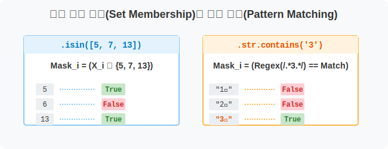
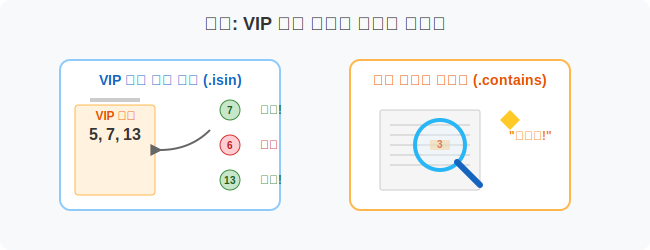
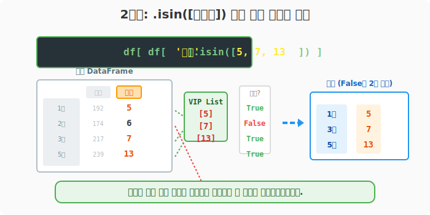
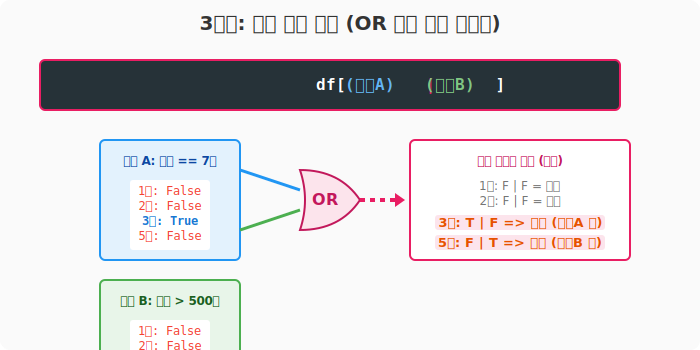
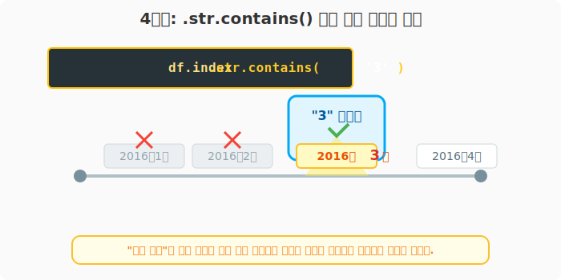

## 6.4.4 고급 논리 검색 기법 (`isin`, `str.contains`)

> 💾 **[실습 파일 다운로드]**
> 본 강의의 전체 실습 코드를 직접 실행해 볼 수 있는 주피터 노트북 파일입니다. 아래 링크를 클릭하여 다운로드 후 VS Code에서 열어보세요.
> - [📥 df_conditional_search_practice.ipynb 파일 다운로드](./df_conditional_search_practice.ipynb) (클릭 또는 마우스 우클릭 후 '다른 이름으로 링크 저장')

## 🧮 전산학적/수학적 의미: 집합 귀속 여부($\in$)와 패턴 매칭(Pattern Matching)

단순한 부등호 비교(`>`, `<`)를 넘어, 특정 속성의 값이 미리 정의된 데이터 집합(Set)의 원소로 포함되는지 검사하거나, 문자열(String) 데이터 스트림 내부에 특정 하위 패턴(Sub-pattern) 형태가 존재하는지 정규표현식(Regex) 기반으로 검사하여 불리언 마스크(Boolean Mask)를 생성하는 고급 추출 기법입니다.



## 🏷️ 비유로 이해하기: VIP 게스트 명단과 키워드 스캐너

- **`.isin([명단])` (VIP 명단 체크):** 클럽 문지기가 들어오는 사람 이름이 A, B, C 세 명으로 적힌 'VIP 리스트'에 있는지 없는지 단번에 대조하여 입장시킵니다. (여러 개의 `==` 와 `|` 연산을 한 번에 묶은 효과입니다.)
- **`.str.contains('단어')` (키워드 스캐닝):** 수백 페이지짜리 문서 더미에서 "사고"라는 단어가 스치기만 해도 그 문서를 전부 뽑아옵니다.



---

## 🪄 [실습 1] 서울시 교통사고 원본 데이터 준비

VS Code나 주피터 노트북을 열고 `pandas_01.py` 파일을 생성하여 단계별로 실습을 진행합니다.

### 1단계: 원본 데이터 불러오기
```python
import pandas as pd

df = pd.read_csv('data/2016-01-2016-12_Seoul_Accident.csv', encoding='euc-kr', index_col=0).head(5)

print("--- 📚 원본 표(앞 5줄) ---")
print(df)
```
**[출력 결과]**
```text
         사고(건)  사망(명)  부상(명)
연월
2016년1월      192      5    387
2016년2월      174      6    328
2016년3월      217      7    435
2016년4월      216      7    419
2016년5월      239     13    522
```

---

## 🪄 [실습 2] 복습: 단일 논리 연산과 필터링

작성한 코드 아래에 다음 코드를 추가합니다.

### 1단계: 부등호를 이용한 불리언 마스크 필터링
앞차시에서 배운 기초 불리언 인덱싱(Boolean Indexing)입니다. 부등호를 사용하면 `True/False` 답안지(Mask)가 만들어지고, 이를 대괄호 `[]` 안에 넣으면 필터링이 되었습니다.

```python
# 1. 부상자가 400명 이상인가? (True/False 시리즈 반환)
mask = df['부상(명)'] >= 400

# 2. 이 마스크를 던져주어 True인 행만 필터링!
df_filtered = df[mask]

print("--- [1단계] 부상자 400명 이상 검색 결과 ---")
print(df_filtered)
```
**[출력 결과]**
```text
         사고(건)  사망(명)  부상(명)
연월
2016년3월      217      7    435
2016년4월      216      7    419
2016년5월      239     13    522
```

---

## 🪄 [실습 3] `.isin(리스트)`: "이 명단에 있는 사람 다 나와!"

계속해서 아래 코드를 추가합니다.

### 1단계: isin()을 활용한 다중 타겟 검색
"사망자가 정확히 5명이거나, 7명이거나, 13명인 달을 뽑아라" 라고 할 때, `(df['사망'] == 5) | (df['사망'] == 7) | ...` 처럼 쓰면 코드가 너무 끔찍해집니다. 이때 찾을 값들을 파이썬 리스트로 묶어 `.isin()` 한 방에 던져줍니다.

```python
# 사망자가 정확히 [5, 7, 13] 명 중 하나에 해당하는 행 검색
targets = [5, 7, 13]
df_vip = df[ df['사망(명)'].isin(targets) ]

print("--- [2단계] isin()으로 정확한 타겟값들 한 번에 검색 ---")
print(df_vip)
```
**[출력 결과]**
```text
         사고(건)  사망(명)  부상(명)
연월
2016년1월      192      5    387
2016년3월      217      7    435
2016년4월      216      7    419
2016년5월      239     13    522
```



> 검색 목록에 없었던 2월(사망 6명) 데이터만 정확하게 쏙 빠진 것을 볼 수 있습니다.

---

## 🪄 [실습 4] 혼합 다중 검색 (AND, OR)

계속해서 동일한 파일에 아래 코드를 추가합니다.

### 1단계: OR(|) 연산자를 활용한 복합 검색
`.isin()` 검색도 다른 조건과 `&` (AND) 또는 `|` (OR) 연산자로 결합할 수 있습니다. 괄호 `()` 치는 것을 절대 잊지 마세요!

```python
# 사망자가 7명이거나(또는) 부상자가 500명을 초과하는 달 검색
# (2016년5월은 사망이 13명으로 7명은 아니지만 부상이 500초과이므로 OR 조건 통과!)
complex_search = df[ (df['사망(명)'].isin([7])) | (df['부상(명)'] > 500) ]

print("--- [3단계] 혼합 OR 다중 검색 결과 ---")
print(complex_search)
```
**[출력 결과]**
```text
         사고(건)  사망(명)  부상(명)
연월
2016년3월      217      7    435
2016년4월      216      7    419
2016년5월      239     13    522
```



---

## 🪄 [실습 5] `.str.contains('문자')`: 문자열 속에 숨은 글자 찾기

새로운 실습을 위해 `pandas_02.py` 파일을 생성합니다. 성적표 데이터(`df`) 생성 코드를 상단에 복사한 뒤 실습을 진행합니다.

### 1단계: 문자열 패턴 검색
숫자가 아닌 글자 데이터를 다룰 때 가장 많이 쓰는 함수입니다. 지금 데이터프레임의 인덱스 이름들은 `'2016년1월'` 같은 문자열(String) 객체입니다. "어디든 좋으니까 '3' 이라는 한 글자라도 들어있으면 찾아와!" 가 가능해집니다.

```python
# 인덱스(df.index)가 문자열(.str) 구조일 때, 문자열 내부에 '3'을 포함(.contains)하는가?
contains_3 = df[ df.index.str.contains('3') ]

print("--- [4단계] '3'이 포함된 문자열(계절) 찾기 ---")
print(contains_3)
```
**[출력 결과]**
```text
         사고(건)  사망(명)  부상(명)
연월
2016년3월      217      7    435
```



> **현업용 지식:** `str.contains` 안에는 강력한 **정규표현식(Regular Expression)** 패턴도 곧바로 들어갈 수 있습니다. 전화번호 형식이나 이메일 형식만 찾아내는 등 데이터 전처리(Pre-processing) 과정의 핵심 마법이 됩니다.