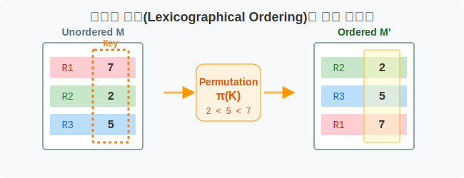
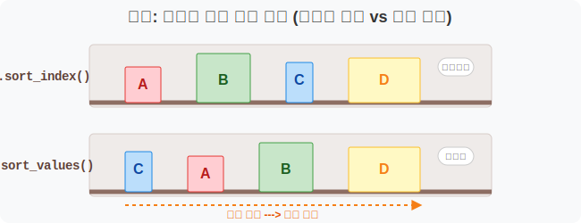
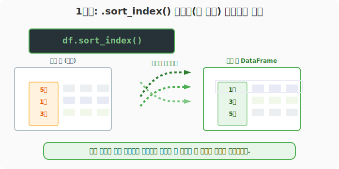
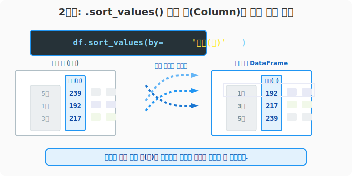
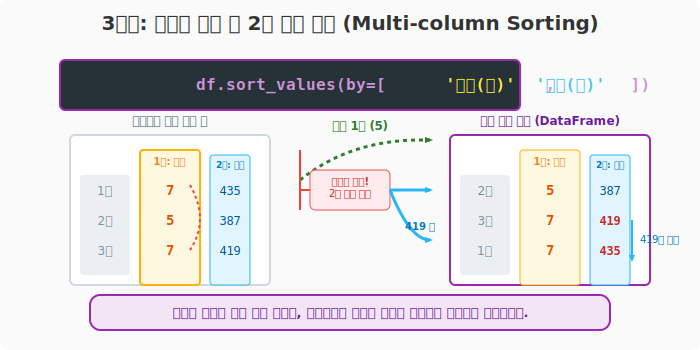

## 6.4.5 `.sort_index`와 `.sort_values` (쌍끌이 정렬 기법)

> 💾 **[실습 파일 다운로드]**
> 본 강의의 전체 실습 코드를 직접 실행해 볼 수 있는 주피터 노트북 파일입니다. 아래 링크를 클릭하여 다운로드 후 VS Code에서 열어보세요.
> - [📥 df_sorting_practice.ipynb 파일 다운로드](./df_sorting_practice.ipynb) (클릭 또는 마우스 우클릭 후 '다른 이름으로 링크 저장')

## 🧮 전산학적/수학적 의미: 사전식 배열(Lexicographical Ordering)과 순열 재배치

데이터 매트릭스의 축(Axis) 메타데이터 또는 내부의 벡터(Vector) 값을 기준으로 레코드(행 또는 열)의 순서를 재배치하는 알고리즘입니다. 특정 속성값의 크기를 비교(`>`, `<`)하여 오름차순(Ascending) 또는 내림차순(Descending)으로 메모리상의 위치를 스와핑(Swapping)하며 순열을 맞춥니다.



## 🏷️ 비유로 이해하기: 도서관 책장 다시 정리하기

- **`.sort_index()`**: "책등에 적힌 '분류 번호(이름표)' 순서대로 가나다순으로 다시 꽂아!" (이름표 기준 정렬)
- **`.sort_values()`**: "그런 거 상관없고 무조건 책의 '두께(데이터 값)'가 얇은 것부터 두꺼운 순으로 다시 꽂아!" (알맹이 기준 정렬)
- 정렬을 수행할 때, 책갈피나 포스트잇(나머지 데이터)들은 책을 따라 통째로 같이 이동합니다! (레코드 유지 보장)



---

## 🪄 [실습 0] 준비물: 뒤죽박죽된 서울시 교통사고 원본 데이터

실습을 위해 고의로 시간 순서가 뒤섞인 가짜 데이터 3줄을 만들어 봅니다.

```python
import pandas as pd

# 일부러 5월, 1월, 3월 순서로 데이터를 생성했습니다.
df = pd.DataFrame(
    data=[
        [239, 13, 522],
        [192, 5, 387],
        [216, 7, 419],
        [217, 7, 435]
    ],
    index=['2016년5월', '2016년1월', '2016년4월', '2016년3월'],
    columns=['사고(건)', '사망(명)', '부상(명)']
)

print("--- 📚 뒤죽박죽 원본 표 ---")
print(df)
```
**[출력 결과]**
```text
         사고(건)  사망(명)  부상(명)
2016년5월      239     13    522
2016년1월      192      5    387
2016년4월      216      7    419
2016년3월      217      7    435
```

---

## 🪄 [실습 1] `sort_index()`: 껍데기(이름표) 기준으로 정렬하기

가장 왼쪽에 붙어있는 행 이름표(인덱스)를 가나다/알파벳/숫자 순서로 깔끔하게 정리합니다. 시계열 데이터(날짜 순서)를 다룰 때 필수적입니다.

```python
# 행 인덱스 문자열 순서('1월' -> '3월' -> '5월')로 오름차순 정렬
# (기본값이 오름차순 ascending=True 로 작동합니다)
sorted_by_idx = df.sort_index()

# 만약 역순(최신순 등)으로 정렬하고 싶다면 ascending=False 를 줍니다.
reverse_idx = df.sort_index(ascending=False)

print("--- [1단계] 인덱스(날짜) 순서로 바르게 정렬 ---")
print(sorted_by_idx)
```
**[출력 결과]**
```text
         사고(건)  사망(명)  부상(명)
2016년1월      192      5    387
2016년3월      217      7    435
2016년4월      216      7    419
2016년5월      239     13    522
```


> *(참고)* 가로줄(열 이름표, `columns`)을 가나다순으로 정렬하고 싶다면 `df.sort_index(axis=1)` 을 축 방향을 바꿔 사용하면 됩니다.

---

## 🪄 [실습 2] `sort_values(by=)`: 알맹이(실제 값) 기준으로 줄 세우기

데이터 분석에서 가장 많이 쓰이는 함수입니다. 특정 기준 열(Column)을 지목(`by=`)하면, 그 열의 숫자 크기에 따라 전체 표의 순서가 요동칩니다. 

```python
# '사고(건)' 의 숫자가 가장 작은 달부터 위에서 아래로 세웁니다.
sorted_by_val = df.sort_values(by='사고(건)')

# '사망' 숫자가 숫자가 가장 "큰" 달부터 (내림차순) 세웁니다.
highest_death = df.sort_values(by='사망(명)', ascending=False)

print("--- [2단계] 사고가 적은 순(오름차순)으로 줄 세우기 ---")
print(sorted_by_val)
```
**[출력 결과]**
```text
         사고(건)  사망(명)  부상(명)
2016년1월      192      5    387
2016년4월      216      7    419
2016년3월      217      7    435
2016년5월      239     13    522
```



---

## 🪄 [실습 3] 2차 기준 지정 (동점자 처리 규정)

만약 1순위 기준으로 삼은 열의 숫자가 똑같다면(동점), 어떻게 순서를 판가름할까요? 그럴 때는 `by=` 파라미터에 파이썬 리스트 구조 `[1순위, 2순위]`를 넘겨줍니다.

```python
# 동점자 처리: 사망자 수로 먼저 줄을 세우되, 
# 만약 사망자 수가 같다면 부상자 수로 다시 줄 세우기!
tie_breaker = df.sort_values(by=['사망(명)', '부상(명)'])

print("--- [3단계] 복합 기준(다중 열) 정렬 ---")
print(tie_breaker)
```
**[출력 결과]**
```text
         사고(건)  사망(명)  부상(명)
2016년1월      192      5    387
2016년4월      216      7    419
2016년3월      217      7    435
2016년5월      239     13    522
```



> 이 다중 기준 정렬 테크닉은 학교 성적표, 스포츠 리그 순위표 등 현실 세계의 거의 모든 랭킹 시스템을 완벽하게 모사할 수 있습니다.