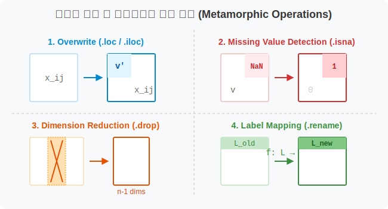
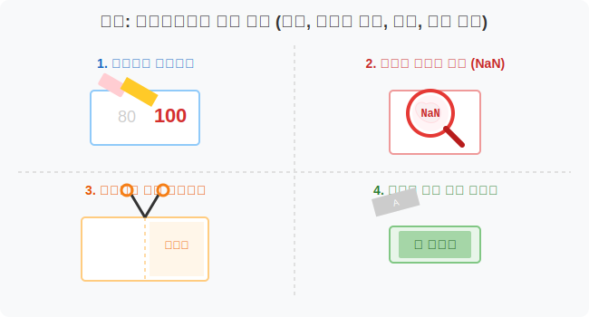
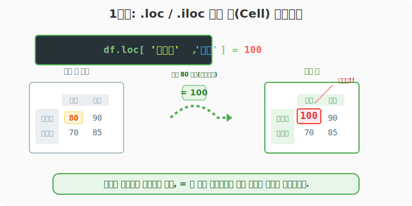
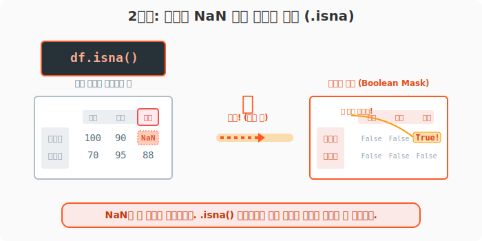
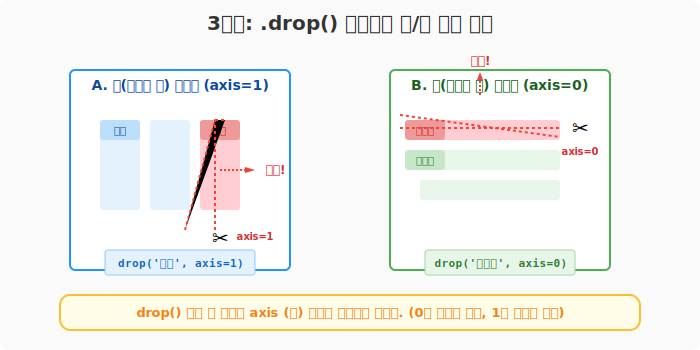
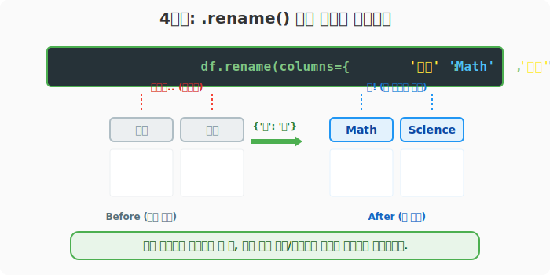
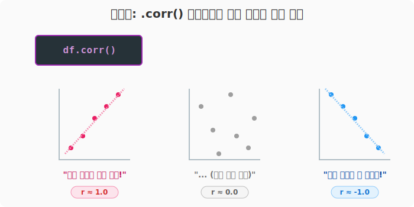

## 6.4.6 데이터 전처리 공방: 결측치, 수정, 제거, 변경

> 💾 **[실습 파일 다운로드]**
> 본 강의의 전체 실습 코드를 직접 실행해 볼 수 있는 주피터 노트북 파일입니다. 아래 링크를 클릭하여 다운로드 후 VS Code에서 열어보세요.
> - [📥 df_various_modifications_practice.ipynb 파일 다운로드](./df_various_modifications_practice.ipynb) (클릭 또는 마우스 우클릭 후 '다른 이름으로 링크 저장')

## 🧮 전산학적/수학적 의미: 메타데이터 변이(Metamorphic Operations) 및 결측치 대치(Imputation)

현실 세계의 데이터는 깨끗하지 않습니다. 이 장에서는 1) 특정 메모리 오프셋의 값을 외부 데이터로 강제 덮어쓰기(Overwriting)하고, 2) 서로 차원이 맞지 않는 데이터를 결합할 때 발생하는 `NaN` (Not a Number, 결측치)을 감지하고, 3) 텐서의 특정 축 성분을 잘라내고(`drop`), 4) 차원의 라벨을 변경(`rename`)하는 데이터 정제(Data Cleansing) 기법들을 배웁니다.



## 🏷️ 비유로 이해하기: 스프레드시트 청소 공방

- 엑셀 파일을 열어서 잘못 입력된 오타 셀을 찾아 하나씩 지우개로 지우고 새 값을 쓰거나(`.loc`, `.iloc` 대입),
- 군데군데 이빨이 빠진 데이터(빈칸, `NaN`)가 어디 있는지 스캐너로 찾고(`.isna()`),
- 쓸데없는 열은 구역 지정해서 삭제하고(`.drop()`),
- 열 이름이 마음에 안 들면 이름표를 새로 교체(`.rename()`)하는 청소부(Janitor)의 역할을 합니다!



---

## 🪄 [실습 1] 한땀 한땀 핀셋 수정하기 (단일 셀 덮어쓰기)

VS Code나 주피터 노트북을 열고 `pandas_01.py` 파일을 생성하여 단계별로 실습을 진행합니다.

### 1단계: 임의의 성적표 생성 및 셀 값 강제 덮어쓰기
`6.3`장에서 배웠던 참조(조회) 방식을 그대로 쓴 채, 오른쪽 화살표(`=`)로 값을 찔러 넣기만 하면 기존 데이터가 지워지고 새로운 데이터가 대입됩니다.

```python
import pandas as pd
import numpy as np

# 임의의 성적표 생성
df = pd.DataFrame(
    data=[[80, 90], [70, 85]],
    index=['홍길동', '이순신'],
    columns=['수학', '영어']
)
print("--- [수정 전 원본] ---")
print(df)

# 1. 이름 기반 수정 (.loc / .at)
df.loc['홍길동', '수학'] = 100

# 2. 좌표 번호 기반 수정 (.iloc / .iat)
df.iloc[1, 1] = 95 

print("\n--- [수정 후] ---")
print(df)
```
**[출력 결과]**
```text
--- [수정 전 원본] ---
      수학  영어
홍길동  80  90
이순신  70  85

--- [수정 후] ---
      수학  영어
홍길동 100  90   <- 변경 완료!
이순신  70  95   <- 변경 완료!
```



---

## 🪄 [실습 2] 블랙홀 `NaN`의 탄생과 감지 (`.isna()`)

작성한 코드 아래에 다음 코드를 추가합니다.

### 1단계: 결측치 스캐닝
현업에서 두 데이터를 합치거나 줄(행)을 억지로 끼워 넣을 때, 짝이 맞지 않으면 판다스는 빈 공간을 **`NaN` (Not a Number)** 이라는 결측값으로 채워버립니다. 

```python
# '과학' 이라는 새로운 열을 만들면서 이순신 점수만 넣어줍시다.
# 홍길동 점수는 안 줬으니 빈칸이 생기겠죠?
df['과학'] = pd.Series([88], index=['이순신'])

print("--- [NaN 결측치 발생] ---")
print(df)

# 누락된 데이터가 어디 있는지 스캐너 가동!
print("\n--- [결측치 스캔 결과: df.isna()] ---")
print(df.isna())
```
**[출력 결과]**
```text
--- [NaN 결측치 발생] ---
      수학  영어    과학
홍길동 100  90   NaN     <- 판다스가 빈칸을 NaN으로 채움!
이순신  70  95  88.0

--- [결측치 스캔 결과: df.isna()] ---
        수학     영어     과학
홍길동  False  False   True   <- True 램프에 불이 들어온 곳이 구멍난 곳입니다!
이순신  False  False  False
```



> *(참고)* 나중에 머신러닝 모델에 이 데이터를 넣으려면 `NaN` 자리 (True 불이 켜진 곳)를 반드시 `0`으로 메꾸거나 제외해야 합니다. `pd.isna(df)` 나 `df.isnull()` 함수를 모두 동일하게 스캐너로 쓸 수 있습니다.

---

## 🪄 [실습 3] 메스! 불필요한 행/열 잘라내기 (`.drop()`)

새로운 실습을 위해 `pandas_02.py` 파일을 생성합니다. 성적표 데이터(`df`) 생성 코드 및 추가 열 생성 코드를 파일 상단에 복사한 뒤 실습을 진행합니다.

### 1단계: 필요 없는 행/열 잘라내기
데이터 분석에 전혀 필요 없는 열(Column)이나 행(Row)은 자원을 낭비하므로 `drop()`으로 잘라냅니다. 여기서도 `axis`(축) 방향 설정이 생명입니다.

```python
# 1. 싹둑! '영어' 열(수직선)을 잘라버려라! -> 축을 가로(axis=1)로 지정!
df_dropped_col = df.drop('영어', axis=1)

# 2. 싹둑! '초기 데이터'인 홍길동 행(가로줄)을 자르자! -> 축을 세로(axis=0)로 지정!
df_dropped_row = df.drop('홍길동', axis=0)

print("--- [1] 영어 열 절단 수술 완료 ---")
print(df_dropped_col)

print("\n--- [2] 홍길동 행 절단 수술 완료 ---")
print(df_dropped_row)
```
**[출력 결과]**
```text
--- [1] 영어 열 절단 수술 완료 ---
      수학    과학
홍길동 100   NaN
이순신  70  88.0

--- [2] 홍길동 행 절단 수술 완료 ---
     수학  영어    과학
이순신  70  95  88.0
```



---

## 🪄 [실습 4] 촌스러운 이름표 떼어내기 (`.rename()`)

계속해서 동일한 파일에 아래 코드를 추가합니다.

### 1단계: 컬럼명 교체
`A`, `B` 처럼 의미 없는 컬럼명이나 보기 안 좋은 이름들을 다른 이름으로 바꿀 수 있습니다. 파이썬의 **사전(Dictionary)** 구조 `{'옛날이름': '새이름'}`을 씁니다.

```python
# 수학을 'Math', 과학을 'Science'로 이름 교체!
df_renamed = df.rename(columns={'수학': 'Math', '과학': 'Science'})

print("--- [이름표 교체 완료] ---")
print(df_renamed)
```
**[출력 결과]**
```text
--- [이름표 교체 완료] ---
     Math  영어  Science
홍길동   100  90      NaN
이순신    70  95     88.0
```



---

## 🪄 [실습 5] 🎁 [보너스] 숫자들 간의 궁합 보기 (`.corr()`)

마지막으로 아래 코드를 추가합니다.

### 1단계: 상관계수 계산
서로 다른 숫자 열들이 얼마나 "비슷한 패턴으로 오르고 내리는지"를 한 방에 보여주는 통계 함수입니다.
- `1.0`에 가까울수록: 한쪽이 오르면 다른 쪽도 미친 듯이 같이 오름 (양의 상관관계)
- `1`에 가까울수록: 한쪽이 오르면 다른 쪽은 미친 듯이 떨어짐 (음의 상관관계)
- `0`에 가까울수록: 둘은 아무 상관 없음

```python
# 성적표의 과목 간 상관계수 구하기
print("--- [과목별 상관계수 테이블] ---")
print(df.corr())
```
**[출력 결과]**
```text
--- [과목별 상관계수 테이블] ---
          수학        영어        과학
수학  1.000000 -1.000000       NaN
영어 -1.000000  1.000000       NaN
과학       NaN       NaN  1.000000
```



> 이 기능은 본격적인 통계 분석 전, 데이터의 숨겨진 유전자 지도를 그려보는 아주 강력한 도구입니다.