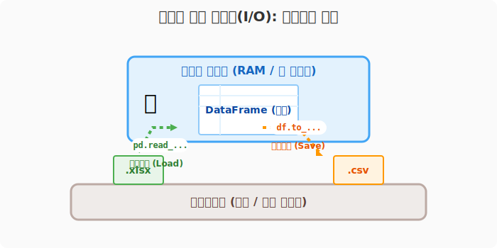
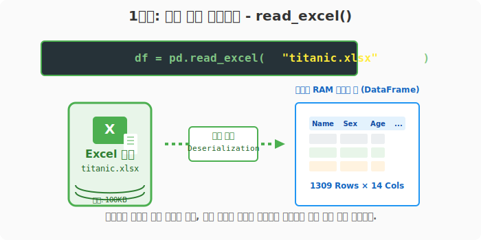
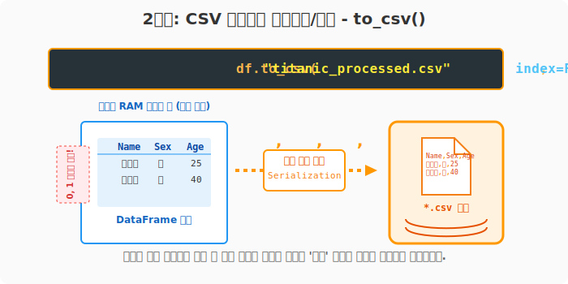
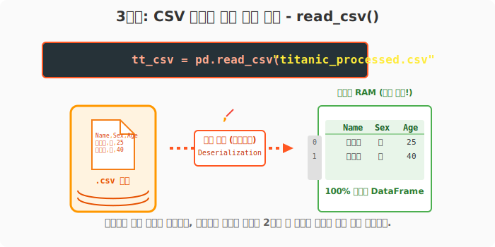

## 6.5.1 외부 데이터 파일 불러오기와 내보내기 (I/O)

**[전산학적/수학적 의미: 직렬화와 역직렬화 (Serialization & Deserialization)]**
판다스의 `DataFrame` 객체는 컴퓨터의 휘발성 주 메모리(RAM) 위에서만 존재하는 2차원 자료 구조입니다. 이 데이터를 영구적인 보조 기억 장치(하드디스크)에 텍스트나 바이너리 형태로 포맷팅하여 저장하는 것을 내보내기(Serialization, Write)라 하고, 반대로 포맷팅된 파일을 읽어와 메모리상의 2차원 객체로 복원하는 것을 불러오기(Deserialization, Read)라 합니다. 

**[비유로 이해하기: 작업대(메모리)와 창고(하드디스크)]**
- **`read_` 시리즈**: 창고에 예쁘게 포장되어 있는 상자(CSV, Excel 파일)를 꺼내서, 연구원의 책상(메모리) 위에 쫙 펼쳐놓는 작업입니다.
- **`to_` 시리즈**: 책상 위에서 온갖 수학 연산과 정제 작업이 끝난 데이터 표를 잃어버리지 않게 예쁜 상자에 담아서 창고에 다시 영구 보관하는 작업입니다.



---

### [1단계] 엑셀(.xlsx) 파일 불러오기: `read_excel()`

현업에서 가장 친숙한 엑셀 파일을 그대로 파이썬 작업대로 불러옵니다. `read_`로 시작하는 다양한 함수가 있으며, `data/` 폴더에 위치한 유명한 **타이타닉 탑승객 데이터**를 가져와 보겠습니다.

```python
import pandas as pd

# 창고(data/ 경로)에서 엑셀 파일을 읽어와 df_excel 변수에 저장(할당)합니다.
df_excel = pd.read_excel("data/titanic.xlsx")

# head() 함수로 앞의 5줄만 제대로 가져왔는지 검수합니다.
print("--- 🚢 타이타닉 엑셀 데이터 불러오기 ---")
print(df_excel.head())
```
**[출력 결과]**
```text
--- 🚢 타이타닉 엑셀 데이터 불러오기 ---
   pclass  survived                                             name     sex  ...
0       1         1                    Allen, Miss. Elisabeth Walton  female  ...
1       1         1                   Allison, Master. Hudson Trevor    male  ...
2       1         0                     Allison, Miss. Helen Loraine  female  ...
3       1         0             Allison, Mr. Hudson Joshua Creighton    male  ...
4       1         0  Allison, Mrs. Hudson J C (Bessie Waldo Daniels)  female  ...
```



데이터를 처음 올려놓고 나면, 앞선 `6.4.1` 장에서 배운 기초 건강검진(`info()`)을 바로 수행해 구조를 파악하는 것이 좋습니다.

```python
print("\n--- 🩺 데이터프레임 정보 스캔 ---")
df_excel.info()
```
**[출력 결과]**
```text
--- 🩺 데이터프레임 정보 스캔 ---
<class 'pandas.core.frame.DataFrame'>
RangeIndex: 1309 entries, 0 to 1308
Data columns (total 14 columns):
...
dtypes: float64(2), int64(4), object(8)
memory usage: 143.3+ KB
```
> 출력 결과를 통해 1309명의 승객 정보와 14개의 다양한 특성(Name, Age, Survived 등)을 지닌 대규모 데이터인 것을 파악할 수 있습니다.

---

### [2단계] CSV 파일로 저장하기: `to_csv()`

**CSV (Comma Separated Values)** 형식은 데이터가 쉼표(`,`)로 구분된 매우 단순하고 가벼운 텍스트 파일입니다. 엑셀의 복잡한 서식(색상, 테두리 등)이 없기 때문에 수천만 건의 데이터를 다룰 때 사실상의 표준 프레임워크로 사용됩니다. 

책상 위에 있던 데이터를 분석하기 용이한 CSV 포맷으로 하드디스크에 저장해 봅니다.

```python
# 현재 메모리에 있는 표 형식을 CSV 파일 상자로 포장해서 창고에 넣습니다.
# (index=False 를 주지 않으면 불필요한 번호 0, 1, 2... 열이 하나 더 추가되어 저장되니 주의하세요!)
df_excel.to_csv("data/titanic_processed.csv", index=False)

print("--- 💾 CSV 저장 완료 ('data/titanic_processed.csv') ---")
```
**[출력 결과]**
```text
--- 💾 CSV 저장 완료 ('data/titanic_processed.csv') ---
```



---

### [3단계] 저장된 CSV 파일을 다시 불러오기: `read_csv()`

방금 저장했던 가벼운 CSV 파일을 다시 파이썬 메모리로 불러올 수 있습니다. 엑셀 함수 대신 `read_csv`를 사용합니다.

```python
# 방금 저장한 따끈따끈한 csv 파일을 다시 불러옵니다.
tt_csv = pd.read_csv("data/titanic_processed.csv")

# 엑셀에서 불러온 것과 완벽히 동일한 구조인지 처음 8줄을 확인합니다.
print("--- 📦 새로 저장한 CSV 데이터 불러오기 ---")
print(tt_csv.head(8))
```
**[출력 결과]**
```text
--- 📦 새로 저장한 CSV 데이터 불러오기 ---
   pclass  survived                                             name     sex  ...
0       1         1                    Allen, Miss. Elisabeth Walton  female  ...
1       1         1                   Allison, Master. Hudson Trevor    male  ...
2       1         0                     Allison, Miss. Helen Loraine  female  ...
3       1         0             Allison, Mr. Hudson Joshua Creighton    male  ...
4       1         0  Allison, Mrs. Hudson J C (Bessie Waldo Daniels)  female  ...
5       1         1                                Anderson, Mr. Harry    male  ...
6       1         1                  Andrews, Miss. Kornelia Theodosia  female  ...
7       1         0                                Andrews, Mr. Thomas    male  ...
```



> **📌 핵심 팁 요약**
> - 데이터를 파이썬 안으로 가져오고 싶을 때: **`pd.read_형식("경로")`**
> - 파이썬에서 다 끝난 데이터를 밖으로 빼내 저장할 때: **`df.to_형식("경로")`** 
> - 판다스는 이밖에도 JSON (`.read_json`), SQL DB (`.read_sql`), Parquet 시스템과도 호환되는 강력한 입출력 엔진을 지원합니다.